#### Create .rdm Animations with Blender

Many production buildings, public services or ornamental assets use animations to generate a more lively atmosphere. This short tutorial shows how to set up your own animation with Blender and get it to work in Anno 1800. As an example we will animate a small crane extracted from the heavy weapons factory:

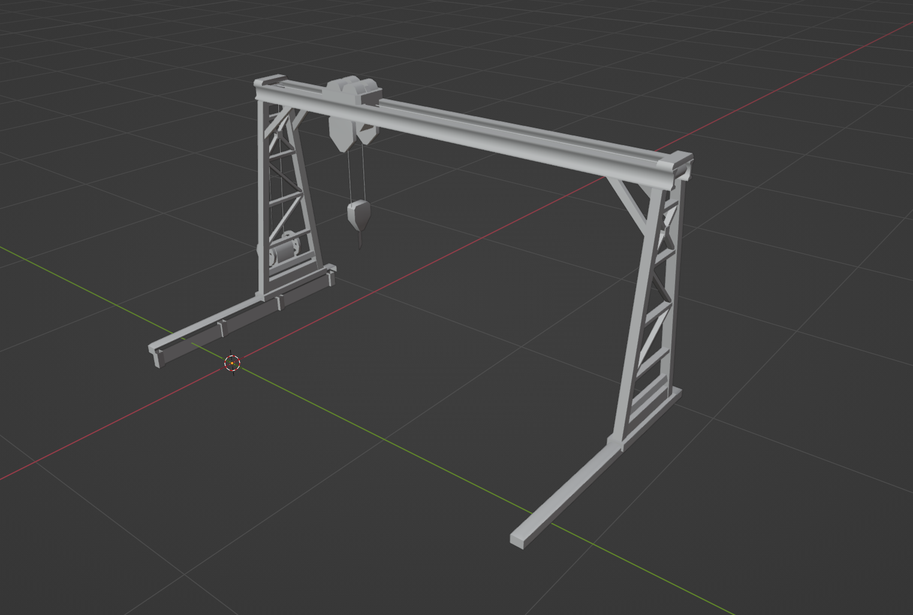

# Requirements: 

-	Blender 2.8 or higher 
-	rdm4-bin converter
-   Anno Cfg Import / Export Addon

# Ressources: 

Download the model, cfg file and, for checking, an example .blend file here: 

## Step 1: Adjust Materials

Open an empty .blend file and import the cfg file via the Cfg Import / Export Addon.  

Most Anno materials use the vertex format `P4h_N4b_G4b_B4b_T2h`, however for animated models you have to use the format `P4h_N4b_G4b_B4b_T2h_I4b`, otherwise the model will not show up in the game. To convert a material from one format to another, do the following in the material properties tab: 

-	Scroll down to the property `NumBonesPerVertex`: set it from `0` to `1` (I´m not 100 % sure, but I guess the Anno engine doesn´t allow more than 1 bone per vertex)
-	Scroll further to `VertexFormat`: add _I4b after T2h

**You have to do this for all materials applied to your model, no matter if the specific part is animated or not.** 

## Step 2: Export / Re-Import your Model

I guess you usually export your model as a .rdm file from Blender with the Anno Import / Export Addon. For animation purposes you should export it as a `.glb` file:

-	Click on your model, go to FILE--> Export --> `Anno Model (.rdm / .glb)` and change the file name of your model to `your_name.glb` 
-	Select the VertexFormat `P4h_N4b_G4b_B4b_T2h_I4b`

Anno mirrors objects along the x-axis and so does the Import / Export Addon (if you haven´t unticked the „mirror along x“ in the addon preferences). If you open your exported model with a 3D-viewer of your choice you´ll see it´s mirrored. Anno will mirror it „back“ again, so ingame it looks like in Blender.


To create your animation, use the mirrored model. Therefore you have two options, both should do the trick:

-	Open a new empty .blend file and choose the import option `gltf 2.0 (.glb / gltf)` 
-	Open a new empty .blend file, go to EDIT --> Preferences --> Add-ons --> untick „mirror along x“ in the I/E addon tab. Choose the import option `Anno Model (.rdm / .glb)`  

> **Why the mirrored model if the I/E addon can mirror it and Anno mirrors it back anyway?** 
> Because the I/E addon doesn´t support animations at the moment. As you will see later, we can´t export our animated model, armature, bones and what else we need, > with this tool. We would have to export it via the Blender standard option „gltf 2.0“. As a consequence our model will not be mirrored along x (in a 3D viewer it > will look like in Blender). As we already know, Anno mirrors in any case, as a result we would get the wrong direction ingame and - even worse - all animations > > would play wrong. Have fun with doing the animations again.

## Step 3: Add Vertex Groups

> This works like any other animation in Blender, nothing specific with Anno. If you are already familiar with it, you can skip this part.

A vertex group consists of vertices you assigned to it. Each group can change location and rotation individually, although they are part of the same mesh. Exactly what you need for your animation :) 

To define vertex groups...

- Click on your model and go into **EDIT MODE**
- In the properties tab on the left you will find the property `Vertex groups` (left pic). Add 3 groups with `+` and name them *base*, *top* and *hook* (or any other name you want) (right pic).  

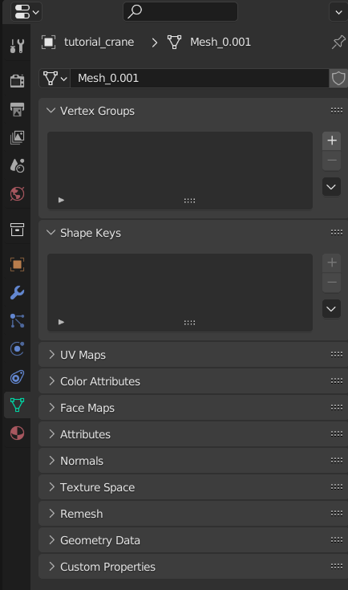

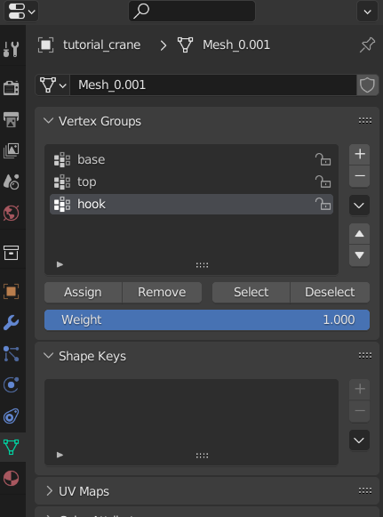

- Choose the vertex group *hook* and select all corresponding faces in the viewport: 

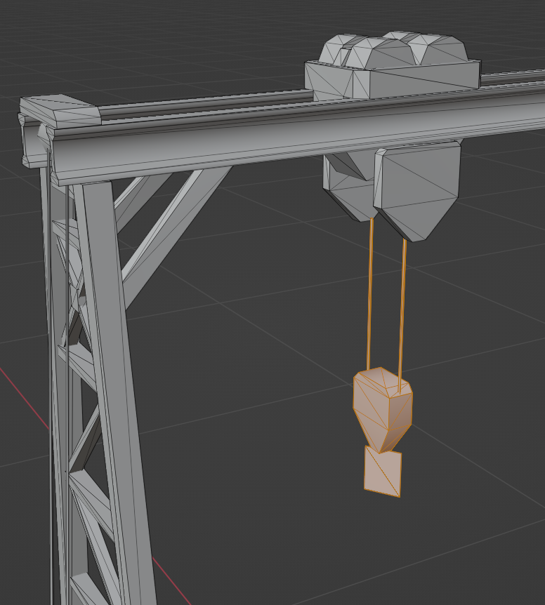
 
- When you are sure that you highlighted every face click on `Assign` 
- Now choose *top* in the list and select all faces which should belong to it. `Assign` 
- For the *base*, move your mouse to the viewport, press `A`. Every face of the crane is now automatically selected. Click on *base* and `Assign`. Click on *top* and `Remove`, same with *hook*. As a last step, click on *base* again, select the rails on the bottom and remove them from this group. They clearly shouldn´t be animated. 
- If you click on *base*, it should look like this: 

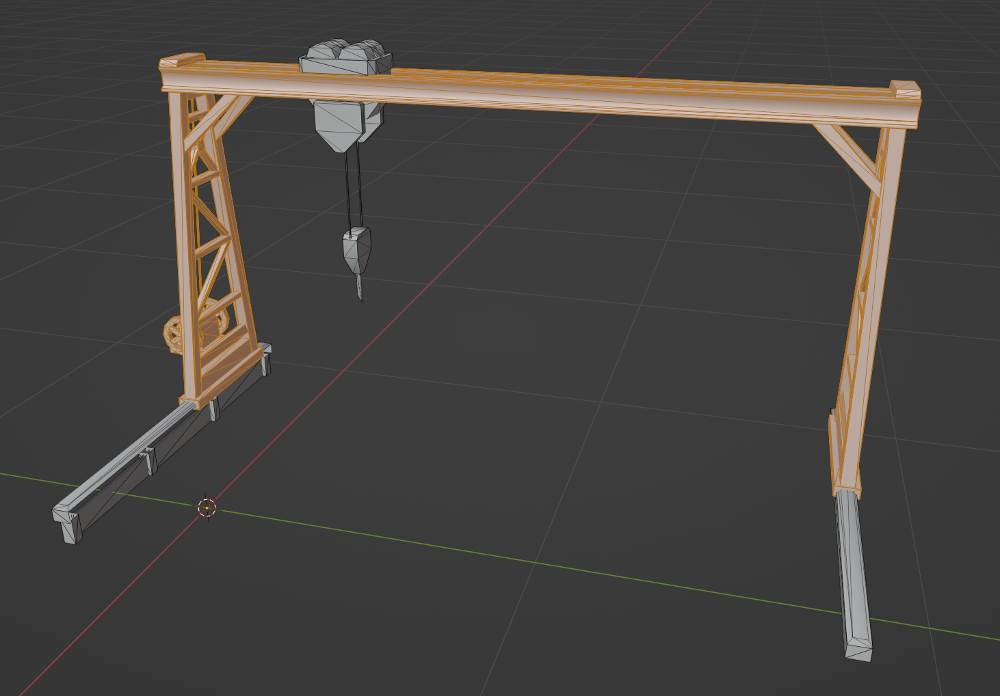

## Step 4: Rigging

To be able to animate your model you need to add one more thing: Bones, which are connected to your vertex groups. 

> Imagine the vertex groups as your limbs, head, torso etc. and the bones as the skeleton which allows them to move  

- Go back into **OBJECT MODE** --> `SHIFT``A` --> `Add armature`

You will see that Blender automatically added a bone to the viewport and an armature to your outline on the left: 

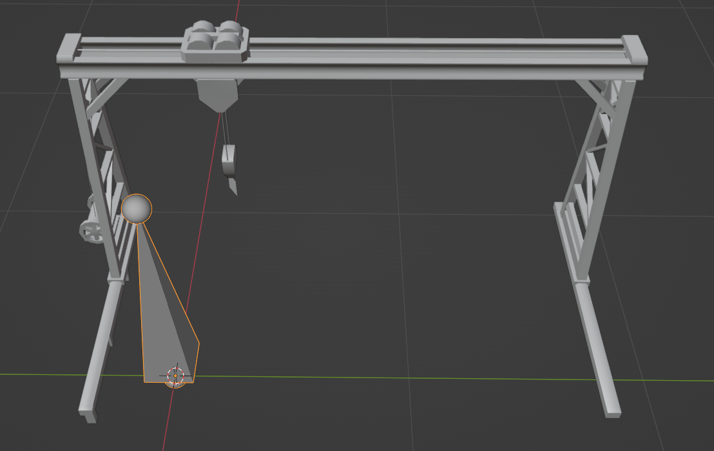

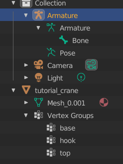

- Click on `Bone` in your outline and go into **EDIT MODE**. 
- You can move, rotate, scale or duplicate bones like any other object in Blender. For our purposes duplicate the bone twice. 
- Now move, rotate and scale them to your liking so that the bones visually represent our *base*, *top* and *hook*. Suggestion:

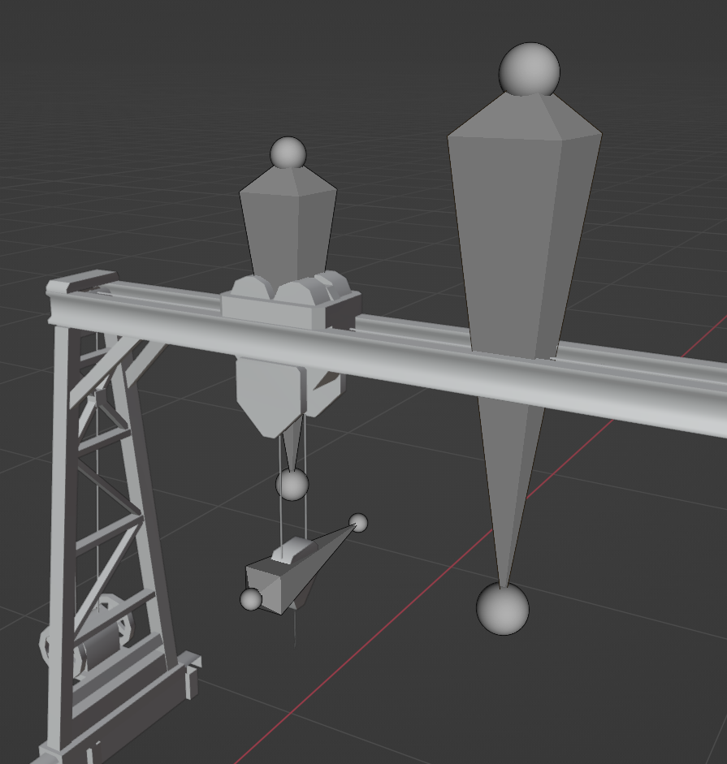
 
- Rename the bones to *base*, *top* and *hook*. This naming ensures that our base bone belongs to our base vertex group, the top bone to the top vertex group and the hook bone to the hook vertex group. **The names must be identical!** 

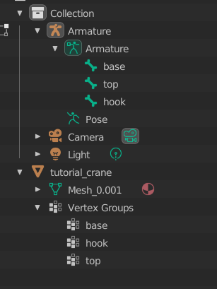

- Go back into **OBJECT MODE** --> select the crane model first and then the bones --> press `Ctrl``P` --> choose `with empty groups`

When you look at your outline you will see that the model is linked to the armature, in other words: Vertex groups and bones are linked and ready for animation :)

## Part 5: Add an Animation

Now the fun part begins.

- Change the workspace to **Animation**
- Change the editing context from **Dope Sheet** to **Action Editor** (box 1) --> in my opinion provides a clearer UI
- Click on `new`: An animation will be added. Give it a name, i.e. *work01* (box 2). The animation automatically belongs to your `Armature` in your outline (box 3)

> In this tutorial we will only create one work animation, as our idle animation is just „do nothing“ (as it is for most Anno vanilla animations). The idle animation will be added automatically by the rdm4-converter.

- If you haven´t been switched into **POSE MODE** by Blender, click on a bone and then switch from **OBJECT MODE** or **EDIT MODE** into **POSE MODE** (box 4)
- Select the **Bone Properties** tab on the right (box 5)

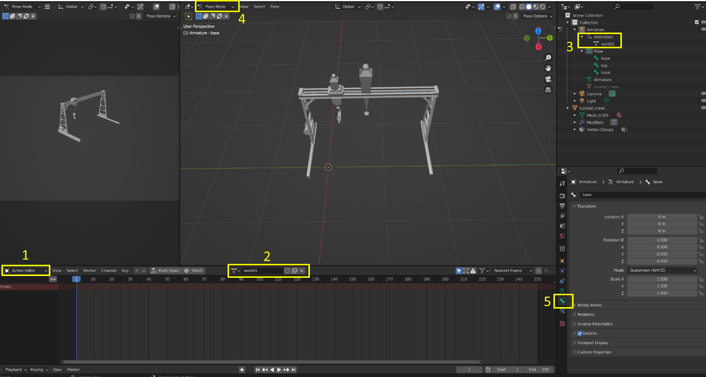

- Select the *base* bone (now highlighted blue) and press `I` --> select `Location, Rotation and Scale`
- The first keyframe - represented as a yellow dot - appears in the **Action editor** and the color of the properties tab on the right changes to an ugly yellow-green color. This indicates that the current location, rotation and scale of the selected bone / vertex group / keyframe is now part of the animation.

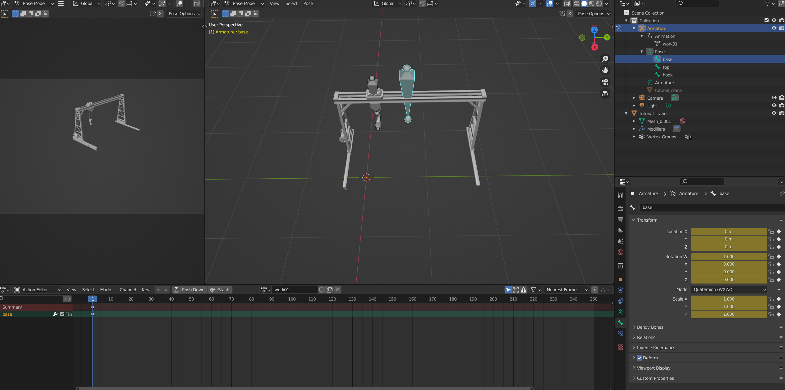

> Optional: Select `keying` at the very bottom --> `Active keying set` --> `Location, Rotation, Scale`. With this setting you won´t have to select `Location, Rotation and Scale` anymore everytime you press `I`. 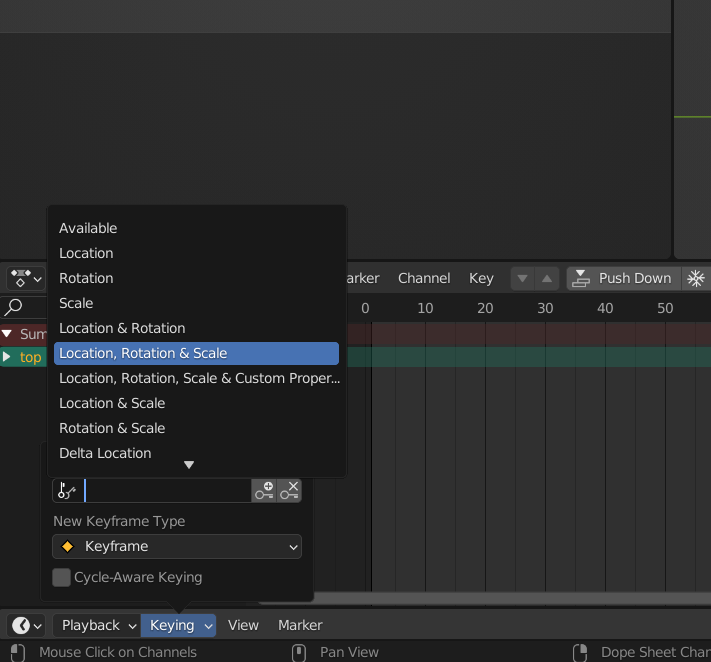

- Now move the blue slider to frame 50 and press `I` again. The next keyframe appears and a yellow bar shows up between 1 and 50. This means, the position of a bone between two keyframes hasn´t changed. In many cases this is what you want, for example when only a specific bone should move, while others hold their position. But you will see the implication in a few seconds.  

> Many inconsistencies in your animations like clipping into other model parts may be caused by such missing „on hold“ keyframes.

- Move the slider to 150. Press `G` and `X` to move the bone along the x-axis (don´t worry if another axis changes its values on the right instead of x, that´s because the bones use their own coordinate system, for you only the visual result is important). Stop at 0.6. Press `I`. 

Now you should see, that *top* and *hook* didn´t move and are still at their rest position. That is not what we want in this case. There are two options to solve this:  
1.	Select not only the *base* bone but also *top* and *hook* bones and move them at the same time
> Only recommended if the bones move completely individually from each other for the most part of your animation. Otherwise it´s tedious to select every bone all the time and mistakes are likely. 
2.	Parent bones 
> Only recommended if the child bone(s) always move with their parent bone(s) (of course not necessarily vice versa). Do not parent if parent bone(s) should move without their child(s). 

In this case you can use option 2, because *top* and *hook* should - of course - always move when the *base* moves. *Top* and *hook* can still move relatively to the *base*:

- Press `Ctrl``Z` twice to undo the last two operations (`I` and move along x) 
- Select a bone, go into **EDIT MODE** and select the bone which is supposed to be the child at first. In our case the *hook* bone. 
- Press `Shift` and select the parent bone, in our case the *top* bone --> press `Ctrl``P` --> `keep offset`  
- Select the *top* bone, press `Shift` and select the *base* bone --> press `Ctrl``P` --> `keep offset` 

In the outline you can see a nested list: *base* is the parent of *top* and *top* is the parent of *hook*. When you move the *base* bone along the x-axis, *top* and *hook* move as well now. 

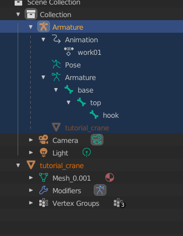

Now it´s up to you. Move the bones as you please, set keyframes, move bones... 
`G` and `X` = move along x 
`G` and `Y` = move along y
`G` and `Z` = move along Z
`R` and `X` = rotate around x 
`R` and `Y` = rotate around y
`R` and `Z` = rotate around Z

> Scaling is not supported by the rdm4 converter as far as I know. But who cares about scaling? 

**Don´t forget to `Play` your animation from time to time, so you encounter mistakes early and debugging is less frustrating!** 

The last keyframe...
- Should be set at (last frame - 1), e.g. if your animation has a duration of 1000 frames, set the last keyframe at 999 
- Should be the **rest position** again: Just enter the initial xyz coordinates / angles into the properties tab on the right 
Both ensures that you get a smooth transition between the loops.

>**If you want to do 360° rotations**: 
> Blender will choose the shortest path between two keyframes, so if you want to rotate a vertex group by 2pi… you will see nothing, the object won´t move. Solution: > Set more key frames. Even 180° is not stable in many cases, so I recommend an angle of 90° (4 key frames).   
> Example

## Part 6: Export your Animation and Convert it to .rdm

- Once you finished your animation, switch into **OBJECT MODE** and select the following: 


- Click on FILE --> EXPORT --> `gltf 2.0 (.gltf / .glb)` and use the settings below: 


- Open a console (cmd, gitbash, powershell etc) and follow the instructions on the [rdm4-bin github page](https://github.com/lukts30/rdm4). 

Usually the command is sth like: 
`your_path/tools>rdm4-bin.exe -g=P4h_N4b_G4b_B4b_T2h_I4b -i your_path/tutorial_crane_lod0.glb -sa --no_transform`

**Be sure your mesh uses a different name than your vertex groups / bones. Otherwise you will get an error message by the rdm4 converter.** It tells you to use the option `–unstableIndex`, but this will cause all your vertex group / bone names to be replaced with sth like „unnamedglftnode_01“.

After the converter has done its work, you will get a detailed list of what he did, including some yellow warnings regarding „output sampler not supported scale“ (remember: we didn´t do any scaling anyway, so just ignore these messages). 

At the end of the list you may notice these lines: 

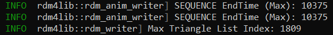

This is the time in milliseconds your animation needs to run one loop. By default Anno uses milliseconds, Blender displays frames (although you can switch to seconds). If you plan to add some timed sounds to your animation or if you use multiple different animations which should start at certain time stamps you may find it helpful to switch between milliseconds and frames: 

> - current frame *  (1 min)/(1440 frames) * (60000 ms)/(1 min) = time in ms
> - time in ms * (1 min)/(60000 ms) * (1440 frames)/(1 min) = current frame

Example: If the animation uses 249 frames, time is 10.375 ms, what is exactly the time given by the rdm-converter. 
Example 2: If you want to play a sound, starting at keyframe 142 and ending at keyframe 212, you get 5916 ms and 8833 ms. Both numbers can be used in your cfg file (see step 7).

For this animation, the rdm converter generated three .rdm files: *anim_0*, *anim_1* and *out*. 
*anim_0* is your *work01* animation (compare the file size), *anim_1* the idle animation (much smaller file size) and *out* is the model itself. 

## Step 7: Add your Animation to your Building`s cfg

- Add a folder named `anims` to your mods building folder and copy *anim_0* and *anim_1* into it 
- The *out* file goes into the rdm folder 
- Rename the files to fit the Anno naming specifications: sth. like *tutorial_crane_lod0.rdm* for the model and *tutorial_crane_work01.rdm* / *tutorial_crane_idle01.rdm* for the animations
- Open the cfg file *rdm_animation_tutorial.cfg* 

- Adjust the filepath from...
```XML
<FileName>data/rdm/tutorial_crane_not_animated_lod0.rdm</FileName>
```
... to the name you chose for your model, e.g.
```XML
<FileName>data/rdm/tutorial_crane_lod0.rdm</FileName>
```

- Add **animation entries** to your model to tell Anno that the model comes with two animations. The exact placement is not mandatory, but Ubi places them between `<Transformer>` and `<Materials>`:   

```XML
        </Transformer>
			<Animations>
				<Config>
					<ConfigType>ANIMATION</ConfigType>
					<LoopCount>0</LoopCount>
					<FileName>data\anims\tutorial_crane_work01.rdm</FileName>
					<Scale>4.000000</Scale>
				</Config>
				<Config>
					<ConfigType>ANIMATION</ConfigType>
					<LoopCount>0</LoopCount>
					<FileName>data\anims\tutorial_crane_idle01.rdm</FileName>
					<Scale>1.000000</Scale>
				</Config>
			</Animations>
		<Materials>
```

The `Scale` property determines the speed of the whole animation: 
- 1.0 represents the speed you can see in Blender.
- Values > 1 slow the animation down
- Values < 1 fasten the animation
This is a great way to simplify your animation work in Blender, since it doesn´t take thousands of frames, if you want a slow animation, nor a confusing bunch of densely packed keyframes, if you want a fast animation.     

- Add **sequence entries** to your cfg. Those define which animation should be played in which order, at which time and how long. These sequence entries are quite powerful and I haven´t understood all their magic yet. 
The most basic one is shown below, but it fits for most simple animations:  

```XML
        <Sequences>
            <Config>
                <ConfigType>SEQUENCE</ConfigType>
                <SequenceID>1000</SequenceID>       <!--> Usually used for the idle animation <-->
                <Looped>1</Looped>      <!--> the animation should be played more than once right? <-->
                <DisableEffects>1</DisableEffects>      <!--> does what it´s called and for most cases should be true during idle <-->
                <RestartEffects>0</RestartEffects>      <!--> idk what this does exactly, haven´t seen any other value than 0 anyway <-->
                <Speed>1.000000</Speed>     <!--> idk, maybe the same as Scale, try if you dare <-->
                <Track>
                    <TrackID>1</TrackID>        <!--> Starts with value 1, 2, 3... n <-->			
                    <TrackElement>      <!--> For each <Type> there need to be an extra <TrackElement> <-->
                        <Type>2</Type>      <!--> 2 is used as <Type> in a <TrackElement> when defining the <Condition> for an animation being played <-->
                        <StartTime>0</StartTime>        <!--> time in ms when the animation should start <-->
                        <EndTime>1000</EndTime>         <!--> time in ms when the animation should end, for the idle animation this doesn´t really matter <-->
                        <Condition>32</Condition>       <!--> 32 is the standard flag for idle <-->
                    </TrackElement>
                    <TrackID>2</TrackID>
                    <TrackElement>
                        <Type>0</Type>      <!--> 0 is used as <Type> in a <TrackElement>, when referencing a <AnimationID> and <ModelID> <-->
                        <StartTime>0</StartTime>
                        <EndTime>1000</EndTime>
                        <AnimationID>1</AnimationID>        <!--> Starts with value 0, 1, 2... n; corresponds to the order of the animations of the model <-->
                        <ModelID>0</ModelID>        <!--> Starts with value 0, 1, 2... n; corresponds to the order of the models in the cfg <-->
                    </TrackElement>
                </Track>
            </Config>
            <Config>
                <ConfigType>SEQUENCE</ConfigType>
                <SequenceID>3000</SequenceID>       <!--> Usually used for the work animation <-->
                <Looped>1</Looped>
                <DisableEffects>0</DisableEffects>
                <RestartEffects>0</RestartEffects>
                <Speed>1.000000</Speed>
                <Track>
                    <TrackID>1</TrackID>				
                    <TrackElement>
                        <Type>2</Type>
                        <StartTime>0</StartTime>
                        <EndTime>12458</EndTime>        <!--> take the value from the rdm4 converter <-->
                        <Condition>64</Condition>       <!--> 64 is the standard flag for work <-->
                    </TrackElement>
                    <TrackID>2</TrackID>
                    <TrackElement>
                        <Type>0</Type>
                        <StartTime>0</StartTime>
                        <EndTime>12458</EndTime>
                        <AnimationID>0</AnimationID>
                        <ModelID>0</ModelID>
                    </TrackElement>
                </Track>
            </Config>
        </Sequences>
```
- Save and close the Cfg
- Open the `.ifo file` and add a short version of the sequence entry: 

```XML
        <Sequence>
		    <Duration>1000</Duration>
		    <Looped>1</Looped>
		    <Speed>1</Speed>
		    <Id>1000</Id>
	    </Sequence>
	    <Sequence>
		    <Duration>12458</Duration>
		    <Looped>1</Looped>
		    <Speed>1</Speed>
		    <Id>3000</Id>
	    </Sequence>
```
- Create a `.fc file`, even an empty one does the trick. Without one, the animation doesn´t show up ingame

FINISH :) 

## Special cases

1. **360° rotations** 
    Blender will always choose the shortest path between two keyframes, so if you want to rotate a vertex group by 2pi… you will probably see nothing, the object won´t move. The solution is to set more key frames. Even 180° is not stable in many cases, so I recommend an intervall of 90° (4 key frames in total).

2. **Conveyor belt animations**
    These are completely different from what we´ve done in this tutorial so far. They are much easier, since Anno handles them directly as a texture, which gets scrolled automatically, when the building "works". 
    So all you need is a suitable texture: Everything on this map scrolls, thus you need a small extra map only for the conveyor (have a look at the biscuit multifactory maps for an example)  
    In the cfg file there is only one property you have to consider. Given, the following code is part of a factory with a conveyor, the conveyor uses its own texture and makes use of `<cTexScrollSpeed>`  
    ```XML 
        <Config>
					<ConfigType>MATERIAL</ConfigType>
					<VertexFormat>P4h_N4b_G4b_B4b_T2h</VertexFormat>        <!--> no _I4b needed <-->
					<Common>Common</Common>
					<TerrainAdaption>TerrainAdaption</TerrainAdaption>
					<Environment>Environment</Environment>
					<Glow>Glow</Glow>
					<WindRipples />
					<ShaderID>8</ShaderID>
					<NumBonesPerVertex>0</NumBonesPerVertex>
					<PARALLAX_MAPPING_ENABLED>1</PARALLAX_MAPPING_ENABLED>
					<VERTEX_COLORED_TERRAIN_ADAPTION>0</VERTEX_COLORED_TERRAIN_ADAPTION>
					<ABSOLUTE_TERRAIN_ADAPTION>0</ABSOLUTE_TERRAIN_ADAPTION>
					<cUseLocalEnvironmentBox>1</cUseLocalEnvironmentBox>
					<WIND_RIPPLES_ENABLED>0</WIND_RIPPLES_ENABLED>
					<DisableReviveDistance>0</DisableReviveDistance>
					<cTexScrollSpeed>0.030000</cTexScrollSpeed>     <!--> very sensitive, for slow speeds use values between 0.01 - 0.05 <-->
					<cParallaxScale>1.000000</cParallaxScale>
					<cEnvironmentBoundingBox.x>0.000000</cEnvironmentBoundingBox.x>
					<cEnvironmentBoundingBox.y>0.000000</cEnvironmentBoundingBox.y>
					<cEnvironmentBoundingBox.z>0.000000</cEnvironmentBoundingBox.z>
					<cEnvironmentBoundingBox.w>4.000000</cEnvironmentBoundingBox.w>
					<cWindRippleTiling>0.200000</cWindRippleTiling>
					<cWindRippleSpeed>1.000000</cWindRippleSpeed>
					<cWindRippleNormalIntensity>0.200000</cWindRippleNormalIntensity>
					<cWindRippleMeshIntensity>0.200000</cWindRippleMeshIntensity>
					<METALLIC_TEX_ENABLED>1</METALLIC_TEX_ENABLED>
					<cUseTerrainTinting>0</cUseTerrainTinting>
					<SEPARATE_AO_TEXTURE>0</SEPARATE_AO_TEXTURE>
					<DIFFUSE_ENABLED>1</DIFFUSE_ENABLED>
					<NORMAL_ENABLED>1</NORMAL_ENABLED>
					<DYE_MASK_ENABLED>0</DYE_MASK_ENABLED>
					<HEIGHT_MAP_ENABLED>0</HEIGHT_MAP_ENABLED>
					<SELF_SHADOWING_ENABLED>0</SELF_SHADOWING_ENABLED>
					<WATER_CUTOUT_ENABLED>0</WATER_CUTOUT_ENABLED>
					<ADJUST_TO_TERRAIN_HEIGHT>0</ADJUST_TO_TERRAIN_HEIGHT>
					<GLOW_ENABLED>1</GLOW_ENABLED>
					<NIGHT_GLOW_ENABLED>0</NIGHT_GLOW_ENABLED>
					<Name>material_35_scroll</Name>
					<cModelDiffTex>data\dlc08\graphics\mod_buildings\subway_factory\maps\subway_conveyor_diff.psd</cModelDiffTex>
					<cModelNormalTex>data\dlc08\graphics\mod_buildings\subway_factory\maps\subway_conveyor_norm.psd</cModelNormalTex>
					<cModelMetallicTex>data\dlc08\graphics\mod_buildings\subway_factory\maps\subway_conveyor_metal.psd</cModelMetallicTex>
					<cSeparateAOTex>data/graphics/effects/default_model_mask.png</cSeparateAOTex>
					<cNightGlowMap>0</cNightGlowMap>
					<cDiffuseColor.r>1.000000</cDiffuseColor.r>
					<cDiffuseColor.g>1.000000</cDiffuseColor.g>
					<cDiffuseColor.b>1.000000</cDiffuseColor.b>
					<cEmissiveColor.r>1.660463</cEmissiveColor.r>
					<cEmissiveColor.g>1.418585</cEmissiveColor.g>
					<cEmissiveColor.b>0.967514</cEmissiveColor.b>
				</Config>
    ```


