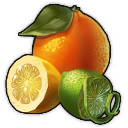
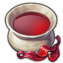
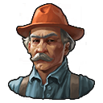

# Tutorial 3 - Making a new production chain

For our next mod we are taking another step in a more advanced mod. We are going to make a new production chain and a new good. We are not going to make it that complex for now and start with a basic production chain and one new product. We are going to make **citrus tea**.

## What are we going to do?

We are going to use an already existing good (**citrus**) to create a new good (**Citrus Tea**).

We will be creating:

- Icons
- Specialist
- Product (Citrus Tea)
- Production chain (Citrus Tea production chain)
- Building that produces our good
- Citizen needs (Citrus Tea as a Luxury Need for Engineers and Investors)
- Triggers to activate everthing ingame
- Building texture. No 3D-modelling yet, just the texture.

This can be a big step because it has a lot of small steps we need to take. But do not worry, we are going to do this step by step.

## Our mod structure

Compared to the previous mod we will now have some more folders and files we need to create. We will call our mod "Tutorial Specialists" The structure now will look like this:

- [Gameplay] Tutorial Citrus Tea
  - data
    - config
      - export
        - main
          - asset
            - xml file (assets.xml) which contains all the logic for our mod.
      - gui
        - xml files containing the translations for text in every language
          - texts_english.xml
          - texts_french.xml
          - texts_german.xml
          - …
    - graphics
      - buildings
        - production
          - production_citrus_tea  
            Contains production_citrus_tea files that describes the new building. - maps  
             Contains maps which are the materials/textures of our building. diff, mask, metal and norm file.
      - icons
        - Custom graphics we use in our mod. Icon for Citrus Tea and icon for specialist.

## Start with the icons

The icons we need for this mod are:

- Citrus Tea good
- Specialist

### Citrus Tea

If we look at what is already available in the game we have the Hibiscus Tea and citrus. Both icons can be recycled to make a new Citrus Tea icon.

For the Citrus icon we go to data18.rda/data/ui/2kimages/main/3dicons/icon_citrus_0.dds and convert the dds to a png.

For the Hibiscus Tea icon we go to data16.rda/data/ui/2kimages/main/3dicons/goods_africa/icon_hibiscus_tea_0.dds and convert the dds to a png.




We do some magic in our photo editing program and voila, we have a nice result.


## Specialist

For the specialist, let's take a man and name him Tony Lipus, Citrua tea smasher. We go to the data2.rda/data/ui/2kimages/main/3dicons/specialists/systemic/icon_farmer_106_0.dds and convert this dds to a png.


We do again some editing magic to get the result below. Changing some colors.



So, we now have our icons and can start with the next step.

## Our GUIDS

Let's start with defining all the GUIDS we need for this mod.

- 1742008803 (Tony Lipus, Citrus tea smasher)
- 1742008804 (Tony Lipus description)
- 1742008805 (Citrus Tea Good)
- 1742008806 (Citrus Tea Good description)
- 1742008807 (Citrus Tea Chain)
- 1742008808 (Citrus Tea Chain description)
- 1742008809 (Citrus Tea Dryer Building)
- 1742008810 (Citrus Tea Dryer Building description)
- 1742008811 (Trigger unhide)
- 1742008812 (Trigger unlock)

## Tony Lipus, Citrus tea smasher

Let's start with our specialist. We know from the previous tutorial how to create a new specialist. So that should not be that hard. See this as an extra exercise.

Steps we need to take:

- Create the translations
- Create the specialist with his proporties
- Add to rewardpool
- Add to trigger

### Create translation

Create the translation for our name of our specialist and the description.

```XML
<ModOps>
  <ModOp Type="add" Path="/TextExport/Texts">
    <!-- START SPECIALIST - Tony Lipus, Citrus tea smasher -->
    <Text>
      <GUID>1742008803</GUID>
      <Text>Tony Lipus, Citrus tea smasher</Text>
    </Text>
    <Text>
      <GUID>1742008804</GUID>
      <Text>Tony does not like the hibiscus tea. He prefers citrus fruits and made sure his tea is better then the hibiscus tea. He bottles some extra lemonade without any additive sugar. Sugar is the new smoking!</Text>
    </Text>
    <!-- END SPECIALIST - Tony Lipus, Citrus tea smasher -->
</ModOps>
```

### Create our specialist

We already created his **name with main GUID** (GUID 1742008803) and **description** (GUID 1742008804). The icon is also already created and we know the path to the icon.

We need to define what we want to do with the specialist. Tony is a specialist for the building that processes **Citrus** to **Citrus Tea**, the **Citrus Tea Dryer** (GUID 1742008809).

Let's make it a **Legendary Specialist** (Rarity & ItemType) item for the **Guildhouse** (Template & Allocation), because it is a specialist for a production building.

A **production boost** is always good (ProductivityUpgrade), so let's do that already for 60%.

In the description we talk about Tony hating additive sugar in **Lemonade** (GUID 133185) and making sugar free lemonade. This can be an extra good he produces when producing Citrus Tea. Let's say **every 4 cycles**.

The building he will have effect on (ItemEffect) is one of the buildings we still need to create, **Citrus Tea Dryer** (GUID 1742008809).

For **Expeditions** (ExpeditionAttribute), he is **male** (PerkMale) and is good at **Medicine - 50 and Diplomacy - 15**.

Let's also give him a **reduction for the workforce of 30%** (BuildingUpgrade).

```XML
  <!-- START SPECIALIST - Tony Lipus, Citrus tea smasher -->
  <ModOp GUID="191388" Type="addNextSibling">
    <Asset>
      <Template>GuildhouseItem</Template>
      <Values>
        <Standard>
          <GUID>1742008803</GUID> <!-- SPECIALIST - Tony Lipus, Citrus tea smasher -->
          <Name>Tony Lipus, Citrus tea smasher</Name>
          <IconFilename>data/graphics/icons/icon_tony_lipus.png</IconFilename>
          <InfoDescription>1742008804</InfoDescription>
        </Standard>
        <Text>
          <LocaText>
            <English>
              <Text>Item Template</Text>
              <Status>Exported</Status>
              <ExportCount>1</ExportCount>
            </English>
          </LocaText>
        </Text>
        <Locked />
        <Buff />
        <Item>
          <MaxStackSize>1</MaxStackSize>
          <Rarity>Legendary</Rarity>
          <ItemType>Specialist</ItemType>
          <Allocation>GuildHouse</Allocation>
          <TradePrice>1250000</TradePrice>
          <TradePriceOnlineCurrency>1250000</TradePriceOnlineCurrency>
        </Item>
        <FactoryUpgrade>
          <ProductivityUpgrade>
            <Value>60</Value>
            <Percental>1</Percental>
          </ProductivityUpgrade>
          <AdditionalOutput>
            <Item>
              <Product>133185</Product> <!-- Lemonade -->
              <AdditionalOutputCycle>4</AdditionalOutputCycle>
              <Amount>1</Amount>
            </Item>
          </AdditionalOutput>
        </FactoryUpgrade>
        <ItemEffect>
          <EffectTargets>
            <Item>
              <GUID>1742008809</GUID> <!-- Citrus Tea Dryer -->
            </Item>
          </EffectTargets>
        </ItemEffect>
        <ItemAction />
        <ExpeditionAttribute>
          <BaseMorale>0</BaseMorale>
          <ExpeditionAttributes>
            <Item>
              <Attribute>PerkMale</Attribute>
              <Amount>1</Amount>
            </Item>
            <Item>
              <Attribute>Medicine</Attribute>
              <Amount>50</Amount>
            </Item>
            <Item>
              <Attribute>Diplomacy</Attribute>
              <Amount>15</Amount>
            </Item>
            <Item />
            <Item />
          </ExpeditionAttributes>
          <ItemDifficulties>Hard</ItemDifficulties>
        </ExpeditionAttribute>
        <BuildingUpgrade>
          <WorkforceAmountUpgrade>
            <Value>-30</Value>
            <Percental>1</Percental>
          </WorkforceAmountUpgrade>
        </BuildingUpgrade>
      </Values>
    </Asset>
  </ModOp>
  <!-- END SPECIALIST - Tony Lipus, Citrus tea smasher -->
```

### Add to rewardpool

Adding the specialist to some rewardpools should not be that hard anymore. Pick some you like maybe? We take the following for now:

- 192840 - Specialists - Europe and SA Goods - Legendary
- 193963 - Specialists - Europe and SA Goods - Legendary - Guild
- 193079 - Specialists - Investor Specialists - Legendary

```XML
  <!-- START  ADD TO REWARDPOOL - Tony Lipus, Citrus tea smasher -->
  <ModOp GUID="192840,193963,193079" Type="add" Path="/Values/RewardPool/ItemsPool">
    <Item>
      <ItemLink>1742008803</ItemLink> <!-- SPECIALIST - Tony Lipus, Citrus tea smasher -->
    </Item>
  </ModOp>
  <!-- END ADD TO REWARDPOOL - Tony Lipus, Citrus tea smasher -->
```

### Add specialist to trigger

We will already create our main triggers that we will use for the other assets of this mod.

We know how the triggers work. We just need to define when to trigger the trigger. In our case, we need citrus to be available to make citrus tea. Citrus is one of the Tourist goods that unlocks at a certain amount of tourists. So we can only unlock Citrus Tea when we can actually also make citrus. We unhide everything for Citrus Tea at 750 tourists and unlock everything at 1250 tourists. In this case we do have 2 separate triggers. One for unhide and one for unlock

```XML
  <!-- START TRIGGER -->
  <ModOp Type="addnextSibling" GUID="130248">
    <!--UNHIDE - 750 Tourists -->
    <Asset>
      <Template>Trigger</Template>
      <Values>
        <Standard>
          <GUID>1742008811</GUID>
          <Name>MOD Trigger</Name>
        </Standard>
        <Trigger>
          <TriggerCondition>
            <Template>ConditionPlayerCounter</Template>
            <Values>
              <Condition />
              <ConditionPlayerCounter>
                <PlayerCounter>PopulationByLevel</PlayerCounter>
                <Context>601379</Context> <!-- Tourists -->
                <CounterAmount>750</CounterAmount>
              </ConditionPlayerCounter>
            </Values>
          </TriggerCondition>
          <TriggerActions>
            <Item>
              <TriggerAction>
                <Template>ActionUnlockAsset</Template>
                <Values>
                  <Action />
                  <ActionUnlockAsset>
                    <UnhideAssets>
                      <Item>
                        <Asset>1742000200</Asset> <!-- SPECIALIST - Tony Lipus, Citrus tea smasher -->
                      </Item>
                    </UnhideAssets>
                  </ActionUnlockAsset>
                </Values>
              </TriggerAction>
            </Item>
          </TriggerActions>
        </Trigger>
        <TriggerSetup />
      </Values>
    </Asset>
  </ModOp>
  <ModOp Type="addnextSibling" GUID="130248">
    <!--UNLOCK - 1250 Tourists -->
    <Asset>
      <Template>Trigger</Template>
      <Values>
        <Standard>
          <GUID>1742008812</GUID>
          <Name>MOD Trigger</Name>
        </Standard>
        <Trigger>
          <TriggerCondition>
            <Template>ConditionPlayerCounter</Template>
            <Values>
              <Condition />
              <ConditionPlayerCounter>
                <PlayerCounter>PopulationByLevel</PlayerCounter>
                <Context>601379</Context> <!-- Tourists -->
                <CounterAmount>1250</CounterAmount>
              </ConditionPlayerCounter>
            </Values>
          </TriggerCondition>
          <TriggerActions>
            <Item>
              <TriggerAction>
                <Template>ActionUnlockAsset</Template>
                <Values>
                  <Action />
                  <ActionUnlockAsset>
                    <UnlockAssets>
                      <Item>
                        <Asset>1742000200</Asset> <!-- SPECIALIST - Tony Lipus, Citrus tea smasher -->
                      </Item>
                    </UnlockAssets>
                  </ActionUnlockAsset>
                </Values>
              </TriggerAction>
            </Item>
          </TriggerActions>
        </Trigger>
        <TriggerSetup />
      </Values>
    </Asset>
  </ModOp>
  <!-- END TRIGGER -->
```

Perfect! We now have our specialist ready to use!

## Citrus Tea, the new good

Time to create our new good. We already have the icon for it. The rest is also not that complicated. A good has not that many proporties.

### addNextSibling, Template, GUID, name, description, text

We will be adding this new good to the list of goods right after for example fish (GUID 1010200)

The **template** we use for a new good is &lt;Template>Product&lt;/Template>.

```XML
  <!-- START ADD GOOD - Citrus Tea -->
  <ModOp Type="addNextSibling" GUID='1010200'>
    <Asset>
      <Template>Product</Template>
    </Asset>
  </ModOp>
  <!-- END ADD GOOD - Citrus Tea -->
```

We add the GUID, name, icon and GUID of the description.

```XML
  <!-- START ADD GOOD - Citrus Tea -->
  <ModOp Type="addNextSibling" GUID='1010200'>
    <Asset>
      <Template>Product</Template>
      <Values>
        <Standard>
          <GUID>1742008805</GUID>
          <Name>Citrus Tea</Name>
          <IconFilename>data/graphics/icons/citrus-tea.png</IconFilename>
          <InfoDescription>1742008806</InfoDescription>
        </Standard>
      </Values>
    </Asset>
  </ModOp>
  <!-- END ADD GOOD - Citrus Tea -->
```

Then we add the fallback text.

```XML
  <!-- START ADD GOOD - Citrus Tea -->
  <ModOp Type="addNextSibling" GUID='1010200'>
    <Asset>
      <Template>Product</Template>
      <Values>
        <Standard>
          <GUID>1742008805</GUID>
          <Name>Citrus Tea</Name>
          <IconFilename>data/graphics/icons/citrus-tea.png</IconFilename>
          <InfoDescription>1742008806</InfoDescription>
        </Standard>
        <Text>
          <LocaText>
            <English>
              <Text>Citrus Tea</Text>
              <Status>Exported</Status>
              <ExportCount>1</ExportCount>
            </English>
          </LocaText>
        </Text>
      </Values>
    </Asset>
  </ModOp>
  <!-- END ADD GOOD - Citrus Tea -->
```

### Product

Next is the important part of the product. It defines the most important proporties of the product.

#### StorageLevel

This can be:

- Building
- Area

Building is used for alle production goods.

Area is used for all "workforce products".

In our case it is a production good so, **building**.

#### ProductCategory

Products are categorised. We have different categories:

- 11702 - Product Category Resource
- 11703 - Product Category Intermediate Good
- 11704 - Product Category Supply Good
- 11705 - Product Category Happiness Good
- 11706 - Product Category Money Good
- 11707 - Product Category Construction Material
- 11708 - Product Category Public Supply
- 11709 - Product Category Public Happiness
- 11710 - Product Category Public Money
- 11710 - Product Category Public Money
- 134777 - Product Category Bus Need
- 135875 - Product Category Commercial Supply

In our case, it is the Product Category Happiness Good (GUID 11705).

#### BasePrice

We define a basprice for our good.

#### CivLevel

This will define on which citizen level the good is used. In our case it will be used for Engineers and Investors. So, CivLevel 4.

#### AssociatedRegion

Define where this good is assosiated with. There are a couple of regions we can choose from:

- Moderate (Old World)
- Colony01 (New World)
- Arctic (Arctic)
- Africa (Enbesa)

We can combine multiple regions. For example for us the citrus comes from the New World and we produce the good in the Old World. So both are associated with our good.

#### ProductionRegions

##### RegionType

Define where this good will be produced. There are a couple of regions we can choose from:

- Moderate (Old World)
- Colony01 (New World)
- Arctic (Arctic)
- Africa (Enbesa)

We can also combine multiple regions. But we only need 1 in this case. It will only be produced in the Old World.

##### RequiredDLCs

Lock the good if the required DLC is not available. We already saw this list before but here it is again:

- 410003 (Imperial Pack)
- 410021 (Season Pass Player Assets)
- 410069 (Season 2 Pass Reward)
- 305 (Season 3 Pass Reward)
- 25945 (Season 4 Bonus Content)
- 410079 (Amusements Pack)
- 116630 (Holiday Ornament Pack)
- 4100010 (The Anarchist)
- 410040 (Sunken Treasures)
- 410041 (Botanica)
- 410042 (The Passage)
- 410059 (Seat Of Power)
- 410070 (Bright Harvest)
- 410071 (Land of Lions)
- 410083 (Docklands)
- 410084 (Tourist Season)
- 410085 (The High Life)
- 24961 (Seeds Of Change)

We need in our case the Tourist DLC (GUID 410084).

```XML

<Product>
    <StorageLevel>Building</StorageLevel>
    <ProductCategory>11705</ProductCategory> <!-- Happiness Good -->
    <BasePrice>150</BasePrice>
    <CivLevel>4</CivLevel>
    <AssociatedRegion>Moderate;Colony01</AssociatedRegion>
    <ProductionRegions>
        <Item>
            <RegionType>Moderate</RegionType>
            <RequiredDLCs>
                <Item>
                    <RequiredDLC>410084</RequiredDLC> <!-- Tourist Season -->
                </Item>
            </RequiredDLCs>
        </Item>
    </ProductionRegions>
</Product>

```

### ExpeditionAttribute

Define a base flat amount for morale and a flat amount if you want to add a specific attribute to the good.

We already saw the list but here it is again:

- Crafting
- Diplomacy
- Melee (Force)
- Might (Naval Power)
- Navigation
- Medicine
- Faith
- Hunting

In our case we add 0 base morale but an extra attribute of 20 medicine.

```XML
<ExpeditionAttribute>
    <BaseMorale>0</BaseMorale>
    <ExpeditionAttributes>
        <Item>
            <Attribute>Medicine</Attribute>
            <Amount>20</Amount>
        </Item>
    </ExpeditionAttributes>
</ExpeditionAttribute>
```

If we combine all this we get:

```XML
  <!-- START ADD GOOD - Citrus Tea -->
  <ModOp Type="addNextSibling" GUID='1010200'>
    <Asset>
      <Template>Product</Template>
      <Values>
        <Standard>
          <GUID>1742008805</GUID>
          <Name>Citrus Tea</Name>
          <IconFilename>data/graphics/icons/citrus-tea.png</IconFilename>
          <InfoDescription>1742008806</InfoDescription>
        </Standard>
        <Text>
          <LocaText>
            <English>
              <Text>Citrus Tea</Text>
              <Status>Exported</Status>
              <ExportCount>1</ExportCount>
            </English>
          </LocaText>
        </Text>
        <Product>
          <StorageLevel>Building</StorageLevel>
          <ProductCategory>11705</ProductCategory> <!-- Luxury Need -->
          <BasePrice>150</BasePrice>
          <CivLevel>4</CivLevel>
          <AssociatedRegion>Moderate</AssociatedRegion>
          <ProductionRegions>
            <Item>
              <RegionType>Moderate</RegionType>
              <RequiredDLCs>
                <Item>
                  <RequiredDLC>410084</RequiredDLC> <!-- Tourist Season -->
                </Item>
              </RequiredDLCs>
            </Item>
          </ProductionRegions>
        </Product>
        <ExpeditionAttribute>
          <BaseMorale>20</BaseMorale>
          <ExpeditionAttributes>
            <Item>
              <Attribute>Medicine</Attribute>
              <Amount>20</Amount>
            </Item>
          </ExpeditionAttributes>
        </ExpeditionAttribute>
      </Values>
    </Asset>
  </ModOp>
  <!-- END ADD GOOD - Citrus Tea -->
```

## Adding the good to ProductStorageLists & ProductList

We have created the good, but the next step in the process is telling the game to which **ProductStorageList** and **ProductList** we want to add the good. If we go to the warehouse or harbour, the goods are divided in different categories. We have to add our good to all the lists we want.

There are a lot of **ProductStorageList** and **ProductList** available, and it is hard in the beginning to find the right lists you need. The only advice I can give in the beginning is to find the first list in the assets.xml and then go through all of them. Then add every list you encounter and think your product can fit in.

### ProductStorageList

To start we will add our product to the ProductStorageLists. We can now go through the whole assets.xml and search for all &lt;Template>ProductStorageList&lt;/Template> and take the ones we need and add our product to those lists also. There are 8 lists in total and 2 of them are the right fit for this good. 120055 (StandardProductStorageList) and 120057 (StandardMarketplaceModerateStorageList).

- 120055 - StandardProductStorageList
- 120056 - StandardOilHarborStorageList
- 120061 - StandardCoalStoneStorageList
- 120057 - StandardMarketplaceModerateStorageList
- 120058 - StandardMarketplaceColonyStorageList
- 120059 - StandardMarketplaceArcticStorageList
- 122362 - StandardMarketplaceAfricaStorageList
- 120060 - EmptyStorageList

We go and look in the assets.xml for this list to be able to know what the path is we need to do the right **Type="add"**.

```XML
<Asset>
  <Template>ProductStorageList</Template>
  <Values>
      <Standard>
          <GUID>120055</GUID>
          <Name>StandardProductStorageList</Name>
      </Standard>
      <ProductStorageList>
          <ProductList>
              <Item>
                  <Product>120008</Product>
              </Item>
              <Item>
                  <Product>1010196</Product>
              </Item>
              <Item>
                  <Product>1010200</Product>
              </Item>
              <Item>
                  <Product>1010195</Product>
              </Item>
              ...
          </ProductList>
      </ProductStorageList>
  </Values>
</Asset>
```

So, if we look at the path we should:

```XML
  <!-- START ADD GOOD TO StandartProductStorageList -->
  <ModOp Type="add" GUID='120055,120057' Path="/Values/ProductStorageList/ProductList">
    <Item>
      <Product>1742008805</Product> <!-- GOOD - Citrus Tea  -->
    </Item>
  </ModOp>
  <!-- END ADD GOOD TO StandartProductStorageList -->
```

### ProductList

We can now go through the whole assets.xml and search for all &lt;Template>ProductList&lt;/Template> and take the ones we need and add our product to those lists. This amount of ProductList is a lot longer. There are at the moment of writing this tutorial 102 ProductLists.

For easy access I added them underneath and put them together based on their function:

Main tab with all products in the kontor.

- 502017 - FarmerUnlockGoods
- 502018 - WorkerUnlockGoods
- 502019 - ArtisanUnlockGoods
- 502020 - EngineerUnlockGoods
- 502066 - EngineerUnlockGoods_WithoutOil
- 502308 - TouristUnlockGoods
- 502021 - InvestorUnlockGoods
- 502134 - ScholarUnlockGoods
- 502022 - JornaleroUnlockGoods
- 502023 - ObreroUnlockGoods
- 502024 - ExplorerUnlockGoods
- 502025 - TechnicianUnlockGoods
- 502219 - TechnicianUnlockGoods_WithoutScrap
- 502071 - ShepherdUnlockGoods
- 502072 - ElderUnlockGoods
- 502175 - ScrapForInKontorFilter

For the idividual tabs (resources, materials,...):

- 501995 - FarmerConsumerGoods
- 501996 - WorkerConsumerGoods
- 501997 - ArtisansConsumerGoods
- 501998 - EngineerConsumerGoods
- 501999 - InvestorConsumerGoods
- 502000 - JornaleroConsumerGoods
- 502001 - ObreroConsumerGoods
- 502002 - ExplorerConsumerGoods
- 502003 - TechnicianConsumerGoods
- 502073 - ShepherdConsumerGoods
- 502074 - ElderConsumerGoods
- 502133 - ScholarConsumerGoods
- 502309 - TouristConsumerGoods
- 501957 - ConstructionMaterials
- 502168 - ConstructionMaterials_AfricaSort
- 502221 - ConstructionMaterials_WithoutScrap
- 502049 - RawMaterials_Europe
- 502050 - RawMaterials_SouthAmerica
- 502051 - RawMaterials_Arctic
- 502075 - RawMaterials_Africa
- 502037 - AgriculturalGoods_Europe
- 502038 - AgriculturalGoods_SouthAmerica
- 502039 - AgriculturalGoods_Arctic
- 502076 - AgriculturalGoods_Africa
- 502043 - IntermediateGoods_Europe
- 502044 - IntermediateGoods_SouthAmerica
- 502045 - IntermediateGoods_Arctic
- 502077 - IntermediateGoods_Africa
- 502031 - AllConsumerGoods_EuropeSort
- 502034 - AllConsumerGoods_SouthAmericaSort
- 502035 - AllConsumerGoods_ArcticSort
- 502081 - AllConsumerGoods_AfricaSort
- 502052 - AllRawMaterials_EuropeSort
- 502053 - AllRawMaterials_SouthAmericaSort
- 502054 - AllRawMaterials_ArcticSort
- 502082 - AllRawMaterials_AfricaSort
- 502040 - AllAgricultureGoods_EuropeSort
- 502041 - AllAgricultureGoods_SouthAmericaSort
- 502042 - AllAgricultureGoods_ArcticSort
- 502083 - AllAgricultureGoods_AfricaSort
- 502046 - AllIntermediateGoods_EuropeSort
- 502047 - AllIntermediateGoods_SouthAmericaSort
- 502048 - AllIntermediateGoods_ArcticSort
- 502084 - AllIntermediateGoods_AfricaSort
- 501955 - AllGoodsWithoutStrategicGoods
- 501961 - StrategicGoods
- 501992 - LuxuryGoods
- 501993 - BasicNeedGoods
- 501994 - HeatGoods

For the workforce boost menu. Position matters!

- 502004 - FarmerWorkforceGoods
- 502005 - WorkerWorkforceGoods
- 502006 - ArtisanWorkforceGoods
- 502007 - EngineerWorkforceGoods
- 502008 - JornaleroWorkforceGoods
- 502009 - ObreroWorkforceGoods
- 502010 - ExplorerWorkforceGoods
- 502011 - TechnicianWorkforceGoods
- 502069 - ShepherdWorkforceGoods
- 502070 - ElderWorkforceGoods

Session goods:

- 502012 - ModerateSessionGoods
- 502013 - SouthAmericaSessionGoods
- 502014 - ArcticSessionGoods
- 502085 - AfricaSessionGoods

Docklands importers. Position matters!

- 502233 - Tattershire_ImportGoods
- 502234 - Feedl_ImportGoods
- 502235 - Chanteuse_ImportGoods
- 502236 - Qinsa_ImportGoods
- 502237 - OldLevants_ImportGoods
- 502238 - Kitea_ImportGoods
- 502239 - PromistTrust_ImportGoods
- 502240 - Ganymedia_ImportGoods
- 502242 - Docklands_ImporterGoods

Not sure what those do:

- 502016 - AllGoodsUnlock_EuropeSort
- 502065 - AllGoodsUnlock_EuropeSort_WithoutOil
- 502027 - AllGoodsUnlock_SouthAmericaSort
- 502067 - AllGoodsUnlock_SouthAmericaSort_WithoutOil
- 502028 - AllGoodsUnlock_ArcticSort
- 502068 - AllGoodsUnlock_ArcticSort_WithoutOil
- 502078 - AllGoodsUnlock_AfricaSort
- 502080 - AllGoodsUnlock_AfricaSort_WithoutOil
- 502220 - AllGoodsUnlock_EuropeSort_WithoutOil_WithoutScrap

Not used anymore:

- 501954 - AllGoods_OLD
- 501956 - ConsumerGoods_OLD
- 501958 - RawMaterials_OLD
- 501959 - AgriculturalGoods_OLD
- 501960 - IntermediateGoods_OLD

Which ones are we going to use? Well, let's go through the whole list.
Important to know is that the order we put the good into the list is important. If we would just use Typ="add" it will be added at the end of the list. If we want to add it immediatly after a certain good we use **Type="addNextSibling"** or the one before an item **Type="addPrevSibling"**.

Our good Citrus Tea is a luxury good available for Engineers and Investors. It is produced by Workers in the Old World. It is an Old World session good. We will make it availble for selling in Docklands by one of the sellers (Old Levant & Co.).

So we are using:

- 502020 - EngineerUnlockGoods
- 502066 - EngineerUnlockGoods_WithoutOil
- 501998 - EngineerConsumerGoods
- 502031 - AllConsumerGoods_EuropeSort
- 501992 - LuxuryGoods
- 502005 - WorkerWorkforceGoods
- 502012 - ModerateSessionGoods
- 502237 - OldLevants_ImportGoods
- 502242 - Docklands_ImporterGoods

We combine some of them to make sure we can add them right after the same products in the lists.

```XML
  <!-- START ADD GOOD TO ProductLists - after Pocket Watches (1010246) -->
  <ModOp Type="addNextSibling" GUID="502020,502066,501998,502031,501992,502012" Path="/Values/ProductList/List/Item[Product='1010246']">
    <Item>
      <Product>1742008805</Product> <!-- GOOD - Citrus Tea  -->
    </Item>
  </ModOp>
  <!-- END ADD GOOD TO ProductList -->

  <!-- START ADD GOOD TO WorkerWorkforceGoods - after bread (1010213) -->
  <ModOp Type="addNextSibling" GUID="502005" Path="/Values/ProductList/List/Item[Product='1010213']">
    <Item>
      <Product>1742008805</Product> <!-- GOOD - Citrus Tea  -->
    </Item>
  </ModOp>
  <!-- END ADD GOOD TO WorkerWorkforceGoods -->

  <!-- START ADD GOOD TO OldLevants_ImportGoods + Docklands_ImporterGoods - after Hibiscus Tea (114390) -->
  <ModOp Type="addNextSibling" GUID="502005" Path="/Values/ProductList/List/Item[Product='114390']">
    <Item>
      <Product>1742008805</Product> <!-- GOOD - Citrus Tea  -->
    </Item>
  </ModOp>
  <!-- END ADD GOOD TO OldLevants_ImportGoods + Docklands_ImporterGoods -->
```

## Building Citrus Tea

Now that we have our product and we made sure the product is visible in our kontor, it is time to make the building that will actually produce our new product.

### The code of the building

We are going to make a production building. This building has a certain template: **&lt;Template>FactoryBuilding7&lt;/Template>** and add it as a next sibling after one of the first buildings, in our case 1010343 (Farmer Residence - ResidenceBuilding).

```XML
<!-- START PRODUCTION - Citrus Tea -->
<ModOp Type="addNextSibling" GUID='1010343'>
    <Asset>
        <Template>FactoryBuilding7</Template>
        <Values>
          ...
        </Values>
    </Asset>
</ModOp><!-- END PRODUCTION - Citrus Tea -->
```

We can go to our assets.xml file and search for multiple examples to see how this template is structured and what kind of possibilities it has. We will not cover all possibilities for now, but just the ones we are going to use in this building.

#### Standard

This part should not have any secrets anymore for us. We can easily fill this in with all our info.

```XML
<Standard>
    <GUID>1742008809</GUID>
    <Name>Citrus Tea Dryer</Name>
    <IconFilename>data/graphics/icons/citrus-tea.png</IconFilename>
    <InfoDescription>1742008810</InfoDescription>
</Standard>
```

#### Building

This part contains a couple of different parts. We will only use 2 for this building.

##### BuildModeRandomRotation

```XML
<BuildModeRandomRotation>90</BuildModeRandomRotation>
```

Define how many degrees you can rotate the building when placing the building.

- 90
- 180

We choose for rotation **90 ** degrees.

##### AssociatedRegions

```XML
<AssociatedRegions>Moderate</AssociatedRegions>
```

Defines in which region we can build this building.

Regions:

- Moderate
- Colony01
- Arctic
- Africa

In our case **moderate**. Because it is only buildable in the Old World.

#### Cost

Every building has a building cost. Depending on what you need you can add the different building materials.

```XML
<Cost>
    <Costs>
        <Item>
            <Ingredient>1010017</Ingredient> <!-- Coins -->
            <Amount>6000</Amount>
        </Item>
        <Item>
            <Ingredient>1010196</Ingredient> <!-- Timber -->
            <Amount>25</Amount>
        </Item>
        <Item>
            <Ingredient>1010205</Ingredient> <!-- Bricks -->
            <Amount>15</Amount>
        </Item>
        <Item>
            <Ingredient>1010218</Ingredient> <!-- Steal Beams -->
            <Amount>5</Amount>
        </Item>
        <Item>
            <Ingredient>1010207</Ingredient> <!-- Windows -->
        </Item>
        <Item>
            <Ingredient>1010202</Ingredient> <!-- Reinforced concrete -->
        </Item>
    </Costs>
</Cost>
```

For our **Citrus Tea Dryer** building, we need to have **4000 coins, 25 timer, 15 bricks and 5 steal beams**.

#### Object

Within the object we can define the model of the building we are creating. For now let's just use the link to a model we will be creating later in this tutorial. We link to a **.cfg file**. This is a file that references to model, the textures, ect. But more about that later in this tutorial.

We can add multiple variations for the building.

```XML
<Object>
    <Variations>
        <Item>
            <Filename>data/graphics/buildings/production/production_citrus_tea/production_citrus_tea.cfg</Filename>
        </Item>
    </Variations>
</Object>
```

#### Selection

There are a couple of possibilities but for this we only going to use **ParticipantMessageArcheType**. This defines which portrait we will show in the menu at the bottom right that pops up when selecting the building.

- [NONE]
- Resident_tier01 - Farmers
- Resident_tier02 - Workers
- Resident_tier03 - Artisan
- Resident_tier04 - Engineers
- Resident_tier05 - Investors
- Resident_tier01_atWork - Farmers
- Resident_tier02_atWork - Workers
- Resident_tier03_atWork - Artisan
- Resident_tier04_atWork - Engineers
- Resident_tier04_atWork - Investors
- SA_Resident_tier01 - Jornaleros
- SA_Resident_tier02 - Obreros
- SA_Resident_tier01_atWork - Jornaleros
- SA_Resident_tier02_atWork - Obreros
- Arctic_Resident_tier01 - Explorers
- Arctic_Resident_tier02 - Technicians
- Arctic_Resident_tier01_atWork - Explorers
- Arctic_Resident_tier02_atWork - Technicians
- Africa_Resident_tier01 - Shepherds
- Africa_Resident_tier02 - Elders
- Africa_Resident_tier03 - Scholars
- Resident_Tourist
- Campaign_character_01_demolition_expert
- Void_Trader
- Third_party_05_Sarmento
- GGJ_Yaosca

```XML
<Selection>
    <ParticipantMessageArcheType>Resident_tier02_atWork</ParticipantMessageArcheType>
</Selection>
```

For this building, we will use the Old World Worker workforce, so **Resident_tier02_atWork**.

#### Text

We have again some basic fallback localization text.

```XML
<Text>
    <LocaText>
        <English>
            <Text>Citrus Tea Dryer</Text>
            <Status>Exported</Status>
            <ExportCount>2</ExportCount>
        </English>
    </LocaText>
</Text>
```

#### SoundEmitter

This will define which sounds will be played when clicking the building or zoom in to the building.

```XML
<SoundEmitter>
    <ActiveSounds>
        <Item>
            <Sound>270300</Sound> <!-- Tea Spicer sounds -->
        </Item>
        <Item>
            <Sound>270266</Sound> <!-- Tea Spicer sounds -->
        </Item>
    </ActiveSounds>
</SoundEmitter>
```

For our building we will reuse the existing Tea Spicer sounds. To find those sounds we can search for the Tea Spicer building in the main assets.xml and look for this part.

#### FactoryBase

This is an important part of the building. This will define what the building will process as input goods (**FactoryInputs**) and produce as output good (**FactoryOutputs**), the time it will take to process the good in seconds (**CycleTime**) and if this building is the main factory that produces this good. If you create a building that produces the same good as a vanilla building you set the **IsMainFactory** to 0 and not 1.

- FactoryInputs
- FactoryOutputs
- CycleTime
- IsMainFactory

```XML
<FactoryBase>
    <FactoryInputs>
        <Item>
            <Product>133097</Product> <!-- Citrus Fruits -->
            <Amount>1</Amount>
            <StorageAmount>10</StorageAmount>
        </Item>
    </FactoryInputs>
    <FactoryOutputs>
        <Item>
            <Product>1742008805</Product> <!-- GOOD - Citrus Tea -->
            <Amount>1</Amount>
            <StorageAmount>10</StorageAmount>
        </Item>
    </FactoryOutputs>
    <CycleTime>60</CycleTime>
    <IsMainFactory>1</IsMainFactory>
</FactoryBase>
```

In our case we have **Citrus Fruits** as an **input** good. We process 1 ton every cycle and we can store 10 tons. Every cycle we **produce/output** 1 ton of **Citrus Tea**. We can also store 10 tons of it. A **cycle** takes **60 seconds**. This building is the main factory that produces Citrus Tea.

#### Maintenance

Every building has an upkeep in most cases coins and workforce.

##### Workforce

- 1010052 - Farmer Workforce
- 1010115 - Worker Workforce
- 1010116 - Artisan Workforce
- 1010117 - Engineer Workforce
- 1010128 - Investor Workforce
- 1010366 - Jornalero Workforce
- 1010367 - Obrero Workforce
- 112653 - Explorer Workforce
- 112654 - Technician Workforce
- 114340 - Shepherd Workforce
- 114341 - Elder Workforce
- 124478 - Scholar Workforce

```XML
<Maintenance>
    <Maintenances>
        <Item>
            <Product>1010017</Product> <!-- Amount of coins upkeep -->
            <Amount>150</Amount>
            <InactiveAmount>50</InactiveAmount>
        </Item>
        <Item>
            <Product>1010115</Product> <!-- Amount of Workforce - Workers -->
            <Amount>40</Amount>
        </Item>
    </Maintenances>
</Maintenance>
```

We choose **150 coins** as upkeep costs. When the building is set to pause it still costs 50 coins upkeep.
We match our workforce with the choosen ParticipantMessageArcheType, in our case **40 Worker workforce**.

#### Industrializable

We can electrify a building to get a productionboost of 100%. We set the value to 1.

```XML
<Industrializable>
    <BoostedByIndustrialization>1</BoostedByIndustrialization>
</Industrializable>
```

We are now done with our building. This part of the code should look like this:

```XML
<!-- START PRODUCTION - Citrus Tea -->
<ModOp Type="addNextSibling" GUID='1010343'>
    <Asset>
        <Template>FactoryBuilding7</Template>
        <Values>
            <Standard>
                <GUID>1742008809</GUID>
                <Name>Citrus Tea Dryer</Name>
                <IconFilename>data/graphics/icons/citrus-tea.png</IconFilename>
                <InfoDescription>1742008810</InfoDescription>
            </Standard>
            <Building>
                <BuildModeRandomRotation>90</BuildModeRandomRotation>
                <AssociatedRegions>Moderate</AssociatedRegions>
            </Building>
            <Cost>
                <Costs>
                    <Item>
                        <Ingredient>1010017</Ingredient> <!-- Coins -->
                        <Amount>6000</Amount>
                    </Item>
                    <Item>
                        <Ingredient>1010196</Ingredient> <!-- Timber -->
                        <Amount>25</Amount>
                    </Item>
                    <Item>
                        <Ingredient>1010205</Ingredient> <!-- Bricks -->
                        <Amount>15</Amount>
                    </Item>
                    <Item>
                        <Ingredient>1010218</Ingredient> <!-- Steal Beams -->
                        <Amount>5</Amount>
                    </Item>
                    <Item>
                        <Ingredient>1010207</Ingredient> <!-- Windows -->
                    </Item>
                    <Item>
                        <Ingredient>1010202</Ingredient> <!-- Reinforced concrete -->
                    </Item>
                </Costs>
            </Cost>
            <Object>
              <Variations>
                <Item>
                  <Filename>data/graphics/buildings/production/production_citrus_tea/production_citrus_tea.cfg</Filename>
                </Item>
              </Variations>
            </Object>
            <Selection>
                <ParticipantMessageArcheType>Resident_tier02_atWork</ParticipantMessageArcheType>
            </Selection>
            <Text>
                <LocaText>
                    <English>
                        <Text>Citrus Tea Dryer</Text>
                        <Status>Exported</Status>
                        <ExportCount>2</ExportCount>
                    </English>
                </LocaText>
            </Text>
            <SoundEmitter>
                <ActiveSounds>
                    <Item>
                        <Sound>270300</Sound> <!-- Tea Spicer sounds -->
                    </Item>
                    <Item>
                        <Sound>270266</Sound> <!-- Tea Spicer sounds -->
                    </Item>
                </ActiveSounds>
            </SoundEmitter>
            <FactoryBase>
                <FactoryInputs>
                    <Item>
                        <Product>133097</Product> <!-- Citrus Fruits -->
                        <Amount>1</Amount>
                        <StorageAmount>10</StorageAmount>
                    </Item>
                </FactoryInputs>
                <FactoryOutputs>
                    <Item>
                        <Product>1742008805</Product> <!-- GOOD - Citrus Tea -->
                        <Amount>1</Amount>
                        <StorageAmount>10</StorageAmount>
                    </Item>
                </FactoryOutputs>
                <CycleTime>60</CycleTime>
                <IsMainFactory>1</IsMainFactory>
            </FactoryBase>
            <Maintenance>
                <Maintenances>
                    <Item>
                        <Product>1010017</Product> <!-- Amount of coins upkeep -->
                        <Amount>150</Amount>
                        <InactiveAmount>50</InactiveAmount>
                    </Item>
                    <Item>
                        <Product>1010115</Product> <!-- Amount of Workforce - Workers -->
                        <Amount>40</Amount>
                    </Item>
                </Maintenances>
            </Maintenance>
            <Industrializable>
                <BoostedByIndustrialization>1</BoostedByIndustrialization>
            </Industrializable>
        </Values>
    </Asset>
</ModOp><!-- END PRODUCTION - Citrus Tea -->
```

## ItemEffectTargetPool

We now have our building ready to use. In the game we have items that can boost buildings. But to be able to boost those buildings we need to add those buildings to a certain pool.

For example in our current situation, we have a building that produces tea, this is a drink. There are more then 130 different pools we can use and add our building to. Go to the main assets.xml and search for **&lt;Template>ItemEffectTargetPool&lt;/Template>**. Go through all those ItemEffectTargetPools and look at the ones we need.

- 6000018 - all production
- 193856 - all production except powerplant
- 193875 - all production boosted by electricity
- 193778 - all drinks production
- 190897 - all food productions

We choose the add type, and add those to the right GUID's and the correct path within the pool.

```XML
<!-- START ADD BUILDING TO ALL ITEMEFFECTTARGETPOOLS  -->
<ModOp Type="add" GUID='6000018,193856,193875,193778,190897' Path="/Values/ItemEffectTargetPool/EffectTargetGUIDs">
    <Item>
        <GUID>1742008809</GUID> <!-- BUILDING - Citrus Tea Dryer  -->
    </Item>
</ModOp><!-- END ADD BUILDING TO ALL ITEMEFFECTTARGETPOOLS -->
```

## Productionchain

### Create productionchain

When we want to build our new building that produces our new good, we go to the building menu and we can see the production chain of to produce that good. In our case the good Citrus Tea, and the chain where we want the citrus orchard with an arrow to the new building, the Citrus Tea Dryer.

To do this we need to tell the game to create that productionchain. We will be creating a **&lt;Template>ProductionChain&lt;/Template>**. Search for this template to see an example. We will add our new productionchain as a next sibling right after the first productionchain (500091).

```XML
<!-- START PRODUCTION CHAIN - Citrus Tea -->
<ModOp Type="addNextSibling" GUID='500091'>
    <Asset>
        <Template>ProductionChain</Template>
        <Values>
            <Standard>
                <GUID>1742008807</GUID> <!-- CHAIN - Citrus Tea  -->
                <Name>Citrus Tea</Name>
                <IconFilename>data/graphics/icons/citrus-tea.png</IconFilename>
                <InfoDescription>1742008808</InfoDescription>
            </Standard>
            <ProductionChain>
                <Building>1742008809</Building> <!-- BUILDING - Citrus Tea Dryer  -->
                <Tier1>
                    <Item>
                        <Building>133031</Building> <!-- BUILDING - Orchard: Citrus Fruit -->
                    </Item>
                </Tier1>
            </ProductionChain>
            <Locked />
            <Text>
                <LocaText>
                    <English>
                        <Text>Citrus Tea Dryer</Text>
                        <Status>Exported</Status>
                        <ExportCount>2</ExportCount>
                    </English>
                </LocaText>
            </Text>
        </Values>
    </Asset>
</ModOp><!-- END PRODUCTION CHAIN - Citrus Tea -->
```

The new part in this template is the **&lt;ProductionChain>** part. This contains the different buildings, starting with the final building that produces our final good.

We then go 1 tier deeper to our orchard building. We use the correct GUID's as a reference.

### Add to building menu

Now that we have our productionchain, we need to add this chain to our buildingmenu. Otherwise the game will not show it and you will not be able to build the building.

There are different buildingmenus. Search for **&lt;Template>ConstructionCategory</Template>** to find all the different constructioncategories.

The 2 big categories are the one where the buildings are grouped based on the citizen tier, and the other one is the one where it is grouped based on the function. They are also grouped per session type.

We will be using:

- 25000192 - moderate construction menu 4 (tier) > Engineers
- 500945 - moderate construction menu needs (category)

We add the chain as a next sibling to both **ConstructionCategories** at the right path.

We do add something new here that we did not see before. We want to add this chain in the buildingmenu at a specific point. For example, after of before another chain instead of at the end. We use for example **[Building='500902']** for this at the end of the path. We declare the GUID of another chain, and our new chain will be added as the next sibling of this chain. To know where you can add it you can go ingame and see the different positions in the buildingmenu and look up the chain with the GUID search from https://schwubbe.de/modding_blog.php#beitrag15, or you can go and look in the assets.xml to find the position in the corresponding ConstructionCategory and search with https://schwubbe.de/modding_blog.php#beitrag15 for some of the GUID you can see there to know which position you want.

We will put it after **500902 (Coffee)** for both construction categories.

```XML
<!-- START ADD CHAIN TO BUILDING MENU ConstructionCategory - Engineers / moderate construction menu 4 (tier) (25000192) -->
<ModOp Type="addNextSibling" GUID='25000192' Path="/Values/ConstructionCategory/BuildingList/Item[Building='500902']">
    <Item>
        <Building>1742008807</Building> <!-- CHAIN - Citrus Tea  -->
    </Item>
</ModOp><!-- END ADD CHAIN TO BUILDING MENU -->

<!-- START ADD CHAIN TO BUILDING MENU ConstructionCategory - Consumables / moderate construction menu needs (category) (500945) -->
<ModOp Type="addNextSibling" GUID='500945' Path="/Values/ConstructionCategory/BuildingList/Item[Building='500902']">
    <Item>
        <Building>1742008807</Building> <!-- CHAIN - Citrus Tea  -->
    </Item>
</ModOp><!-- END ADD CHAIN TO BUILDING MENU CATEGORY -->
```

## Add consumption

We created our new good, created the building that produces the good but still need to link this new good to our actual population we want to consume the good. The Citrus Tea will be a **luxury good for Engineers and Investors**.

Every citizen tier has a list of goods they consume or need. This list can be found in the **&lt;Template>PopulationLevel7&lt;/Template>** for the specific citizen tier.

Go to the main assets.xml and search for **&lt;Template>PopulationLevel7&lt;/Template>**. You will find 13 population tiers at the moment. Let's go to **Moderate Population 4**, this is the Engineers.

If we go down the structure we see **&lt;PopulationLevel7>** followed by **&lt;PopulationInputs>**. We then have a list of **&lt;Item>** nodes. All those &lt;Item> nodes are inputs the ingineers require. For example, the first we see is GUID **1010217**, which is Canned food.

```XML
<PopulationLevel7>
  <PopulationInputs>
    <Item>
      <Product>1010217</Product>
      <Amount>0.00034188</Amount>
      <SupplyWeight>12</SupplyWeight>
      <MoneyValue>40</MoneyValue>
    </Item>
    ...
  </PopulationInputs>
</PopulationLevel7>
```

Apart from the GUID for the required good, we see some other things depending on the good. For some of the goods we see a **Amount**, **SupplyWeight**, **MoneyValue**, **HappinessValue**, **FullWeightPopulationCount** or **NoWeightPopulationCount**.

### Amount

This wil determine the amount that will be consumed by this population tier. Be aware of balancing this value. This value seems really weird and is not that easy to understand.

#### Example for Coffee for Engineers:

The value we see there is **0.000784314**. This is the amount what **1 resident consumes every second**. So, to know how much 1 residence (so 1 building of that citizen) consumes every minute we need to multiply that amount by 60 and then by the amount of max residents a residence can house.

0.000784314 _ 60 _ 40 = 1,8823536 ton/min

#### Example for Penny Farthings:

0.000416667 _ 60 _ 40 = 1 ton/min

### SupplyWeight

This defines how many residents that good or service if being fully supplied attracts to the residence. This is used for basic needs. For example if SupplyWeight is set to 20, when fully supplied the good er service, 20 extra residents will be added to that residence.

### MoneyValue

This defines the amount of money you will get by providing this good or service to this citizen tier. The amount is divided by 10. So if you want 10 extra coins you use 100.

### HappinessValue

Same as for the MoneyValue, but for happiness. Basic needs provide money and add extra citizen. Luxury goods mostly give money and happiness. This HappinessValue is a flat amount.

### FullWeightPopulationCount

**FullWeightPopulationCount** defines the max population for which you could get a penalty for happiness for not fullfulling this luxury need.

### NoWeightPopulationCount

**NoWeightPopulationCount** defines at which citizen level we unlock this good or service and it will start have an impact on this citizen tier.

So, let's see what we want now for our 2 citizen tiers. We will be adding extra goods to the alreay existing **PopulationInputs**. We look at the structure of the citizen tier for the path where we have to add our new good.

Then we decide the values for amount, happiness and money. We do not take the other into account for now.

```XML
  <!-- START ADD TO CONSUMED GOODS - Engineers -->
  <ModOp Type="add" GUID='15000003' Path="/Values/PopulationLevel7/PopulationInputs">
    <Item>
      <Product>1742000202</Product> <!-- GOOD - Citrus Tea -->
      <Amount>0.000130719</Amount>
      <HappinessValue>3</HappinessValue>
      <MoneyValue>80</MoneyValue>
    </Item>
  </ModOp>
  <!-- END ADD TO CONSUMED GOODS - Engineers -->

  <!-- START ADD TO CONSUMED GOODS - Investors -->
  <ModOp Type="add" GUID='15000004' Path="/Values/PopulationLevel7/PopulationInputs">
    <Item>
      <Product>1742000202</Product> <!-- GOOD - Citrus Tea -->
      <Amount>0.000261438</Amount>
      <HappinessValue>5</HappinessValue>
      <MoneyValue>120</MoneyValue>
    </Item>
  </ModOp>
  <!-- END ADD TO CONSUMED GOODS - Investors -->
```

### Add other things to triggers

We already added our specialist to the trigger, but we still need to add the other things to the triggers so they are unlocked ingame.

- 1742000202 - Citrus Tea (Good)
- 1742000204 - Citrus Tea (Chain)
- 1742000206 - Citrus Tea Dryer (Building)

```XML
  <!-- START TRIGGER -->
  <ModOp Type="addnextSibling" GUID="130248">
    <!--UNHIDE - 750 Tourists -->
    <Asset>
      <Template>Trigger</Template>
      <Values>
        <Standard>
          <GUID>1742008811</GUID>
          <Name>MOD Trigger</Name>
        </Standard>
        <Trigger>
          <TriggerCondition>
            <Template>ConditionPlayerCounter</Template>
            <Values>
              <Condition />
              <ConditionPlayerCounter>
                <PlayerCounter>PopulationByLevel</PlayerCounter>
                <Context>601379</Context> <!-- Tourists -->
                <CounterAmount>750</CounterAmount>
              </ConditionPlayerCounter>
            </Values>
          </TriggerCondition>
          <TriggerActions>
            <Item>
              <TriggerAction>
                <Template>ActionUnlockAsset</Template>
                <Values>
                  <Action />
                  <ActionUnlockAsset>
                    <UnhideAssets>
                      <Item>
                        <Asset>1742000200</Asset> <!-- SPECIALIST - Tony Lipus, Citrus tea smasher -->
                      </Item>
                      <Item>
                        <Asset>1742000202</Asset> <!-- GOOD - Citrus Tea -->
                      </Item>
                      <Item>
                        <Asset>1742000204</Asset> <!-- CHAIN - Citrus Tea -->
                      </Item>
                      <Item>
                        <Asset>1742000206</Asset> <!-- BUILDING - Citrus Tea Dryer  -->
                      </Item>
                    </UnhideAssets>
                  </ActionUnlockAsset>
                </Values>
              </TriggerAction>
            </Item>
          </TriggerActions>
        </Trigger>
        <TriggerSetup />
      </Values>
    </Asset>
  </ModOp>
  <ModOp Type="addnextSibling" GUID="130248">
    <!--UNLOCK - 1250 Tourists -->
    <Asset>
      <Template>Trigger</Template>
      <Values>
        <Standard>
          <GUID>1742008812</GUID>
          <Name>MOD Trigger</Name>
        </Standard>
        <Trigger>
          <TriggerCondition>
            <Template>ConditionPlayerCounter</Template>
            <Values>
              <Condition />
              <ConditionPlayerCounter>
                <PlayerCounter>PopulationByLevel</PlayerCounter>
                <Context>601379</Context> <!-- Tourists -->
                <CounterAmount>1250</CounterAmount>
              </ConditionPlayerCounter>
            </Values>
          </TriggerCondition>
          <TriggerActions>
            <Item>
              <TriggerAction>
                <Template>ActionUnlockAsset</Template>
                <Values>
                  <Action />
                  <ActionUnlockAsset>
                    <UnlockAssets>
                      <Item>
                        <Asset>1742000200</Asset> <!-- SPECIALIST - Tony Lipus, Citrus tea smasher -->
                      </Item>
                      <Item>
                        <Asset>1742000202</Asset> <!-- GOOD - Citrus Tea -->
                      </Item>
                      <Item>
                        <Asset>1742000204</Asset> <!-- CHAIN - Citrus Tea -->
                      </Item>
                      <Item>
                        <Asset>1742000206</Asset> <!-- BUILDING - Citrus Tea Dryer  -->
                      </Item>
                    </UnlockAssets>
                  </ActionUnlockAsset>
                </Values>
              </TriggerAction>
            </Item>
          </TriggerActions>
        </Trigger>
        <TriggerSetup />
      </Values>
    </Asset>
  </ModOp>
  <!-- END TRIGGER -->
```

### The creation of the building

WILL UPDATE THIS FURTHER, STAY TUNED!
