# WIP !!!!!!! Modelling in Blender for Anno 1800

We already did some things in Blender in previous tutorials but at this point do we actually know enough to make a new model or to actually know if something is not correct who we can fix it? I have to be honest, I do not at this point. I tried multiple things and nothing works out as inteded. I do a lot of things wrong and I really understand the flow better.

For me personally Blender is a huge effort to learn. In the Discord a lot of people already helped a lot, but dispite all their efforts I keep making the same mistakes or still do not understand where I go wrong. So, I thought it would be interesting to document my journey really detailed so those more experienced people can read my "journal" and maybe see where I go wrong and so also help other people with this documentation who also want to get into the moddeling for Anno 1800.

## Version 1: A simple combination of props and existing models

The first version we are going to make will be a combination of existing props and models. That way we can get to know the interface of Blender better and the different layers and structures in a Anno 1800 modelling asset.

We are going to make a new building that collects dung in the Old World. We will be using the model from the New World and be adding some props like trees and others.

### The Blender setup

Make sure you have set up Blender already like we did in [Tutorial 4](https://github.com/anno-mods/modding-guide/blob/main/hier0nimus-tutorials/04-making-new-ship/readme.md#blender).

You have:
- Added rdm4 converter
- Added texconv.exe
- Added FileDBReader
- Added Blender-Anno-.cfg-Import-Addon and linked all the paths correctly in this extension
- Activated Mesh A.N.T.Landscape

### Choose the base we will be using

Every building has an amount of tiles. 3x3, 5x4, ect. We will be using the same base as the base of the building we will be using, the Haciende Fertiliser works, 4x3 tiles.

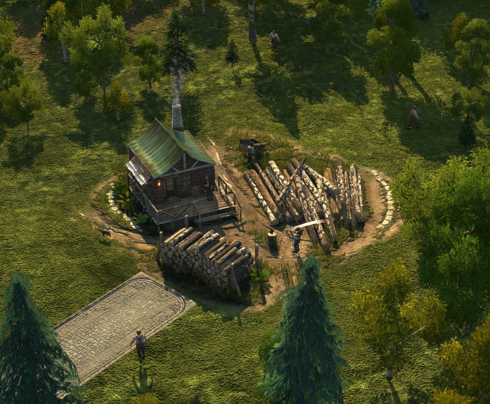

### Create new file in Blender 

Open Blender and remove all the standard elements from the workspace. 

Now already **Save** your file and create the folder structure at the right location of your mod.

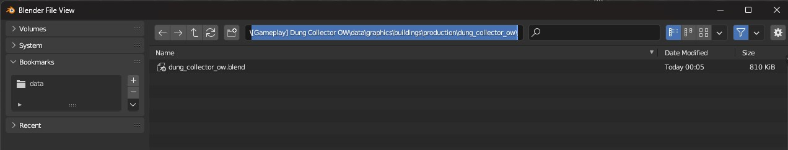
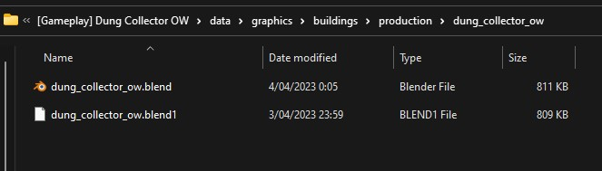

### Link mod in Anno Object Tab 

We have to make sure all our imported files and used textures are visibile in Blender. To make sure of that, we need to link our mod in the **Anno Object tab**.

To open the **Anno Object tab**, press **"N"**.

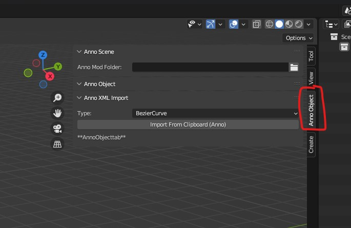

Now link the folder of your mod in the **Anno Scene** > **Anno Mod Folder**.

### Import cfg with correct base tiles

I personally find it easiest to import a building that has the correct basetiles already. That way I do not have to change that much to the IFO files.

To import the correct cfg we first need to find out which cfg we need to import and what the location is. We want the Haciende Fertiliser Works.

First we try to find the correct GUID so we can actually look for it in the assets.xml. For this we use [https://schwubbe.de](https://schwubbe.de/modding_blog.php#beitrag15) again. 

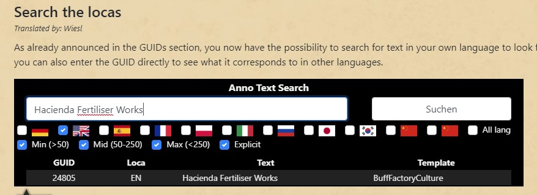

We see the GUID is **24805**. 

We now go to the main **assets.xml** and search for **<GUID>24805</GUID>**. We find 19 references and after going through them we find the location of the asset where the building is actually created. 

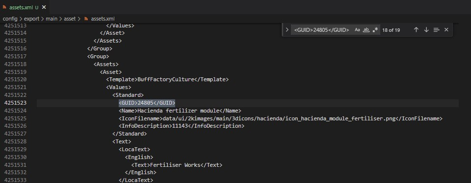

We go through the asset and look for the path to the model.
We see the path is **data/dlc10/graphics/buildings/special/hacienda/fertilizer_module/fertilizer_module_01.cfg**

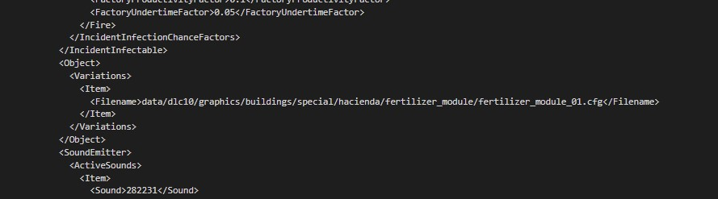

Now we can go to Blender and import that specific .cfg file into Blender.

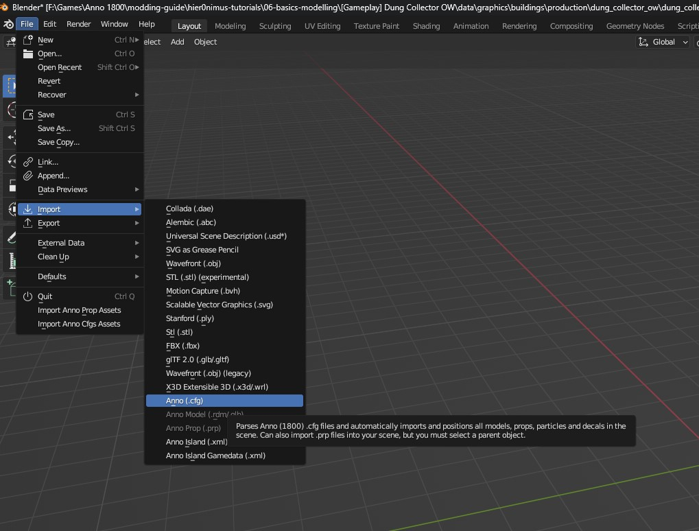

We navigate to the correct location **data/dlc10/graphics/buildings/special/hacienda/fertilizer_module/fertilizer_module_01.cfg**

We do NOT select **Import .cfg as Subfile**. This is something we will be doing later. In this case, the cfg we are importing is the main file.

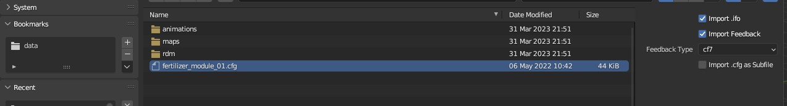

You will now see the Hacienda Fertiliser Works imported on your workspace.

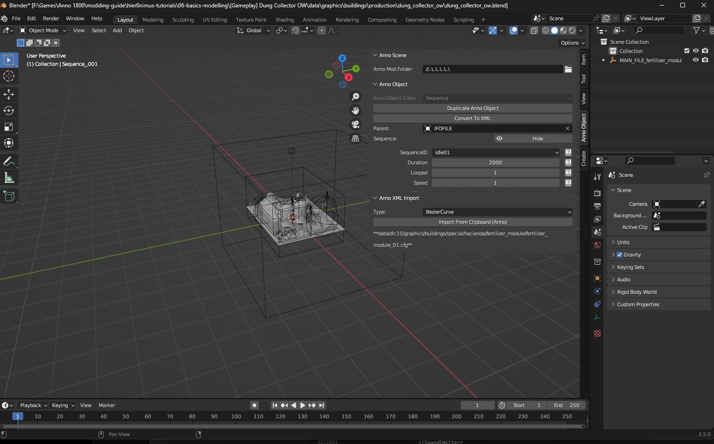

We can zoom in and out with scrolling the middle mouse button, pan to other parts with click and holding the middle mouse button + shift and then move the mouse, rotate around the object by click and holding the middle mouse button and moving the mouse.

### The interface

#### Workspace

Change the active workspace to **Modeling** to have some more space to work on and remove not needed panels.

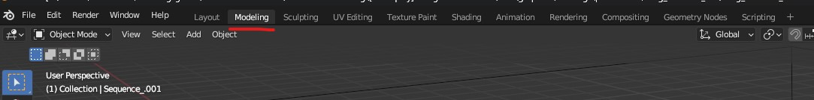

#### Viewport Shading

Change the viewport shading to **Material preview** to make sure all the links to the textures are correct.

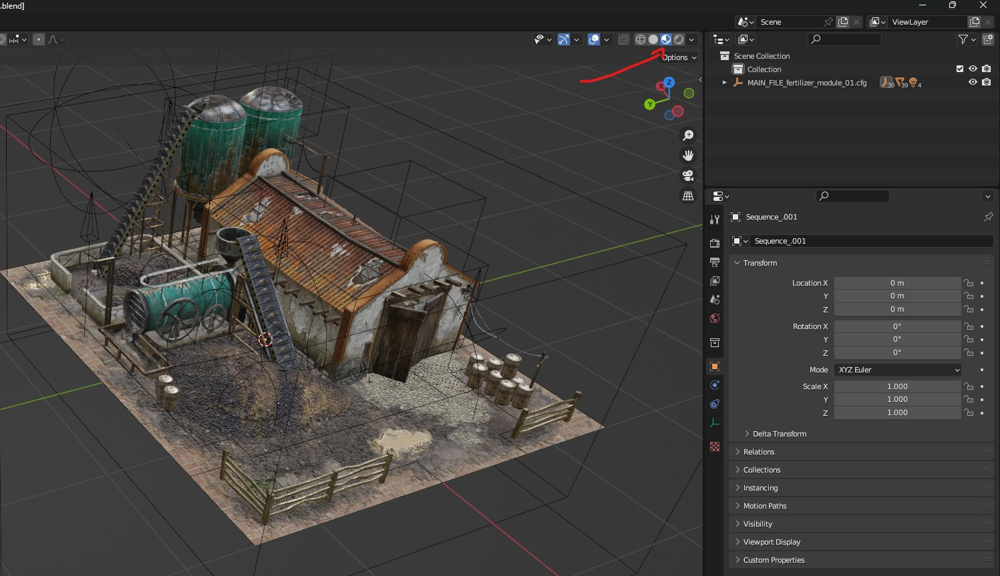

#### Scene collection

On the upper right side of the interface we have the treeview of our scene. It shows all the elements that are on our scene in a tree view. So, some elements are children of other elements.

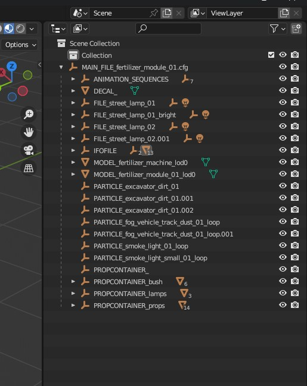

When we will be exporting our final result, we will be exporting to a .cfg file. This file will be the **MAIN_FILE** and will contain everything that is inside this parent. When we export to this .cfg file we need to select this **MAIN_FILE** in the tree view.

