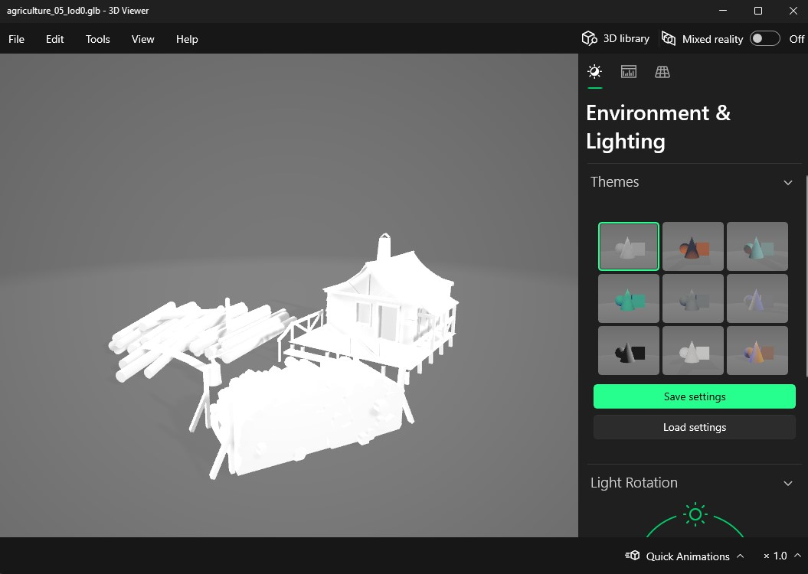
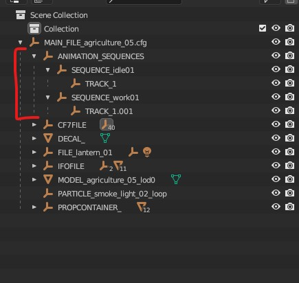
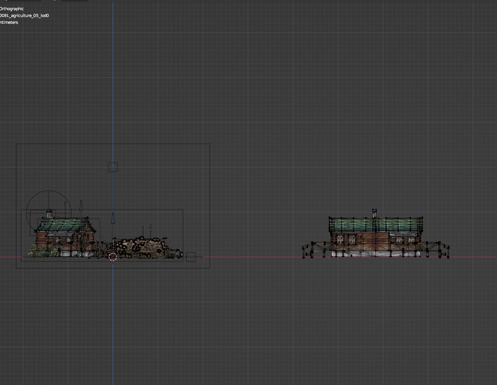
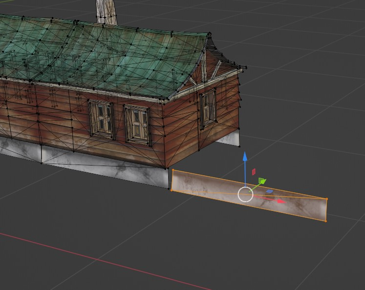
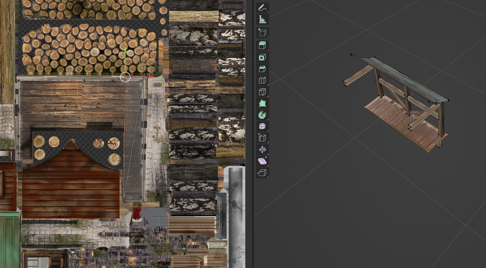
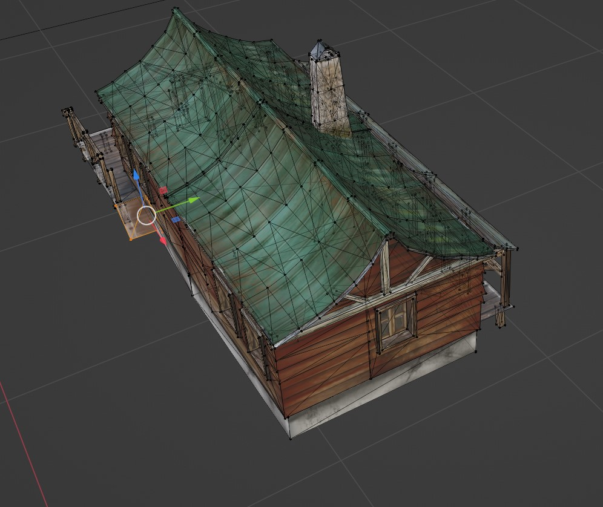
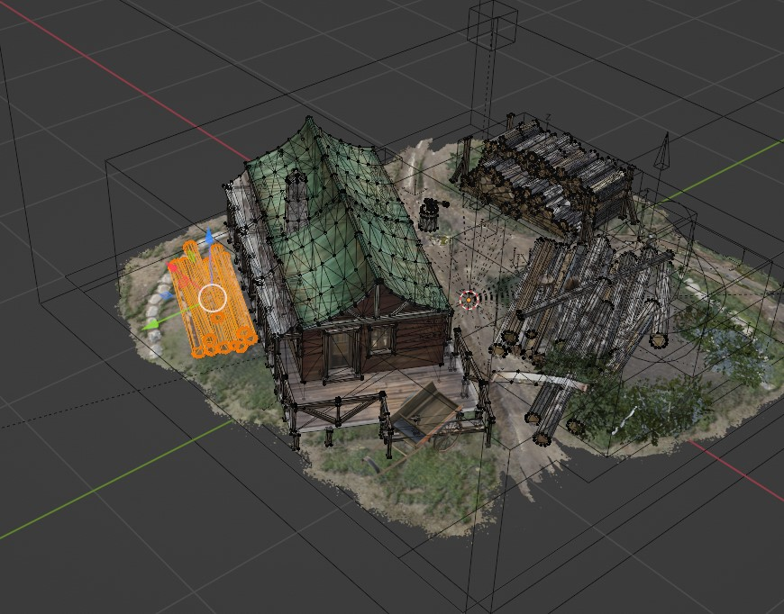
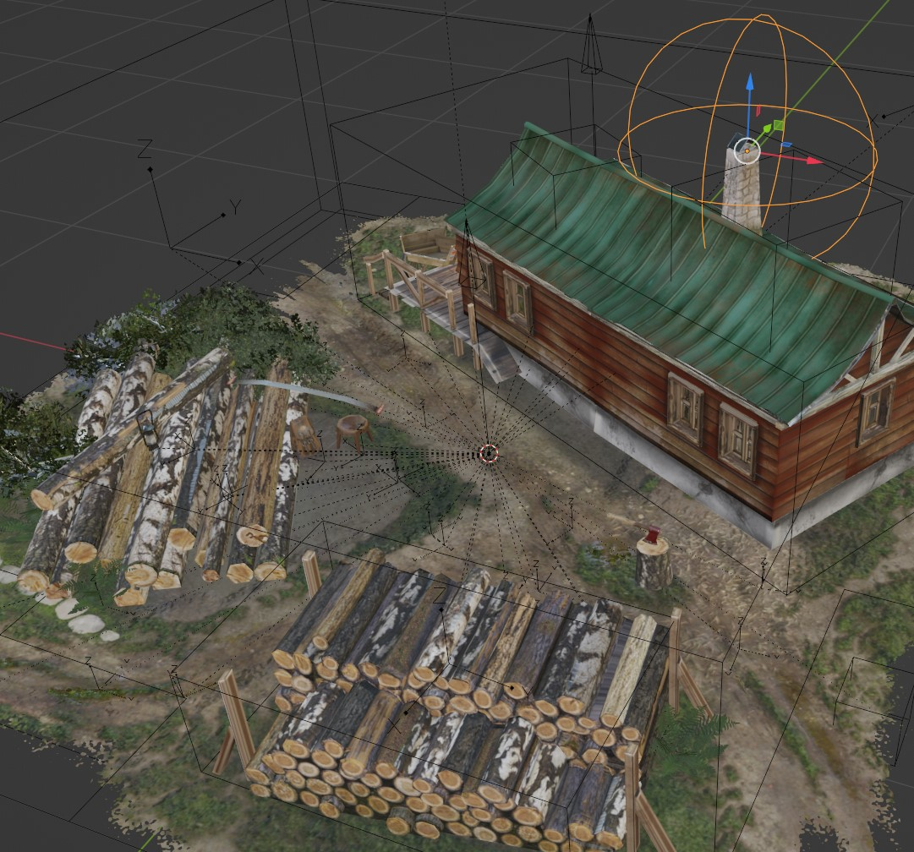
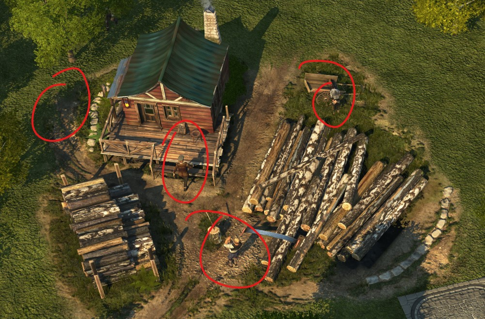
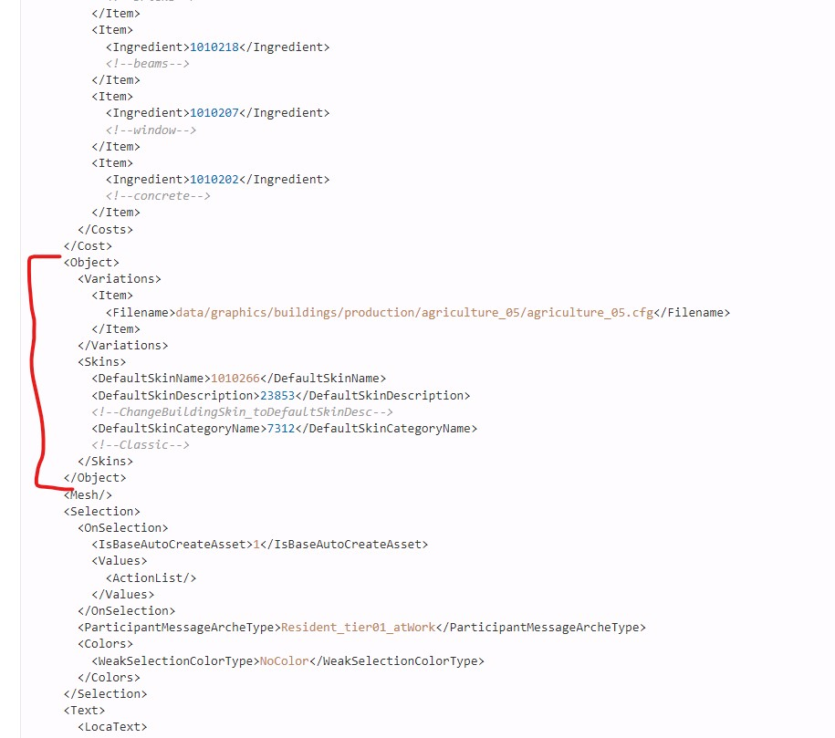

# Modelling in Blender for Anno 1800

We already did some things in Blender in previous tutorials but at this point do we actually know enough to make a new model or to actually know if something is not correctand  fix it? I have to be honest, I do not always know they ins and outs. I try multiple things and sometimes something does not work out as intended. I do a lot of things wrong. When modding, be kind to yourself. Take a step back and see what you did wrong or can do better.

For me personally Blender or I should actually say modelling and everything that comes with it like materials, animations, feedback is a huge effort to learn. In the Discord a lot of people already helped a lot, but dispite all their efforts I sometimes keep making mistakes, still do not understand where I go wrong and still have a lot to learn about a lot of aspects.

Because there are a lot of people like me that want to get started with moddeling and making buildings I thought I could already make a basic modelling tutorial for a building, building (pun inteded) on top of the ship making tutorial.

## Version 1: A simple combination of props and existing model

The first version we are going to make will be a combination of existing props and models. That way we can get to know the interface of Blender better and the different layers and structures in a Anno 1800 modelling asset.

We are going to make a new variation of the lumberjack's hut in the old world, making it possible to switch inbetween 2 variations of this building, who knows, maybe we even make multiple variants, would Miss Minutes approve this?

### The Blender setup

Make sure you have set up Blender already like we did in [Tutorial 4](https://github.com/anno-mods/modding-guide/blob/main/hier0nimus-tutorials/04-making-new-ship/readme.md#blender).

You have:
- Added rdm4 converter
- Added texconv.exe
- Added AnnoFCConverter.exe
- Added FileDBReader
- Added Blender-Anno-.cfg-Import-Addon and linked all the paths correctly in this extension
- Activated Mesh A.N.T.Landscape

### Looking for the correct model

In normal cases we will be making a new building. But for this first building modelling tutorial we will be frankensteining an existing building and make a variation for an existing building not making new production chains but just more variety when building the same building again.

We will be making a new model for the Lumberjack's hut in the Old World. Nothing fancy, nothing big. It will make us understand the different steps in the workflow and the different parts of the model.


As we have seen before, every asset like a building is stored somewhere on the rda files. You should have already extracted all the rda files to be able to open the files within those rda files. If not, got back to the first tutorial and learn more about extracting the rda files. [Tutorial 1](https://github.com/anno-mods/modding-guide/tree/main/hier0nimus-tutorials/01-my-first-mod#how-to-open-the-rda-packages)

To know which building we need to use, we need to know the path to the building. For this we can use different sources like we did before by searching for a GUID or the name of the building.
- Go to [https://schwubbe.de/modding_blog.php](https://schwubbe.de/modding_blog.php), and scroll down until you see “Search the locas”.
- Search for "Lumberjack's hut"


You will see a couple of results from a building template. The first one is clearly for the Arctic. The second (GUID 1010266) and thirth (GUID 101260) could both be for the Old World. But which one is not clear here. 

We could again dive into the assets.xml and look for their GUID. But we could also use another tool that could be handy.

- Go to [https://www.a1800.net/](https://www.a1800.net/) and search in the upperleft search field for the first GUID you want to check.


You will get the result for this GUID. Like the Schwubbe website this tool also searches in the assets.xml but adds some extra functionality to it. You will have to possibility for example to expand the searched asset and get more information from it or look for additional assets.


The result we get is the one we need. To be sure we could also search for the other GUID 101260 to make sure. If we look for that one we see this is the one from the New world (Colony01).

If we go back to our GUID 1010266 we can click through to get the detailed information for this building. We see for example that the colony01 asset inherits from this asset and is a subasset.


If we scroll a bit down, we come accross the section "Values". Here we can find all the information for the building. We can see the name, the template, what the building produces, what it cost to build the building, ect. All the same things that we can also find in the XML. Actually, all those values are actually the values from the XML but just shown in a more user readable way.


If we scroll back up, we can see we have different tabs, one of those tabs is the XML tab. With this tab we can actually switch to the XML view for this building.


This is actually the same XML as the one from the assets.xml but just cut out from the gigantic structure of the assets.xml.


#### The link to the model

In both overviews we can find the link to the model in the rda folder. We need to look at Object/Variations/Item/Item/Filename and there we will find the path **data/graphics/buildings/production/agriculture_05/agriculture_05.cfg**. With this information we can go to our extracted rda folder and go to that path to find a .cfg file. 

#### .cfg file

A .cfg file is the file that contains the whole package of the building. The model, all the props around it like trees, boxes. It also contains the link to the animations and so much more.

Go to the path **data/graphics/buildings/production/agriculture_05/agriculture_05.cfg** and look for this .cfg file.


As you can see, in this folder we can find more then just the .cfg file. We have more files and even folders.

### What is inside a building folder?

#### maps folder

The maps folder contains the materials specificly for this building. If we look at a model we use in Blender, it is build with different parts. The model is one part but around that model we wrap a material to give the model the visible look/color/texture like bricks or metal roof.


If for exmaple we open agriculture_05_diff_0.png or agriculture_05_diff_0.dds we will see this is a flat image of all the different looks of the building and things around it. It is like a sheet of paper that will be wrapped around everything. We already saw that with previous tutorials but it is important to understand this.


The different versions (_0, _1, _2, _3) are used for different zoom levels to load lighter variants instead of always loading the heaviest variant. If we are zoomed out we need less detail then if we are zoomed in.

#### rdm folder

The second folder is the rdm folder which contains all the models that are used specificly for this building.


If we have a normal windows installation, we should be able to open the **agriculture_05_lod0.glb** file to see the model. Try this and already see the model we will be frankensteining.



#### All files

If we look at all the files the most important ones are:
- .cf7 and .fc
- .cfg
- .ifo

The cf7 and the .fc file are both for feedback/animations. When creating feedback and animations in your building, when exporting the building to a .cfg file, it will export specific feedback/animation information inside the .cf7 and .fc file. The .cfg file will look for those files. So, if you link the .cfg file in your building path in the building asset in the assets.xml, that cfg will be loaded inside the game and the game will look for those .cf7 and .fc file via the .cfg file.

The .ifo file contains additional information about the workspace the building is within (tilesize, height in which the building can be viewed, places where animations can walk, where fire can be placed with incidents,...) and additional technical placements like where the cart to pickup or deliver goods will go or the info icon that is floating above the building. This file will also be created when exporting the .cfg file from blender and so the .cfg file needs this file just like the animation files to work proporly if they are used in the model.

### Create new file in Blender 

Time to actually start!

Open Blender and remove all the standard elements from the workspace. 

Now **Save** your file already and create the folder structure at the right location of your mod. 

We could add our building in the same folder as the agriculture_05 because it is just a variation. But to learn about making our own building we will create a new folder called **agriculture_05_variations**. 

My setup in Blender is done that Blender looks for the files in the rda folder, so I create this folder in the exported rda folder, next to the agriculture_05 folder.


Save your blender file inside this folder with the name **agriculture_05_variation_01.blend**.


### Link mod in Anno Object Tab 

! Only needed when you move your mod to another folder and not inside the exported rda folder. Skip this step if not needed. !

We have to make sure all our imported files and used textures are visibile in Blender. To make sure of that, we need to link our mod in the **Anno Object tab**.

To open the **Anno Object tab**, press **"N"**.

Now link the folder of your mod in the **Anno Scene** > **Anno Mod Folder**.


### Import the cfg 

We know the original location of the .cfg file we will be using as a base. When creating a new building ALWAYS start with an existing building. That makes your life SO MUCH easier because a lot of parts that you need are already there. For example all the parts in the IFO file.

Go to Blender and import the **agriculture_05.cfg** file into Blender.


We do NOT select **Import .cfg as Subfile**. This is something we will be doing later for more complex buildings when we want to add extra buildings within our existing building, import multiple cfg files in the same blender file.

You will now see the Lumberjack's Hut imported on your workspace.


We can zoom in and out with scrolling the middle mouse button, pan to other parts with click and holding the middle mouse button + shift and then move the mouse, rotate around the object by click and holding the middle mouse button and moving the mouse.

### The interface

#### Workspace

Change the active workspace to **Modeling** to have some more space to work on and remove not needed panels.


#### Viewport Shading

Change the viewport shading to **Material preview** to make sure all the links to the textures are correct and you can now see the building in his full glory with all the materials wrapped around it.


#### REMARK!

If something is not looking good, there is probably something wrong with your setup of the plugin in Blender, or the exported rda folder. Check [Tutorial 4](https://github.com/anno-mods/modding-guide/blob/main/hier0nimus-tutorials/04-making-new-ship/readme.md#blender) to make sure all the following things are setup correctly. You have:
- Added rdm4 converter
- Added texconv.exe
- Added AnnoFCConverter.exe
- Added FileDBReader
- Added Blender-Anno-.cfg-Import-Addon and linked all the paths correctly in this extension
- Activated Mesh A.N.T.Landscape

#### Scene collection

On the upper right side of the interface we have the treeview of our scene. It shows all the elements that are on our scene in a tree view. So, some elements are children of other elements. You can open all the parents to see all the children elements.


When we will be exporting our final result, we will be exporting to a .cfg file. This file will be the **MAIN_FILE** and will contain everything that is inside this parent. When we export to this .cfg file we need to select this **MAIN_FILE** in the tree view.

### Different Scene elements

If we dive deeper into every element we discover that every element has their own function or aspects to it.

#### ANIMATION_SEQUENCES

If we open this, we see 2 different children elements. One for the **idle** state, and one for the **work** state. We will come back to this later in this tutorial or a different tutorial. It is good enough for now to know this is needed for feedback / animations that are used in this building and it has 2 states depending if the building is working or idle. For example when working smoke could come out of the chimney and when idle there is no smoke. This is is small but clear example and animation. 



#### CF7FILE

If we open this element we see a lot of different children that again contain children. The cf7file contains all the animated feedback elements for this building. So for example people running around doing things to make the building more alive instead of just a static building. This is also tied to the ANIMATION_SEQUENCES states. When the building is idle those people will probably not be there running around but only there when it is in a working state.


The first level is the group and those groups contain the actual asset. For example if we look at the bird_land asset, if we select the child asset we see it is located on the roof of the building.


If you select the element and look in the Anno Scene tab (Shortcut **N**), you will see additional information and settings for every element.


#### DECAL_

The decal is the ground texture underneath the building. If you do not have a decal, we would just see the standard texture of the island where we put the building. 


In this case we have a lot of dirt as decal with grass and paths. The decal is in most cases the same size as the amount of tiles the building takes.

#### FILE

Next we have a **FILE** element. In this cases, it is a lamp. If we open this we see that this contains another linked .cfg file.
 


FILE elements are linked elements. We do not change those inside the cfg we opened but open the original linked cfg if we want to adapt them. They are linked in the file and only reference to an existing element.

We will also be adding new FILE elements which will be linked cfg files. Those can be models with textures and other elements with functionality.

#### IFOFILE

This file contains a lot of important children.


- BoundingBox_BoundingBox: This is a big box that wraps everything of this scene. Every model, prop, other asset needs to be inside this box. If not, it will be cut off ingame and we will have a visual problem. For example, if we have smoke that goes up, the box needs to be tall enough for the smoke. So we will have to scale this box according to the size and other modifications we will be making.


- BuildBlocker: This has the amount of tiles the building is actually using. The tile footprint and the tiles that the building blocks/needs. If you select this you see this is the same as the decal in this case.


- Dummy_DamageImpact: This shows impact of damage on the model when attacked. There can be multiple files of this.


- Dummy_infolayer: If you select this you see a cube above the building in the center. This is the location infolayers are shown. For example when there is missing workfoce.


- Dummy_transporter_spawn: This is the location where the cart comes to the building to load or unload goods.


- FeedbackBlocker: This shows the places were the feedbackunits can walk. There can be multiple files of this.


- IntersectBox_Hitbox: The box where the model can be hit by damage. There can be multiple files of this.


- MeshBoundingBox_MeshBoundingBox: This is a smaller box as you can see, it only wraps around the model and the meshes of the model. Same logic as for the BoundingBox_BoundingBox, but now only for the model. When we make our model bigger we will have to make sure to also make this BoundingBox bigger.


- Sequence: Are linked to the animations

**Other possible children:**
- Dummy_FireDummy: This shows impact of fire on the model when on fire.
- Dummy_hit_metal: This shows the impact of metal (for example special weapons) on the model when attacked

#### MODEL_

Different models that contain the different buildings. The models are linked .rdm files. Like the FILE elements they link to an external file, in this case an rdm model that is located in the original agriculture_05 folder inside the rdm folder. If we want to adapt an existing model and use this new model we first need to export the changed model to a new rdm file otherwise the cfg would still use the original rdm file without the changes.


**Good to know:**

Important to know is that when we export our .cfg file, this export will look up the reference to this model, so the link to the model. The scene does not contain the model itself, but a reference to a file that is somewhere in the folderstructure of your computer. This is important because when moving folders/files this reference can be broken and opening your Blender file can then result in models not showing. This model also contains the materials and also those are linked.

#### PARTICLE

Those files are PARTICLE types and are in this case smoke particles that comes out of chimneys.


#### PROPCONTAINER

The PROPCONTAINER contains extra props like barrels, storage things, plants, ect. We already used this in previous tutorials. If we want to add new props we need to make sure we select the **PROPCONTAINER** when importing. Those props are again linked files with references to other external files.


In this example we selected the backpack prop that is on the porch of the building.

### Let's adapt our model

Now that we know what every file in the treeview does, we can start actually do some magic and make a variation of the building.

Again, if you do not have experience with Blender, moving around and using the tools in Blender can be hard. I would first suggest just to follow some basic Blender tutorial that has nothing to do with Anno to learn the basics of all the tools. Otherwise some basic movements or tools could be hard to follow. There are so much basic tutorials you can find on youtube, just one search away.

If we select our model, we see the orange outlines of the model and what it contains. We see the building, the wood around it, the chopping block with the axe.


Switch to **Edit Mode**


Now you see all the vertices of the model. 

Press 7 on the numpad to get a topview of your workspace.


#### Make a selection

On the left, select the move tool.


Activate X-ray view to make sure when selection you select also thgough the model and not only the front of the selection of the model.


Now select the logs of wood.


You will not be able to select them with one rectangual selection without also selecting a part of the building. If you also selected a part of the building click next to the selection to unselect everything and make a new smaller selection.
Hold shift before making a second selection to add your new selection together with the previous selection.


Another great tip to make sure you selected everything from a specific object is when made a partial selection, you can press CTRL+L to select all adjacent vertices of that object resulting in easy selections without manually having to add many selections untill you have selected everything. This is a LIFESAVER! Take it from me and thanks to Taube for pointing out this tip to me!

If you want to remove a part of a selection you can hold down CTRL and make a selection. Then the new selection will be removed from the current selection.

#### Move the selection

Now that we have made a selection of our model, we will move this out of the way. The moment we move something/change something we technicly have a model that is not the same anymore as the original, resulting in a variant of the building. Offcourse we want to do more then just move the logs and make our variant more different.

Use the blue arrow to move the selection up on the Z-axis, green one to move on the Y-axis and red to move on the X-axis. 


Just move out out of the way for now.


If we look closely, at the location where the logs where is another element that is maybe not so clear on first sight what it could be. If we switch back to **Object mode** and select this element we can see in the treeview after some highlighting that this is actually an animation for fire.


So, when the building is on fire, on this location fire will appear. This makes sense because those logs could be on fire. Now that we moved those logs that fire is offcourse not on the right location anymore, unless we put something else at that location that could be on fire.

For now we will just move the fireDummy on the location of the logs and will leave the other dummies at their current location. We can do this the same way we moved the parts of the model, with the move tool and the arrows. 


When we finish the model we will go over every animation dummy to see if they are still on a logical/correct location.

### Frankenstein the main building

Now the main part of this mod will be done. We will be adapting the main building and create a new building from it. In a more advanced building we would probably have a lot more possibilties, but for this first basic tutorial it is good to start with something smaller to get to know everything.

#### Selection of the building

Make a selection of the main building inside the model.
- Select the model
- Change to Edit mode
- Go to the topview or another angle where you can easily make the selection
- Make the selection of the main building using multiple selections via holding SHIFT or removing parts by holding CTRL or using the CTRL+L to select all adjecent vertices of a smaller selection.


#### Copy the main building

Inside the model, we make a copy of the selected main building. Making a copy results in keeping the original building in case you still need it or want to start over or need parts you removed previously. It is a good practice just to be better safe then sorry.

Copying the model can be done when in Edit mode, having made the selection of the parts you want to copy and then pressing SHIFT+D and moving at the same time the mouse to the location where you want to move the copy to. If pressing the middle mouse button at the same time the copy will move accross the closest axis resulting for example to keep the copy on the same height as the original. This can be interesting to just keep certain references distances or locations.


You can also move the selection again with the moving tool and the arrows.


Important to understand is, that we are still within the same model, but inside the model we just copied vertices. We can check that because in our treeview we still are inside the same MODEL file. Switch to Object Mode and selecting the model we will see the complete selection of everything.


### Go crazy!

Now comes the creative and crazy part. With the available parts of the model we can do whatever we want. We can duplicate them, remove parts from it, add extra parts to it, ect. Your imagination is your best friend here. From this point everybody can make something different.

As an example I duplicated the main building again and add it as an extension of the other building resulting in a larger main building.


But that is only the start. Now we could for example remove the second chimney because 2 is a bit to much. We could remove the second door, remove the porch just to keep the main extension of the building.

We do this by carefully selecting the parts/vertices that we want to manipulate. Making a small selection and then doing CTRL+L is again your best friend here.


When having your final selection you can just press the DELETE key on the keyboard. A small tooltip will open asking you what you want to delete from the selection. In almost all cases you want to delete the vertices. 


Resulting in this case in the second chimney being removed.


As you can see, not everything connects beautiful together where the 2 buildings meet eachother. 


Depending on the buildings and how much effort you want to put into it you will be doing a lot of changes to a building to make sure every part is nicely done.

The important part here is to understand how you move parts around and how to add and delete parts. That is what we did above.

Now I'll do some changes of my own without actually going into to much detail and describing all of them. The changes are basicly all what I described above, moving, adding, deleting parts of the building.

In this case maybe before merging both buildings together we could first make a duplicate, remove a lot of the parts and then when we have a final second part only then merge it into the other building. That would be much easier to select vertices from the second building and not accidently selecting parts of the other building.


Go nuts! And have fun! See you at the end result!

### Some tips

- To make it easier to work on the model, move it away from all the rest.


- With the other numpad keys, you can toggle inbetween other views like sideviews for easier selection or making sure something is straight aligned.




### Stitching buildings together9
Making sure the buildings are nicely stictched together by adapting/moving multiple points on their own or in smaller groups. 


### Remving the door leaving a hole and filling the hole with a new or existing part

When we remove the door the wall has a hole into it. We now need to fill that hole. We can dot this in different ways.


### Extending existing neibouring parts

The first and easiest solution is to extend a part next to it. This will result in the existing part being stretched and sometimes misformed resulting in not a good result. It really depends on the location and the surrounding vertices and the materials that are wrapped around it.


In this case it is okish. It could have been a lot worse.


### Moving something that goes wrong

If we want to move for example the window next to where we removed the door, you will soo materials have a huge impact on how you move parts around.


We clearly see the distored material on the walls. Undo this with CTRL+Z.

### Duplicate a part fo fix a hole

I removed the porch at the back where I removed the door. Now at the base of the building we have a hole. We can fill this by duplicating the bottom part from the sides and putting it in place of the hole.


Select one of the parts.


Duplicate the part with CTRL+D and drag away from the original position while clicking the middle mouse button to stay on the same X-axis.



Rotate 90 degrees with the rotate tool, turning the part dragging on the blue half circle. Hold down SHIFT while dragging to ge in steps of 5 degrees.


Press 1 on the numpad to go into the sideview for easy movement.


Select the specific anchor point of needed to move them to the desired locations.


Change views if needed


Again, we stretched this part compared to the original size. But again in this case it is fine for this small tweak.

### Extend the extension of the building with the roof and the deck

To show another way of duplicating a part but the need to adapt the material we will be adding some additional decking around the building based on the existing parts.

Duplicate the existing deck with the roof.


If we remove a big part, we loose a big part of the deck that we still need. 

Example:


To solve this we will be moving some of the anchor points around, resulting in disformed materials, but we will be fixing those in a second. See the benath taken steps to get the result.


Now select the base vertices, the 2 triangles forming the rectangle.


Now switch to UV Editing at the top


On the left you can see the material again that we previously have seen in the maps folder in the original building folder.

On the right you see the vertices but without the materials, you can show the materials again by toggling the viewport shading.


Select the available vertices on the left. Those are the same vertices as the ones that are selected on the right.


As you can see, the vertices on the left still have the structure as before we moved the anchor points. On the right we clearly see the disformed material because by moving the points in the model and the material still is on the original location the complete material is disformed wrapped around the vertices.

We can fix this by moving the anchor points and vertices also on the material in the left panel. In this case we do this in the existing material, but this clearly shows the power of what you can do with the materials when using customg materials.



And just like that, we fixed the material on the part of the model!

Switch back to the modelling view to have more space again to work and close the screen where we adapt the material.

We can now move the part on the location of our choosing and maybe even duplicate it a couple of times.


Duplicate the ramp from the other side of the building and move it to the newly created decking with roofs.




As a last small change maybe we could change the material on the vertices of the ramp because now it is not really ok.


### The result


If we have a look at our building we already can see a lot of differences. In the end it really looks te same, but we only scratched the surface of what is possible.

### Building placement

Now we have to make the decision to place our building on a good part of the decal. In a perfect world we would also create a custom decal to better match the buildings placement. But for this tutorial we just stick with the existing decal.

I hope you saved the changes already from time to time to make sure when Blender would crash you would not loose all the work.

Go back into the top view and remove the backup building. Then move the new building on a location. Because we made the building kindoff big, and we do not have that much space we made it hard for ourselves to fit in the building on this decal if we want to match the ground a bit. Not putting it above a piece of pathway or above something else that does not make sense. You will immediatly see the struggles you can have. Do not take the propsor animations into account at the moment. We will move them after. The only thing to look out for is to stay a bit from the edges and within the BuildBlocker that can be selected inside the IFOFILE.


Do not worry about some things in the decal that are not looking good. We can mash a lot with placing some props above them like brushes or boxes. We will do this in a second.

We could move the logs back on another location.


And maybe remove some of them or move some of them around to create some differentiation.




Adapt the existing pile of wood a bit bu turning it 180 degrees and moving it a bit.


I think we now have our final building! Good job!

### Moving existing assets and make sure everything is correct

Now that our building is at the correct location and we are not going to mave anything anymore, we have to check all the other assets and files inside our existing structure. For this tutorial we will just be rearranging the existing animations and lights and move around some props. But in more advanced tutorials we will see how we actually add new ones.

#### Moving Dummy_DamageImpact, IntersectBox_Hitbox and FeedbackBlocker_

If we check the location of the 3 different files in the IFOFILE, we see the FeedbackBlocker_ files are still ok.

The Dummy_DamageImpact files and the IntersectBox_Hitbox files need to be moved. Let's move those one over to the building we created.


All the other things in the IFOFILE are ok.

#### Move FILE_lantern_01

The included lantern file that was originally at the porch of the building is still at the old location. Move it to the porch of the new building. Make sure to select the highest parent of this file, so **FILE_lantern_01** and not one of the children. When including a file and manipulating something like the location we always have to do this on the highest level and never on the lower children level.


As you can see we actually did not move the lantern itself but the light. The lantern is a prop that is a different file. The file we moved is the ligh effect which is also important! The latnern itself will be moved in a bit when we move the props around.

#### Move PARTICLE_smoke_light

Next is the smoke particle, the smoke coming out of the chimney when the building is active. Move this to the new chimney of the new building. It can stay at the same height because the chimney is at the same height as the previous one. So just move it along the X-axis and Y-axis. This can be easily done by pressing the 7 on the numpad to switch to the topview.


That look good already!



#### Moving props

Now one of my favourite parts, moving, adding props. Props are the small additions you can just add or move around giving the building a more complete feeling. Let's go over every prop that is already in this file by opening PROPCONTAINER_.

The first one is a **PROP_backpack_01**, this was at the porch of the original building. We can move it around again at the current porch or place it somewhere else. Let's put it next to the base of the house.


Next is a series of brushes that were previously all around the house. We can move them around again and see where they fit accordingly. We can also rotate them, maybe scale them a bit, making them bigger or smaller.


If you want to add more brushes and duplicate an existing brush to get another copy of it, you can use the "Duplicate Anno Object" key in the Anno Object tab when selecting the prop you want to duplicate. 


If needed you can still adapt the model a bit. For example I changed the rotation of the logs a bit to fit better.


Next of the props is the PROP_economy_market_horse_carriage_02. This cart is now at the same location as the building. Which is not really ok. We will actually remove this cart and add another cart instead that is a bit smaller in a second.
Just delete the prop by rightclicking and choose **Delete hierarchy** or just press the delete button on the keyboard when the prop is selected.

Next is our lantern (PROP_lantern_02) where previously we already moved the light from. The lantern itself is the model, but when you change the time in the game and it becames dark, we want this lantern to light up the surroundings. That ligh is done with the FILE_lantern_01. Move the PROP_lantern_02 to the same location as the FILE_lantern_01.


The last prop that we alreadu have ingame is the PROP_stool_01, which was also on the porch. Move it to a location of you choice.

We now have moved around all the props but I also want to show how we can actually add extra props that are not in this file yet. We already did this in the previous tutorial but will do it again as an exercise.

### Adding additional props

Make sure you select the PROPCONTAINER_.


Now go to File > Import > Anno Prop (.prp)


A window will open where you can select the prop you want to import. For this, we need to go to the location of the props that are available. Those props should all be extracted in the rda folder just like you extracted all the buildings previously.

The location of the props can be different, just like the location of the buildings. Props are a bit arranged together in the same folder. The base props can all be found in **data\graphics\props**. Newer props that are released with new DLC's can be found in the corresponding DLC folder underneath graphics\props for example **data\dlc04\graphics\props** for DLC04.

For this we just go to the main props folder **data\graphics\props**. 

There we can see a list of different folders all containing specific props.


For this time I want to add a tree and another cart to move things and maybe a wooden box. All these things can be found in one of those folders.

First let's take the tree. This can be found in **terrain_props\vegetation\trees\moderate**. There we have the list of available trees to choose from. I'll just take **tree_moderate_01_var0.prp**.


This tree is now placed in the 0,0,0 location of our file. We can move it around or maybe resize, rotate it to the correct location/demension.


Now select the PROPCONTAINER_ again to import another new prop, the other cart. Then again go to File > Import > Anno Prop (.prp).
The cart we want to include is inside the **vehicles** folder. After this tutorial or now you can just take the time to open every folder and just see what is available. After some time you will know which props are available and where to find them. There is a way of importing all he props in a library inside blender making it possible to just easily use the props. But for now we just do it this way.

Import **flatbedwagon_01.prp** from the vehicles folder.


Again, move it to a desired location.


Last thing we will be importing is a wooden storage box. This can be found in the **storage** folder in the props folder. Can you manage to do it without me telling you step by step what to do?


#### Moving all feedback units from CF7

Now there is another thing to do, checking all the feedback units. I'm going to be honest, this is not my strongest part. I'm still learning about this at the moment so the things I'm going to do are going to be basic and there are probably going to be some small mistakes

First let us check the CF7 file. 


We have:
- Bird
- Dogs
- Door that opens
- Fire
- Foreman
- Walking
- Woodcutter

To be able to move the feedback units around, make sure you are in Object mode!

Let's go ingame and have a look at the original feedback and how the people move around.




Let's start with the bird. I checked the building ingame and the different stages, but could never see the bird. So, I would just remove the bird.

To do this, right click on the DummyGroup_bird_land and choose **Delete Hierarchy**.

Next is the dog. We see 7 steps that the dog takes going from one point to another. Check all steps by selecting them and see if the dog still goes around all objects or ob he walks through something.

If we check this in our case, only Cf7Dummy_Dog_0 is at a location where there are already otger things. So we move this one a bit.

Next is the feedback_door. I would just remove it. Delete the group.

Next are all the FireDummy. Move them to a desired location that can actually burn, like the building or the logs.

Then we have **Foreman_01**. This is the one that goes from the house to the woodcutter, sits down, ect. This can be a tricky one because he also goes up and sits on the stool. If we can not know which specific file is the one where he sits down we maybe better remove this one to not get weird behaviour. 

If we analyse them and see the positions we see that Foreman_01_0, Foreman_01_1, Foreman_01_8, Foreman_01_9, Foreman_01_10, Foreman_01_11 were all at the porch above the ground. If we analyse the walk of the foreman ingame, we see that Foreman_01_0 and Foreman_01_9 both go inside the house. So that is the location inside the house. We could already move those to another location. If we analyse the rest we can see he goes from 0>11 making a loop. We can move the serie of files accordingly.

Then we have the walking asset that makes a curve but is on the location of the house in some cases. We should move those also.

The last one is the woodcutter but that one should still be at the correct location, unless you moved the chopping block.

We are now done with the animations. We can now start finalizing everything for the model part. One last thing to check.

### Check adapt terrain height

One of the big hurdles for people starting with the modelling part is when the building and the props are inside the ground or floating above the ground. This is because the setting "AdaptTerrainHeight". 

Let me explain what this setting exactly do.


If we look at the school on the left, and the market on the right, they have a different setting for AdaptTerrainHeight / Adjust To Terrain Height.

If you look at the red lines I have drawn it shows what the adaptation to terrain height means. 

If there is adaptation to terrain height, like the market, the building moves according the slope of the terrain parallell with it. The height depends on the height of the terrain underneath it, it adapts to it. If adaptation to terrain height is set for a prop for example, the prop will adjust according to the terrain moving up or down depending on the height of the terrain. This is needed because for example if we put a brush on the ground, but the ground in the game is not on the same height as in Blender we want to brush still to be on groundlevel and not floating above the ground or underneath the ground. So props that are on the ground always have adapt to terrain set to 1 / yes. If we use that knowledge and see the market, that is why the market follows the slope of the hill.

If we then look at the school this is a different story. We have the left part of the school building that is on groundlevel but the right part of the building of the school is above groundlevel. If we look at the roof it is not parallell with the ground like the market. The school building does NOT adapt to terrain height. It sticks at a certain height and stays at that height resulting in pieces being underneath the ground and other pieces above the ground. If we take that knowledge and use this for props, in some cases we want props to act like this. For example of we put a lamp on the wall of this school, we want that lamp to be always at the same position of the wall of the school so it should not adapt to terrain height like the school does not adapt to terrain height. The particle of smoke for example that comes out of the chimney should also not adapt to terrain height because the chimney is also always at the same height.

As described above, we now understand the difference between the two states. Now we take that knowledge and check if all our used models and props and other assets follow the logic we want.

#### Which logic do we have in this case?

There are different assets that needs adapt to terrain height defined. 

The first and most important is the model. In this case the model consists of the building and the logs around it. If we go in sideview we see that we do not have parts of the model underground. Because we do not have parts there, we are forced to let everything adapt to terrain height, otherwise when the left part is at ground level on a slope the other part would float or be underground.


Let us select the model and first rename the model and the MAIN_FILE to agriculture_05_variation_01.


Then in the right panel we select the material proporties tab to see the materials that are used for this model. If we scroll down we see ADJUST_TO_TERRAIN_HEIGHT which is checked. Which means this model will act like the market and follow the slopes of the terrain. This is what we want in this case. 


Next to check are the FILE and PARTICLE assets in this file. We have both of them.

If we select the FILE and we open the anno object tab we see the AdaptTerrainHeight for the selected FILE. Which is again what we want. If the building where the lantern of this light follow the slope, the light should also follow the slope of the terrain.


The same for the smoke PARTICLE.


Last we have all the different props. If we select one we see a setting "Flags" in the Anno Object tab. If set to 1 the AdaptToTerrain is true/yes. If set to 0 it is set to false/no. In this case they are all set to 1 which is the correct setting.


We can check all the props just to be sure.

We are now ready with our building and are ready to export everything.

### Export the model

First we need to export our newly created model, so when exporting the cfg, we use our new model instead of the existing model.

Select the MODEL file in the treeview and make sure you are on **Object mode** and NOT in Edit mode.

Before we export we have to make sure the position of our model is correct relative to the MAIN_FILE. To reset this position we press CTRL+A, a tooltip popsup where we choose "All transforms". If needed the point will be reset to 0,0,0.


Then go to File > Export > Anno Model (.rdm/.glb)


We navigate to the new folder we created for the building where we also saved our blender file, **data\graphics\buildings\production\agriculture_05_variations**.

In this folder we make a new folder called **rdm** and will save our model inside this folder.


Before we save the model to **agriculture_05_variation_01_lod0.rdm** we change the Vertex format setting to the second option.
Make sure to save to **.rdm** and NOT .glb. A .glb file will be made automaticly, but not the other way around and we need the .rdm in the game.


### Export the CFG

Now that we have exported our model we can now export to the main cfg file.

Select the MAIN_FILE in the treeview and then go to File > Export > Anno (.cfg)


On the right you see different options, because we are using the CF7FILE we make sure the Feedback Type is set to cf7.
All the rest can stay the same.


We now have a finished building inside a building folder ready to be used.

### Setting up for using ingame

First we should make a complete mod structure so we can include the new building inside this mod folder structure together with the code we need to include the new building as a variation to the existing lumberjack's hut.

#### Folder structure for the building

- Make a folder called "**[Building] Lumberjacks variation**"
- Inside this folder make a folder called **data**
- Inside this folder make a folder called **graphics**
- Inside this folder make a folder called **buildings**
- Inside this folder make a folder called **production**
- Copy your agriculture_05_variations folder into this folder

Now we can check if all our files are correctly in the folders. 


#### Folder structure for the code

Last but not least, we make the folder structure for the code we have to write to include our new model to the lumberjack's hut asset.

- Go to the "**[Building] Lumberjacks variation\data**" folder
- Inside this folder make a **config** folder next to the graphics folder
- Inside this folder make a **export** folder
- Inside this folder make a **main** folder
- Inside this folder make a **asset** folder
- Inside this folder make a **assets.xml** file and open this.

In this file we start with the basic setup of our mod code:

```
<!-- 

  [Building] Lumberjacks variation

  Created by Hier0nimus
  Enjoy!

-->

<ModOps>

</ModOps>
```

We will now be adding our building .cfg file in the asset of the lumberjack's hut. At the beginning of this tutorial, we had the asset open on a1800.net.

If we do not have it open anymore we can go again to the website and search for GUID 1010266 and open the building. We then scroll down again until we see all the values.


If we scroll a bit down again, we will see the path to the original building, **Values/Object/Variations/Item/Filename** which is **data/graphics/buildings/production/agriculture_05/agriculture_05.cfg**.


First we add our ModOp in our code to specify the asset we want to adapt, in this case the Lumberjack's hut with GUID **1010266**.

```
<ModOps>
  <ModOp GUID='1010266'>
  </ModOp>
</ModOps>
```

Next, we add what we want to do with this asset. We will be adding another building to the list of available buildings. So we use the ModOp type "add".

```
<ModOps>
  <ModOp GUID='1010266' Type="add">
  </ModOp>
</ModOps>
```

Next we define the path where we want to add our extra building. We figured out that already above. But just to make it more clear, go back to a1800.net and switch over to the XML view. Then scroll down untill we are at the part where the building is included at Values/Object/Variations/.



As we can see, inside <Variations> we have an <Item> and within that item the <Filename> with the path to the original building. To add our building here, we need to add an extra <Item> after the existing <Item>.

So we complete our ModOp with the correct path and the correct addition of our custom building.

```
<ModOps>
  <ModOp GUID='1010266' Type="add" Path="/Values/Object/Variations/">
    <Item>
      <Filename>data/graphics/buildings/production/agriculture_05_variations/agriculture_05_variation_01.cfg</Filename>
    </Item>
  </ModOp>
</ModOps>
```

We can now save everything, move the mod folder to our game mods folder and start the game to check out if we did not make any mistakes!

Looking good!


Comparison with the normal lumberjack's hut.


We do have some small feedback unit mistakes, but that is for a more advanced tutorial.

Next on the agenda is a more complex building and creating custum animations and adding new feedback units and more complex assets.