# Skinning an island (WIP)

## Introduction

In the current vanilla game, we have different sessions. Every session is bound to a region. We have the `Moderate` region which is Old World and Cape Trelawney, we have `Colony01` which is the New World, we have `Arctic` which is the Arctic, we have `Africa` which is Enbesa. And then we also offcourse have the new Asian region (`Mod2`) from New horizons which has Horai and other sessions from other mods that use the existing regions. Every region has it's own look and feel, its own vegetation and props, island ground, mountain an river textures. It also has defined which mines are available there and much more. 

Which islands are available in a session is bound to the amount of available islands that the game offers. A New World island can offcourse not fit into the Arctic with its jungle look and feel and Colony01 mineslots. The Moderate and Colony01 regions have a lot of islands. There was invested a lot of time into those 2 regions by the developers to make a large pool of different sizes of islands for those regions. Taludas an Taube even stretched that further and converted all Old World to New World islands and vice versa to even expand the pools even more. 

Sadly, the Arctic and the Africa region have a more limited islandpool. Both have their unique environment and mechanics which results in more work to make the islands. The Arctic islands for example are smaller islands with more challenges. The plateau islands are even more unique compared to what we have in other regions and there are no similar island avaialble (apart from one scenario island)! The Africa islands have their own challenges with the canal system which results in that all those islands being pancake flat. It would otherwise make no sense to make canals there because water would potenially flow uphill because islands from other regions all have sloped terrain.

Another reason why no new islands are added yet to the Arctic of the Enbesan session is the way the session and a lot of the islands are tangled to the questline. Even the slightest change to islands or the session could potentially break questlines. It is possible to manipulate those, but it is more tricky.

This is the reason why it is more challenging to make new Arctic and Enbesa islands and there are currently not many mods yet that expand those islandpools, which is a shame and we should change that! 

## Preparations

Set up the `FileDBReader`, `xmltest`, `rdaconsole` environment variables so you can use them in every folder.

Make sure you have a basic mod setup with assets.xml, modinfo.json and all the corresponding folders and file structure.

## Test custom islands in Arctic session

If we take a look at the structure of a session there are different levels. We have a region, which is in our case `160001`, the Arctic Region. 

If we go one level deeper, we get to the session, which is in our oase `180045`, the Arctic Session. 

If we go another level deeper, the session contains a map template, in our case `112793`, MapTemplate Arctic.

This maptemplate contains the `.a7t` `TemplateFilename` which contains all the information about which islands can be found in this session and much more together with some other files that can be found in that same location.

To quickly check our custom island, we will not change the maptemplate, but just change the link to the islands itself in the `RandomIsland` asset. 

If we go to a1800.net and search for `RandomIsland`, there are not that many islands for the arctic: 
- 116676 - colony03_a01_01
- 116886 - colony03_a01_02_multiplayer
- 116885 - colony03_a01_02_singleplayer
- 116677 - colony03_a01_03
- 116678 - colony03_a01_04
- 116679 - colony03_a01_05
- 116680 - colony03_a01_06
- 116681 - colony03_a01_07
- 116682 - colony03_a01_08

Just for testing and the first step in the process, we change the `<FilePath>` for the small ones to another small island from the New World to make sure we can swap out an island succesfully.

```XML
    <ModOp Type="merge" GUID="116682,116681,116680,116679" Path="/Values/RandomIsland/">
        <FilePath>data\sessions\islands\pool\colony01\colony01_s_01\colony01_s_01.a7m</FilePath>
    </ModOp>
```

Important to know is that this will only work for new games, because existing games will already have the session and map templete loaded. But this is just for testing, so this is fine for now.

Start the game with all updated files and create a new creative mode game to see the New World island in the Arctic.


Offcourse this island does not really fit in this region. As far as I know, there are no palm trees in the Arctic.

We do already see some more general settings being applied to the island. We see some snow on the mountains already. If we would settle the island we will be able to build the Arctic buildings on that island. But in contrast of a couple of things that are already changed, there are way more things that need adaptations to be fitting for this region. Hold on, we will get there one step at the time.

## Create a custom island

You can find the original island folders on the following locations for every region in the extracted rda files:
- For Old World and New World islands: `data\sessions\islands\pool`
- For Arctic islands: `data\dlc03\sessions\islands\pool`
- For Enbesan islands: `data\dlc06\sessions\islands\pool`

To skin an existing island, we copy the island we want to skin to our own mod directory.

Setup your mod structure and create the structure for custom islands under the sessions/islands/pool subdirectory. `data\tutorial\sessions\islands\pool\skinned_islands`

Copy the original island folder to the mod folder on location `data\tutorial\sessions\islands\pool\skinned_islands\`

We choose `colony01_s_01` as the example to start with a simple small island. Rename the folder to `colony01_s_01_skinned` to make it unique.


Make sure inside this folder we have the following files and folder:
- `_gamedata` folder with all the meshes of the island
- `a7m` islandfile that contains all the island information (location of all elements liks props, materials used, mineslot locations and locations of other elements,...)
- `a7me` islandfile we are not going to change
- `a7minfo` islandfile which provides additional island information we will be adapting

Change the names of those files to the same name as your island folder. `colony01_s_01_skinned.a7m`, `colony01_s_01_skinned.a7me`, `colony01_s_01_skinned.a7minfo`.


Open the _gamedata folder and change the name of the island folder in this folder to the same name as the changed island name folder `colony01_s_01_skinned`.

### Check changes

It is a good practice to check regularly with almost every step ingame if everything stll works. Often we do many steps and only then start the game to find out it is not working. Tracing back many steps trying to figure out where we went wrong in which of the steps we took compared to the last time we started the game.

Change the path of the island we changed before to our new custom island. 

```XML
    <ModOp Type="merge" GUID="116682,116681,116680,116679" Path="/Values/RandomIsland/">
        <FilePath>data\tutorial\sessions\islands\pool\skinned_islands\colony01_s_01_skinned\colony01_s_01_skinned.a7m</FilePath>
    </ModOp>
```

You should again see the same island ingame but now it loads our own custom island that we copied. We can not start making changes to that island now that we now it is correctly loaded.

## Preparations of files

To be able to convert/skin islands, like with the modelling process and opening map template files we need some files to convert island specific files. I did not create those files myself and got huge help from **Taube**, **Taludas** and **VALiiiUM** in this process. They did all the groundwork for this and I just make use of their hard work. A big thank you to them! Without them, this would not have been possible and I would not have been able to write down this process and share it with all of you.

### Which files?

Apart from the `FileDBReader`, `xmltest`, `rdaconsole` that we already have set up, we need some additional files.

Download the following [(.zip)](./_sources/files/skinning_island_files.zip) and extract them into the parent folder of your island: 
`data\tutorial\sessions\islands\pool\skinned_islands`

The following files from the zip should be placed in this directory:
- Island_Gamedata_v3.xml
- a7minfo.xml
- Island_RD3D.xml


Go back to the root of your island folder `data\tutorial\sessions\islands\pool\skinned_islands\colony01_s_01_skinned`, copy the file `unpack_island.bat` in there and execute the file to unpack the island files. 

1 folder with the name of your island and one file with the `.xml` extension will be created.


### Unpacking does not work?
In case this does not work, make sure you have set up the `FileDBReader`, `xmltest` and `rdaconsole` environment variables correctly. Open the `unpack_island.bat` with a code editor to see which actions are executed. Examples: `RdaConsole ^extract -f %island_name%.a7m -o %island_name% -y`. If you can not setup the environement files correctly, you can always add the `FileDBReader`, `xmltest` and `rdaconsole` references in every folder where you need them. Make sure to check the commands to see what directory you need.

If this is executed correctly, you should have a new folder and a new file inside the root with the same name as the parent folder, with the name of the island. `data\tutorial\sessions\islands\pool\skinned_islands\colony01_s_01_skinned`. The file should be a patch file for the `.a7minfo` file.

If you open the folder, you should have 4 files:
- `gamedata.data`
- `gamedata_patch.xml`
- `rd3d.data`
- `rd3d_patch.xml`

## Gamedata.data
The `gamedata.data` contains all the island logic in terms of meshes, big elements, mineslots and much more on the island. We can not open this file with a code editor to manipulate or change things. Because we want to manipulate the file in a structured non destructive way, we will be patching the file instead if directly editing the file. With patching the file, we will have a good overview of our changes and have an easier time to go back if something is not correct. The original file is also really big and long which would make manipulating it a big challenge to keep the overview.

To open the file, we need a command and one of the tools we used before. This is a `.data` file. To open those files we need the `FileDBReader` with the fileformat file for islands. 

Open the commandline in this directory by going to the explorer window of this folder, press `CTRL+L` and then execute `cmd` by typing and confirming with enter. A commandline will open in this directory.

The command we use for this is `FileDBReader.exe decompress -f gamedata.data -i ..\..\Island_Gamedata_v3.xml`. The `Island_Gamedata_v3.xml` should be 2 levels up like we copied the files earlier. The FileDBReader should be targeted as environment variable.
For some reason, if the command does not work for the environment variables, add the FileDBReader folder with all the files and fileformats to this folder and use the command `FileDBReader\FileDBReader.exe decompress -f gamedata.data -i ..\..\Island_Gamedata_v3.xml`


With the first command we have `'FileDBReader.exe' is not recognized as an internal or....`. Here we see what happens when the environment variable is not recognised and we need to add the FileDBReader files in the directory so we can target it within this directory. The second command is where we can execute it that way and which extracts the `gamedata.data` file into the `gamedata.xml` file.

Change the name of this file to `gamedata_original.xml` to keep it different and clear this is the original file. 


You can open this .xml file with the code editor to have a peek inside. You will see a lot of walls of numbers which maybe make not much sens at first sight, lists of other elements, ect. Take a bit of time to go through it and read the different nodes. You will encounter `GlobalAmbientName`, `PlayableArea`, `WorldSize`, `VegetationPropSetName`, `HeightMap`, `SessionCameraManager`, `StreetMap`, `Water`, `RiverGrid`, `EnvironmentGrid`, `PathManager`, `RegrowManager`, `TreeMap`, `AmbientMoodSoundHandler`, `AmbientMoodGrid`, `IncidentManager`, `AIUnitManager`, `AIConstructionManager`, `AnimalManager`, `HerdGrid`, `HerdAreas`, `ItemSessionManager`, `MilitaryManager`, `BlueprintManager`, `IrrigationManager`, `SeasonManager`, `AreaIDs`, `SpawnAreaPoints`, `AreaManagerData`, `ObjectGroupCollection`, `GameObject`,... and much more.


As you can see, this file is packed with information about the island and a lot of logic. Reading the names of the nodes gives an idea what is defined here and how much information is stored on this level, what can be manipulated, but also, what could potentially break if we do something wrong. 99.99% of this information is tricky to change and I do not even know how I would change it without breaking things or without actually knowing what I'm doing. We as modders do not have the accessable tools to change all those parameters so we do what we can with the tools we have. 

## rd3d.data
This `rd3d.data` file contains a couple of different things about island compared to the `gamedata.data` file. Two important parts in this file are all the props on the islands and the materialset that we will use to give the island its visual look and feel.

Let's open this file to also have a peek inside. Again with the `FileDBReader` and this time with the fileformat file for rd3d conversion. 
You should still have your commandline open from the previous command, otherwise open it again in the correct direcotory.

Use the command to decompress the `rd3d.data` file to an xml file: `FileDBReader.exe decompress -f rd3d.data -i ..\..\Island_RD3D.xml`. 
Again, if your environment variables are not correctly set up you can also use the command to target the files differently: `FileDBReader\FileDBReader.exe decompress -f rd3d.data -i ..\..\Island_RD3D.xml`


You will now have an `rd3d.xml` file. Change the name to `rd3d_original.xml`.


If we open this file with a code editor we can again already have a peek what is inside. If we again go through the different nodes and try to understand what we see there are some names that make things a bit more clear. `GridWidth`, `GridHeight`, `MaterialSetFileName`, `TintsMap`, `ActiveMap`, `WaterInfos`, `WaterFlow`, `PropGrid`, `Instances`,...


This files contains less different nodes and also is more straight forward then the gamedata file. 

Time to roll up our sleeves and manipulate the files. 

## Manipulating Gamedata.data
Open the `gamedata_original.xml` and the `gamedata_patch.xml` in a code editor and place them side by side. That way we see what we want to patch and what we do for the patching.

The first step of manipulation of the `gamedata.data` file will be changing 2 properties. `GlobalAmbientName` and `VegetationPropSetName`. In this exampe we will be changing a New World Island to an Arctic island. If we look at the top of the `gamedata_original.xml` we see `<GlobalAmbientName>south_america_caribic_01</GlobalAmbientName>`. This defines the "feeling" the island will have with certain elements like snow, sun, weather, basic ground materials,... Offcourse because we want an Arctic island we do not want the `south_america_caribic_01` which would give a jungle feeling. To know what the Arctic value for this is we can do the previous steps of extracting an island and looking at the gamedata.data from an Arctic island. There we will find the value `<GlobalAmbientName>DLC03_01</GlobalAmbientName>`. 

The other value we want to change now is `<VegetationPropSetName>Colony</VegetationPropSetName>`. In this case we do not want the vegetation of the New World in the Arctic offcourse. Again, look at an example of an Arctic island to see what the value is. In this case `<VegetationPropSetName>Arctic</VegetationPropSetName>`.

Now that we know what we want to change and what the values have to become, we can take actions to actually make it happen. We said before we will be patching instead of directly changing the files. In theory, we could just change the `gamedata_original.xml`, repack it and be done with it. For those small changes this would be fine. But we will be doing more manipulations in much deeper structure of the file where patching is much more advised instead of directly changing the file.

When we patch the file we use the same technique as we do for other operations in our mods, with `ModOp` operations. In this case we will be replacing 2 values in a certain path. With our previous knowledge of how mod operations work, this should not be a problem. The tricky part here is to actually be able to target the node you want to change because we do not have a GUID to target. We will be targetting our node via a more general path that starts with `//`. 

We will be writing our patch in the `gamedata_patch.xml` file.

```XML
<ModOps>
    <ModOp Type="replace" Path="//GlobalAmbientName">
        <GlobalAmbientName>DLC03_01</GlobalAmbientName>
    </ModOp>
    <ModOp Type="replace" Path="//VegetationPropSetName">
        <VegetationPropSetName>Arctic</VegetationPropSetName>
    </ModOp>
</ModOps>
```

Those operations will look at the complete file and search for corresponding node with that name. In theory, we could also use `//GameSessionManager/SessionSettings/GlobalAmbientName` and do the replace. That would give the same result. But because both values are unique in this file, just declaring only that value in the path is ok.

We can save the file and close both files for now. We now have done the first step of our patch for our gamedata.data file. 

## Manipulating Gamedata.rd3d
Time now for the next more tricky one, the rd3d file. Open both `rd3d_original.xml` and the `rd3d_patch.xml` side by side. The first change we will be making is a big one already and which costed me some time to wrap my head around and got it working.

### MaterialSetFileName

In the original file, search for `<MaterialSetFileName>`. You will find `<MaterialSetFileName>data/config/engine/material_sets/south_america_01.xml</MaterialSetFileName>`.  

The `MaterialSetFileName` is an really important file which defines a lot of the look and feel of your island. In this case, this island file offcourse links to a material file for the New World. We can follow the path we see there and open this file from the exported rda files. 

If we open the `south_america_01.xml` file with a code editor, it is actually not that hard to understand what we see there. Before we dive deeper into this file, let's actually find a similar file, but the one for the Arctic. Every region has it's own materialset file. If we look at an extracted Arctic island, and we open the rd3d.data file and search for the `<MaterialSetFileName>` we find `<MaterialSetFileName>data/dlc03/config/engine/material_sets/arctic_01.xml</MaterialSetFileName>`. We can again follow that path to open this file and compare it with our New World one. Put those again side by side.
  
This materialset defines the materials on the mesh of the island. If we look at the different `<Material>` nodes in those files we see beach, mountain, grass, mud, snow, rock,... The island is build as a mesh, a big piece of cloth wrapped in a certain shape. This big sheet is divided in all smaller different parts. This materialset defines which part has which material. For example the piece of the wrapped mesh on the coast needs to have a beach material. But there are a couple of different beach materials to give it an even better look instead of having the same material everywhere. The same goes for the mountains and all other parts. We have a lot of materials that define what part of the mesh is looking a certain way. 

The first part of this file has some more general materials defined. If we compare `<GritDiffuseTexture>`. `<CliffDiffuseTexture>`, `CliffNormalTexture` and `SubSurfaceTexture` we could easily swap the ones from the New World for the ones for the Arctic. It is more tricky for the other materials. If we check the order of the list and the `<ID>` of the different elements, we can not just swap the one for the New World with the one from the Arctic. First the New World one contains more Material nodes compared to the Arctic materialset. Secondly, the order is not the same and the ID's are not the same. Because in the process of creating the island, a mesh is linked to a certain material with a certain ID we have to be careful what ID to give to what material. If an ID is for a beach and we give it a mountain texture that could look really weird. 

We have to go manually through every `<Material>` node from the New World materialset and find a corresponding Arctic material. We will have the same material multiple times and that is totally fine. More important is that we find a fitting corresponding material for the original material. Also, do not feel bad because the first conversion will probably not be what you expected and you will manipulate the file a couple of times before you have a result you will feel good about. The most time consuming part here is repacking the files and restarting the game every time to see the result of the change.

Now that we know what the goal is, we can actually start creating our materialset file. Because the structure of the file is bound to the island, we need a new materialset file with the structure of a New World island but the content of an Arctic island. We do this in our mod structure on the same location as the normal materialsets would be. `data\config\engine\material_sets`. This structure is not there in your mod, so create it and place a duplicate of the `south_america_01.xml` file in this folder. Rename this file to a unique name so it does not conflict with one of the other materialsets. In this case we call it `south_america_arctic.xml`.

A tricky part here is that the materialset is not always correctly picked up. We have to do some trick (Thank you Taube for the big help here!) to be able to use our custom materialset. We will change our `south_america_arctic.xml`to `south_america_arctic.materialset` (yes, change extension). 
Then we create an empty `south_america_arctic.xml.lnk` file that is actually a shortcut. The `.lnk` is not going to show but make sure it is a shortcut file.

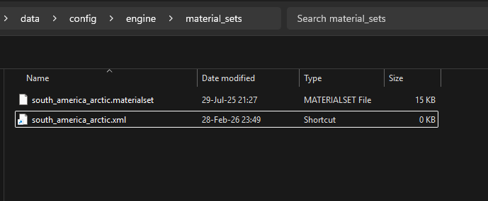

Open both files. The `south_america_arctic.materialset` contains our materialset with all the materials we still need to swap out. In the `south_america_arctic.xml.lnk` file we add the path to the materialset file. Just add `data/config/engine/material_sets/south_america_arctic.materialset` without anything else and save the file. We will reference to this shortcut and this then will pick up our materialset file.

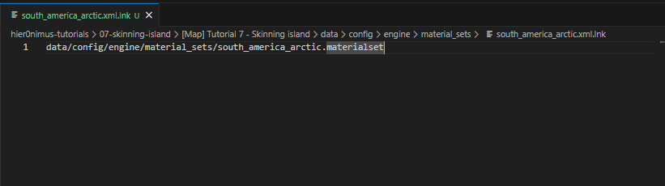

Now, time to swap out all the material values in our new materialset file. First we swap out the `<GritDiffuseTexture>`. `<CliffDiffuseTexture>`, `CliffNormalTexture` and `SubSurfaceTexture`. See the value in the original Arctic materialset and swap the value in our materialset with this value.

So, `<GritDiffuseTexture>data\graphics\landscape\terrain\texture_pool\d_grass_07_diff.psd</>` becomes `<GritDiffuseTexture>data\dlc03\graphics\landscape\terrain\arctic\p_grit_01_diff.psd</>`. 
Do the same for `<CliffDiffuseTexture>`, `CliffNormalTexture` and `SubSurfaceTexture`.

Double check all the values above the `<Material>` node, but as far as I know apart from the ones we changed, the others ones are all the same. There can probably also be done some tweaking in regards of those values maybe, but that is out of my knowledge and scope of this guide.

Now the trickiest part can start about this file, finding a corresponding material for the original material. I can only advice to just follow your guts and see in the original arctic file which corresponding files you have for beach, mountain, mud or other materials. Grass in this case could be swapped out for snow or something else depending on what you want to achieve. 

If you want to see the full list of available materials you can follow the path of the materials and open that location in the extracted rda folders. `data/dlc03/graphics/landscape/terrain/arctic/` and `data\dlc03\graphics\props\terrain_props\vegetation\`. You can also get some inspiration there for matching materials.

#### Change the Materials

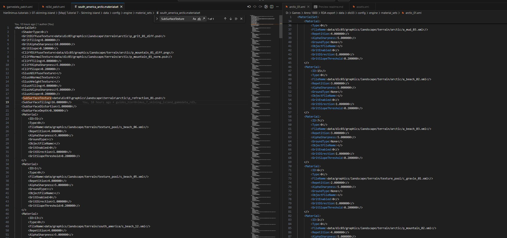

On the left we see the materialset where we want to copy everything to, on the right our example arctic materialset we take as a source to copy the arctic materials from.

It is important to keep the same `<ID>`'s and the order of the different materials in the destination materialset. The way those materialsets work is that the island is created based on this. It looks up the mapped materials so if we would change the order for one material it will be mapped with the wrong part of the island.

Let's do a couple of materials together and after that you can do the rest yourself.

##### Beach

The first material we encounter is for a part that is mapped for the beach:

```XML
    <Material>
        <ID>31</>
        <Type>0</>
        <FileName>data/graphics/landscape/terrain/texture_pool/s_beach_06.xml</>
        <Repetition>4.000000</>
        <AlphaSharpness>5.000000</>
        <GroundType></>
        <ObjectFileName></>
        <GritEnabled>0</>
        <GritDirection>1.000000</>
        <GritSlopeThreshold>0.200000</>
    </>
```

We have to look into the arctic materialset and see if we find a similar beach material.
If we scroll through the complete arctic materialset file, we encounter 2 beach materials. 

```XML
    <Material>
        <ID>15</>
        <Type>0</>
        <FileName>data/dlc03/graphics/landscape/terrain/arctic/a_beach_02.xml</>
        <Repetition>3.000000</>
        <AlphaSharpness>5.000000</>
        <GroundType>None</>
        <ObjectFileName></>
        <GritEnabled>0</>
        <GritDirection>1.000000</>
        <GritSlopeThreshold>0.200000</>
    </>
    <Material>
        <ID>7</>
        <Type>0</>
        <FileName>data/dlc03/graphics/landscape/terrain/arctic/a_beach_03.xml</>
        <Repetition>3.000000</>
        <AlphaSharpness>5.000000</>
        <GroundType>None</>
        <ObjectFileName></>
        <GritEnabled>0</>
        <GritDirection>1.000000</>
        <GritSlopeThreshold>0.200000</>
    </>
```

The same if we would look into the directory mentioned earlier:

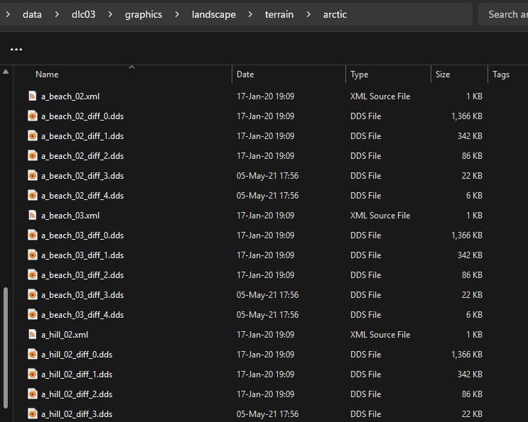

We now choose one of those arctic beach materials so swap out the new world beach material.

So, for example, swap `<FileName>data/graphics/landscape/terrain/texture_pool/s_beach_06.xml</>` with `<FileName>data/dlc03/graphics/landscape/terrain/arctic/a_beach_02.xml</>`.

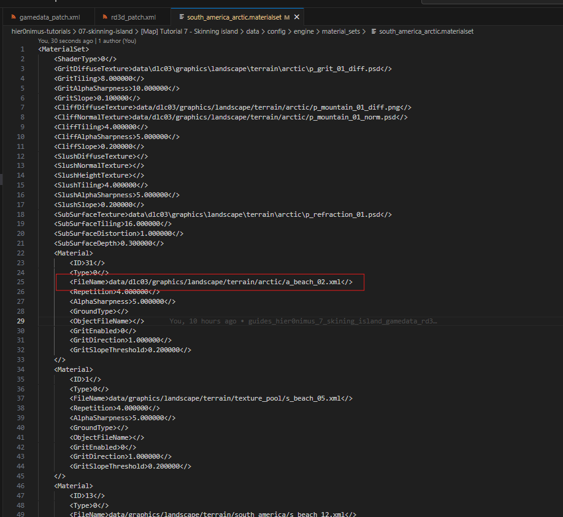

If we scroll down more, we find more beach materials. `s_beach_05.xml`, `s_beach_12.xml`, `s_beach_07.xml`, `s_beach_02.xml`.
As you can see, the New World has more variation in the beach materials compared to the Arctic. For the Arctic we only have 2 of them.
We replace all of them with the ones we have available for the Arctic. Do not worry, we can always come back to this process to experiment if we want to change this.

So, replace `05` with `03`, `12` with `02`, `07` with `03`, ect... Offcourse with the correct path to the arctic files.

##### Mountain

Next after the beach is the Mountain. If we scroll down we see we have different mountain materials. Again, look to the Arctic materialset or folder and see from which mountain materials we can choose from.

Replace `<FileName>data/graphics/landscape/terrain/terra/tropical_mountain_04.xml</>` and the other mountain materials from the original new world materialset with `<FileName>data/dlc03/graphics/landscape/terrain/arctic/p_mountain_02.xml</>` or `<FileName>data/dlc03/graphics/landscape/terrain/arctic/p_mountain_01.xml</>`.

##### Mud

Next in the list is Mud. We only find one mud material for the Arctic. So we can swap out all of them with this one. 
Good to know, we can come back to this materialset to change certain materials and experiment more by maybe swapping one of the mud ones for a snowy one. But that is all depending on the amount of time you want to invest into perfecting this. 

So, swap out `<FileName>data/graphics/landscape/terrain/texture_pool/b_mud_09.xml</>` and the other ones with `<FileName>data/dlc03/graphics/landscape/terrain/arctic/a_mud_03.xml</>`

##### Grass

Grass in the New World is common and we want grass on multiple places on the ground. Grass in the Arctic is a different story. We do not have much grass on the ground in the arctic, mostly some bushes. 

If we look at other options for the Arctic to swap out the grass with something else, we have some grass materials but I think swapping those out would be not correct. This would result in the Arctic being covered with grass all over the island. And most of the ground is actually snow. We will reserve the grass materials for replacing bushes.

If we then look at other suitable materials for the general grass materials we have the `snow`, `cracks`, `ice`, `snowdune`.

- a_snow_01
- a_snow_02
- a_snow_03
- a_snow_04
- a_snow_05
- a_snow_06
- a_snow_07
- a_snow_08
- a_snow_09
- p_cracks_03
- p_ice_01
- p_snow_01
- p_snowdune_01
- p_snowdune_02
- p_snowdune_04

We could use all of those to create some variation for all the grass and flower materials we find. Swap them out and remember, we can always come back to tweak this (and we probably will).

This process took me a long time to get right when I was making White and Cold islands. A lot of trial and error and even then sometimes it is still not perfect because the way the mapping is done and the available materials we have are just limited.

##### Bushes and flowers

Next are the bushes and flowers. To make sure there is at least some vegetation, we swap out the colorful new world flowers with snowy low arctic bushes and grass.

You should know the drill by now. Search for them in the destination materialset file and swap them out with corresponding similar `grass_arctic` materials. 

BUT! Something that catches your eye? ... Indeed. We do not replace `<FileName>` with an `.xml` file, but we replace `<ObjectFileName>` with a `.prp` file. Those are actual prop files and not material textures. So actual 3 dimentional things like actual bushes.

As mentioned above, those are in a different location `data\dlc03\graphics\props\terrain_props\vegetation\`.
There is only 1 grass prop available. You could also include some bushes if you want some higher vegetation. But, there will be another layer of adaptations where we will be adding some props to the island including bushes so do not worry at this point if you do not add them (yet).

##### Underwater plant

We find two underwater prop materials for the Arctic in the original new world materialset file. But, if we look at Arctic alternatives, we actually do not have any. The only underwater material we find is a texture material but not a prop material. 

We can choose here to keep the original underwater material an have some colorful corals in the Arctic or swap them out for generic bush or grass prop materials which will also look okish underwater.

#### Materialset New World to Arctic result

```XML
<MaterialSet>
    <ShaderType>0</>
    <GritDiffuseTexture>data\dlc03\graphics\landscape\terrain\arctic\p_grit_01_diff.psd</>
    <GritTiling>8.000000</>
    <GritAlphaSharpness>10.000000</>
    <GritSlope>0.100000</>
    <CliffDiffuseTexture>data/dlc03/graphics/landscape/terrain/arctic/p_mountain_01_diff.png</>
    <CliffNormalTexture>data/dlc03/graphics/landscape/terrain/arctic/p_mountain_01_norm.psd</>
    <CliffTiling>4.000000</>
    <CliffAlphaSharpness>5.000000</>
    <CliffSlope>0.200000</>
    <SlushDiffuseTexture></>
    <SlushNormalTexture></>
    <SlushHeightTexture></>
    <SlushTiling>4.000000</>
    <SlushAlphaSharpness>5.000000</>
    <SlushSlope>0.200000</>
    <SubSurfaceTexture>data\dlc03\graphics\landscape\terrain\arctic\p_refraction_01.psd</>
    <SubSurfaceTiling>16.000000</>
    <SubSurfaceDistortion>1.000000</>
    <SubSurfaceDepth>0.300000</>
    <Material>
        <ID>31</>
        <Type>0</>
        <FileName>data/dlc03/graphics/landscape/terrain/arctic/a_beach_02.xml</>
        <Repetition>4.000000</>
        <AlphaSharpness>5.000000</>
        <GroundType></>
        <ObjectFileName></>
        <GritEnabled>0</>
        <GritDirection>1.000000</>
        <GritSlopeThreshold>0.200000</>
    </>
    <Material>
        <ID>1</>
        <Type>0</>
        <FileName>data/dlc03/graphics/landscape/terrain/arctic/a_beach_03.xml</>
        <Repetition>4.000000</>
        <AlphaSharpness>5.000000</>
        <GroundType></>
        <ObjectFileName></>
        <GritEnabled>0</>
        <GritDirection>1.000000</>
        <GritSlopeThreshold>0.200000</>
    </>
    <Material>
        <ID>13</>
        <Type>0</>
        <FileName>data/dlc03/graphics/landscape/terrain/arctic/a_beach_02.xml</>
        <Repetition>4.000000</>
        <AlphaSharpness>5.000000</>
        <GroundType></>
        <ObjectFileName></>
        <GritEnabled>0</>
        <GritDirection>1.000000</>
        <GritSlopeThreshold>0.200000</>
    </>
    <Material>
        <ID>26</>
        <Type>0</>
        <FileName>data/dlc03/graphics/landscape/terrain/arctic/a_beach_03.xml</>
        <Repetition>4.000000</>
        <AlphaSharpness>4.000000</>
        <GroundType></>
        <ObjectFileName></>
        <GritEnabled>0</>
        <GritDirection>1.000000</>
        <GritSlopeThreshold>0.200000</>
    </>
    <Material>
        <ID>24</>
        <Type>0</>
        <FileName>data/dlc03/graphics/landscape/terrain/arctic/a_beach_02.xml</>
        <Repetition>10.000000</>
        <AlphaSharpness>5.000000</>
        <GroundType></>
        <ObjectFileName></>
        <GritEnabled>0</>
        <GritDirection>1.000000</>
        <GritSlopeThreshold>0.200000</>
    </>
    <Material>
        <ID>28</>
        <Type>0</>
        <FileName>data/dlc03/graphics/landscape/terrain/arctic/a_beach_03.xml</>
        <Repetition>4.000000</>
        <AlphaSharpness>5.000000</>
        <GroundType></>
        <ObjectFileName></>
        <GritEnabled>0</>
        <GritDirection>1.000000</>
        <GritSlopeThreshold>0.200000</>
    </>
    <Material>
        <ID>17</>
        <Type>0</>
        <FileName>data/dlc03/graphics/landscape/terrain/arctic/p_mountain_02.xml</>
        <Repetition>4.000000</>
        <AlphaSharpness>8.000000</>
        <GroundType></>
        <ObjectFileName></>
        <GritEnabled>0</>
        <GritDirection>1.000000</>
        <GritSlopeThreshold>0.200000</>
    </>
    <Material>
        <ID>8</>
        <Type>0</>
        <FileName>data/dlc03/graphics/landscape/terrain/arctic/p_mountain_01.xml</>
        <Repetition>5.000000</>
        <AlphaSharpness>10.000000</>
        <GroundType></>
        <ObjectFileName></>
        <GritEnabled>0</>
        <GritDirection>1.000000</>
        <GritSlopeThreshold>0.200000</>
    </>
    <Material>
        <ID>30</>
        <Type>0</>
        <FileName>data/dlc03/graphics/landscape/terrain/arctic/p_mountain_01.xml</>
        <Repetition>4.000000</>
        <AlphaSharpness>4.000000</>
        <GroundType></>
        <ObjectFileName></>
        <GritEnabled>0</>
        <GritDirection>1.000000</>
        <GritSlopeThreshold>0.200000</>
    </>
    <Material>
        <ID>16</>
        <Type>0</>
        <FileName>data/dlc03/graphics/landscape/terrain/arctic/a_mud_03.xml</>
        <Repetition>4.000000</>
        <AlphaSharpness>5.000000</>
        <GroundType></>
        <ObjectFileName></>
        <GritEnabled>0</>
        <GritDirection>1.000000</>
        <GritSlopeThreshold>0.200000</>
    </>
    <Material>
        <ID>9</>
        <Type>0</>
        <FileName>data/dlc03/graphics/landscape/terrain/arctic/a_mud_03.xml</>
        <Repetition>4.000000</>
        <AlphaSharpness>3.000000</>
        <GroundType>None</>
        <ObjectFileName></>
        <GritEnabled>0</>
        <GritDirection>1.000000</>
        <GritSlopeThreshold>0.200000</>
    </>
    <Material>
        <ID>2</>
        <Type>0</>
        <FileName>data/dlc03/graphics/landscape/terrain/arctic/a_mud_03.xml</>
        <Repetition>4.000000</>
        <AlphaSharpness>5.000000</>
        <GroundType>None</>
        <ObjectFileName></>
        <GritEnabled>0</>
        <GritDirection>1.000000</>
        <GritSlopeThreshold>0.200000</>
    </>
    <Material>
        <ID>7</>
        <Type>0</>
        <FileName>data/dlc03/graphics/landscape/terrain/arctic/a_mud_03.xml</>
        <Repetition>4.000000</>
        <AlphaSharpness>4.000000</>
        <GroundType>None</>
        <ObjectFileName></>
        <GritEnabled>0</>
        <GritDirection>1.000000</>
        <GritSlopeThreshold>0.200000</>
    </>
    <Material>
        <ID>20</>
        <Type>0</>
        <FileName>data/dlc03/graphics/landscape/terrain/arctic/a_mud_03.xml</>
        <Repetition>4.000000</>
        <AlphaSharpness>5.000000</>
        <GroundType>None</>
        <ObjectFileName></>
        <GritEnabled>0</>
        <GritDirection>1.000000</>
        <GritSlopeThreshold>0.200000</>
    </>
    <Material>
        <ID>3</>
        <Type>0</>
        <FileName>data/dlc03/graphics/landscape/terrain/arctic/a_mud_03.xml</>
        <Repetition>2.000000</>
        <AlphaSharpness>5.000000</>
        <GroundType>None</>
        <ObjectFileName></>
        <GritEnabled>0</>
        <GritDirection>1.000000</>
        <GritSlopeThreshold>0.200000</>
    </>
    <Material>
        <ID>11</>
        <Type>0</>
        <FileName>data/dlc03/graphics/landscape/terrain/arctic/p_snowdune_01.xml</>
        <Repetition>8.000000</>
        <AlphaSharpness>8.000000</>
        <GroundType>None</>
        <ObjectFileName></>
        <GritEnabled>0</>
        <GritDirection>1.000000</>
        <GritSlopeThreshold>0.200000</>
    </>
    <Material>
        <ID>29</>
        <Type>0</>
        <FileName>data/dlc03/graphics/landscape/terrain/arctic/p_snowdune_01.xml</>
        <Repetition>8.000000</>
        <AlphaSharpness>3.000000</>
        <GroundType>None</>
        <ObjectFileName></>
        <GritEnabled>0</>
        <GritDirection>1.000000</>
        <GritSlopeThreshold>0.200000</>
    </>
    <Material>
        <ID>23</>
        <Type>0</>
        <FileName>data/dlc03/graphics/landscape/terrain/arctic/a_beach_02.xml</>
        <Repetition>8.000000</>
        <AlphaSharpness>5.000000</>
        <GroundType>None</>
        <ObjectFileName></>
        <GritEnabled>0</>
        <GritDirection>1.000000</>
        <GritSlopeThreshold>0.200000</>
    </>
    <Material>
        <ID>14</>
        <Type>0</>
        <FileName>data/dlc03/graphics/landscape/terrain/arctic/a_mud_03.xml</>
        <Repetition>4.000000</>
        <AlphaSharpness>5.000000</>
        <GroundType>None</>
        <ObjectFileName></>
        <GritEnabled>0</>
        <GritDirection>1.000000</>
        <GritSlopeThreshold>0.200000</>
    </>
    <Material>
        <ID>5</>
        <Type>0</>
        <FileName>data/dlc03/graphics/landscape/terrain/arctic/a_beach_02.xml</>
        <Repetition>3.000000</>
        <AlphaSharpness>5.000000</>
        <GroundType>None</>
        <ObjectFileName></>
        <GritEnabled>0</>
        <GritDirection>1.000000</>
        <GritSlopeThreshold>0.200000</>
    </>
    <Material>
        <ID>19</>
        <Type>0</>
        <FileName>data/dlc03/graphics/landscape/terrain/arctic/p_snowdune_01.xml</>
        <Repetition>12.000000</>
        <AlphaSharpness>2.000000</>
        <GroundType>None</>
        <ObjectFileName></>
        <GritEnabled>0</>
        <GritDirection>1.000000</>
        <GritSlopeThreshold>0.200000</>
    </>
    <Material>
        <ID>4</>
        <Type>0</>
        <FileName>data/graphics/landscape/terrain/texture_pool/p_snowdune_02.xml</>
        <Repetition>4.000000</>
        <AlphaSharpness>2.000000</>
        <GroundType>None</>
        <ObjectFileName></>
        <GritEnabled>0</>
        <GritDirection>1.000000</>
        <GritSlopeThreshold>0.200000</>
    </>
    <Material>
        <ID>0</>
        <Type>0</>
        <FileName>data/graphics/landscape/terrain/texture_pool/p_snowdune_02.xml</>
        <Repetition>2.000000</>
        <AlphaSharpness>5.000000</>
        <GroundType>None</>
        <ObjectFileName></>
        <GritEnabled>0</>
        <GritDirection>1.000000</>
        <GritSlopeThreshold>0.200000</>
    </>
    <Material>
        <ID>18</>
        <Type>0</>
        <FileName>data/graphics/landscape/terrain/texture_pool/p_snowdune_02.xml</>
        <Repetition>4.000000</>
        <AlphaSharpness>5.000000</>
        <GroundType>None</>
        <ObjectFileName></>
        <GritEnabled>0</>
        <GritDirection>1.000000</>
        <GritSlopeThreshold>0.200000</>
    </>
    <Material>
        <ID>6</>
        <Type>0</>
        <FileName>data/dlc03/graphics/landscape/terrain/arctic/p_mountain_01.xml</>
        <Repetition>4.000000</>
        <AlphaSharpness>2.000000</>
        <GroundType>None</>
        <ObjectFileName></>
        <GritEnabled>1</>
        <GritDirection>0.400000</>
        <GritSlopeThreshold>0.200000</>
    </>
    <Material>
        <ID>21</>
        <Type>0</>
        <FileName>data/dlc03/graphics/landscape/terrain/arctic/a_beach_02.xml</>
        <Repetition>4.000000</>
        <AlphaSharpness>5.000000</>
        <GroundType>None</>
        <ObjectFileName></>
        <GritEnabled>0</>
        <GritDirection>1.000000</>
        <GritSlopeThreshold>0.200000</>
    </>
    <Material>
        <ID>10</>
        <Type>0</>
        <FileName>data/dlc03/graphics/landscape/terrain/arctic/p_snowdune_01.xml</>
        <Repetition>4.000000</>
        <AlphaSharpness>1.200000</>
        <GroundType>None</>
        <ObjectFileName></>
        <GritEnabled>0</>
        <GritDirection>1.000000</>
        <GritSlopeThreshold>0.200000</>
    </>
    <Material>
        <ID>12</>
        <Type>0</>
        <FileName>data/dlc03/graphics/landscape/terrain/arctic/a_beach_02.xml</>
        <Repetition>4.000000</>
        <AlphaSharpness>5.000000</>
        <GroundType>None</>
        <ObjectFileName></>
        <GritEnabled>1</>
        <GritDirection>1.000000</>
        <GritSlopeThreshold>0.200000</>
    </>
    <Material>
        <ID>25</>
        <Type>0</>
        <FileName>data/dlc03/graphics/landscape/terrain/arctic/a_beach_03.xml</>
        <Repetition>4.000000</>
        <AlphaSharpness>4.000000</>
        <GroundType>None</>
        <ObjectFileName></>
        <GritEnabled>1</>
        <GritDirection>1.000000</>
        <GritSlopeThreshold>0.200000</>
    </>
    <Material>
        <ID>22</>
        <Type>1</>
        <FileName></>
        <Repetition>1.000000</>
        <AlphaSharpness>5.000000</>
        <GroundType></>
        <ObjectFileName>data\dlc03\graphics\props\terrain_props\vegetation\grass\grass_arctic_01.prp</>
        <GritEnabled>0</>
        <GritDirection>1.000000</>
        <GritSlopeThreshold>0.200000</>
    </>
    <Material>
        <ID>27</>
        <Type>1</>
        <FileName></>
        <Repetition>1.000000</>
        <AlphaSharpness>5.000000</>
        <GroundType></>
        <ObjectFileName>data\dlc03\graphics\props\terrain_props\vegetation\grass\grass_arctic_01.prp</>
        <GritEnabled>0</>
        <GritDirection>1.000000</>
        <GritSlopeThreshold>0.200000</>
    </>
    <Material>
        <ID>15</>
        <Type>1</>
        <FileName></>
        <Repetition>1.000000</>
        <AlphaSharpness>5.000000</>
        <GroundType></>
        <ObjectFileName>data\dlc03\graphics\props\terrain_props\vegetation\grass\grass_arctic_01.prp</>
        <GritEnabled>0</>
        <GritDirection>1.000000</>
        <GritSlopeThreshold>0.200000</>
    </>
    <Material>
        <ID>32</>
        <Type>1</>
        <FileName></>
        <Repetition>1.000000</>
        <AlphaSharpness>5.000000</>
        <GroundType></>
        <ObjectFileName>data\dlc03\graphics\props\terrain_props\vegetation\grass\grass_arctic_01.prp</>
        <GritEnabled>0</>
        <GritDirection>1.000000</>
        <GritSlopeThreshold>0.200000</>
    </>
    <Material>
        <ID>33</>
        <Type>1</>
        <FileName></>
        <Repetition>1.300000</>
        <AlphaSharpness>5.000000</>
        <GroundType></>
        <ObjectFileName>data\dlc03\graphics\props\terrain_props\vegetation\grass\grass_arctic_01.prp</>
        <GritEnabled>0</>
        <GritDirection>1.000000</>
        <GritSlopeThreshold>0.200000</>
    </>
    <Material>
        <ID>34</>
        <Type>1</>
        <FileName></>
        <Repetition>2.000000</>
        <AlphaSharpness>5.000000</>
        <GroundType></>
        <ObjectFileName>data\dlc03\graphics\props\terrain_props\vegetation\grass\grass_arctic_01.prp</>
        <GritEnabled>0</>
        <GritDirection>1.000000</>
        <GritSlopeThreshold>0.200000</>
    </>
    <Material>
        <ID>35</>
        <Type>1</>
        <FileName></>
        <Repetition>1.000000</>
        <AlphaSharpness>5.000000</>
        <GroundType></>
        <ObjectFileName>data\dlc03\graphics\props\terrain_props\vegetation\grass\grass_arctic_01.prp</>
        <GritEnabled>0</>
        <GritDirection>1.000000</>
        <GritSlopeThreshold>0.200000</>
    </>
    <Material>
        <ID>36</>
        <Type>1</>
        <FileName></>
        <Repetition>1.000000</>
        <AlphaSharpness>5.000000</>
        <GroundType></>
        <ObjectFileName>data\dlc03\graphics\props\terrain_props\vegetation\grass\grass_arctic_01.prp</>
        <GritEnabled>0</>
        <GritDirection>1.000000</>
        <GritSlopeThreshold>0.200000</>
    </>
</>
```

#### Materialset conclusion

This is it! Our materialset to convert an New World island to an Arctic island is now ready to use! With every conversion from one type of an island to another one, we need such a materialset file. 

Yes, I could have given you a ready to use materialset file, but it is good to understand the process of swapping the materials and how it works. Now you could even tweak it or even create other ones for other regions!

### Linking materialset file

Now that we have our materialset set up and in the correct location, it is time to link this new materialset in our `rd3d` file. If we look in the `rd3d_original.xml` and search for `MaterialSetFileName` again, we find `<MaterialSetFileName>data/config/engine/material_sets/south_america_01.xml</MaterialSetFileName>`. `MaterialSetFileName` is unique in this file, like we did with the `gamedata_patch.xml` we can do a `<ModOp>` where we replace this value but now in the `rd3d_patch.xml`. 

```XML
<ModOps>
    <ModOp Type="replace" Path="//MaterialSetFileName">
        <MaterialSetFileName>data/config/engine/material_sets/south_america_arctic.xml</MaterialSetFileName>
    </ModOp>
</ModOps>
```

## Checking the progression ingame, packing gamedata and rd3d files again

### Compressing island files
Now that we have done the basic manipulations and have our patches ready it is time to compress our files again so we end up again with our updated `colony01_s_01_skinned.a7m` file.

We unpacked our `.a7m` file which gave us the `gamedata.data` and the `rd3d.data`. We then decpompressed those files from the `.data` format to the `.xml` format so we could actually open them and manipulate them. We now have to do the same actions but the other way around. So, packing the `.xml` files to `.data` files and then package the `.data` files back into the `.a7m` file.

To do this we will need our tools again which will be executed with the commandline. Like we have the `unpack_island.bat`, which was provided by Taludas and Taube, there is also a `pack_island.bat`. But for some reason, I can not seem to get that one working. So, I manually do those actions what the `.bat` file otherwise does automaticly.

Go to `data\tutorial\sessions\islands\pool\skinned_islands\colony01_s_01_skinned\colony01_s_01_skinned` and open a commandline in this directory.

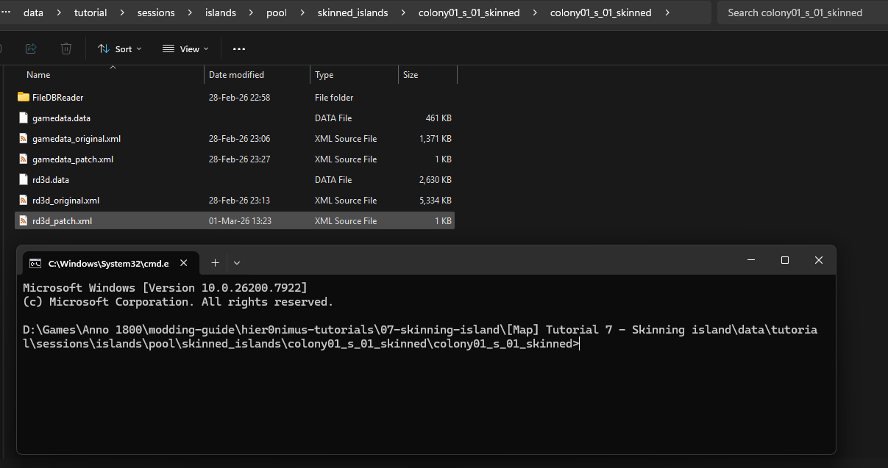

The first step we will be taking is executing the patch files we prepared. We will merge the original xml file with the patch xml file. That way we end up with an xml file which has our mod operations included. So, in our case, a patched file which includes the new GlobalAmbientName, materialset, the new props, ect. Executing / merging 2 xml files is done with `xmltest`. 

We execute the following command to first do it for the gamedata file:
`xmltest gamedata_original.xml gamedata_patch.xml`

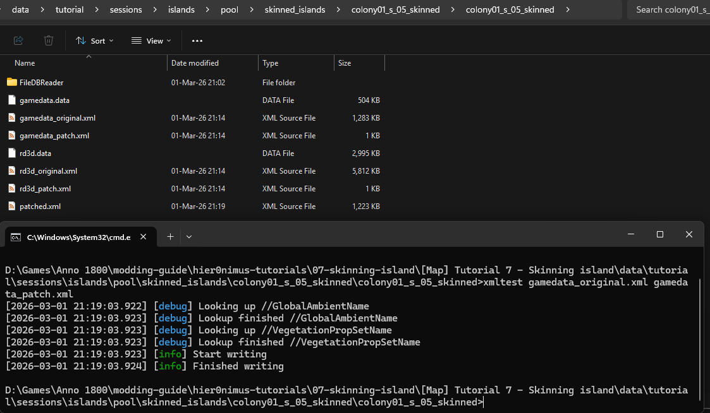

We will get a `patched.xml` file in the directory now. Rename this file to `gamedata_patched.xml`. You can open this file and you should see the changed `GlobalAmbientName` and `VegetationPropSetName` at the top.

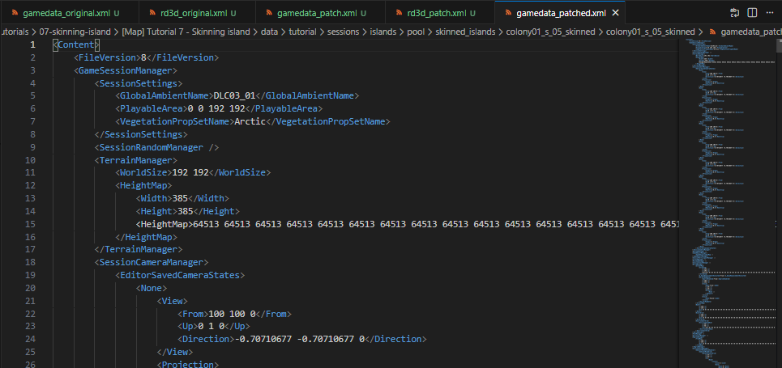

Now that we have our patched gamedata file, we can compress this .xml file back to a .data file. To do this we need the Filedbreader. This one handles compressing and decompressing from `.xml` to `.data` or the other way around. For this we do the following command:

`Filedbreader.exe compress -f gamedata_patched.xml -o .data -c 2 -i ..\..\Island_Gamedata_v3.xml`

In case your environment variables are not correctly set up and you placed the FileDBReader folder in there, you can also use
`FileDBReader\Filedbreader.exe compress -f gamedata_patched.xml -o .data -c 2 -i ..\..\Island_Gamedata_v3.xml`

The result will be a `gamedata_patched.data` file which we will be compressing into the `.a7m` file after we also did the same for the `rd3d` file.

To compress the `rd3d` file back to its data format with the patches included, we first merge our patch with the orginial file like we did for the gamedata file. We do this also with the `xmltest` tool and the following command:

`xmltest rd3d_original.xml rd3d_patch.xml`

We again get a `patched.xml` file which we rename to `rd3d_patched.xml`. If we open this file, we should also see our changes we did in the patch in this file.

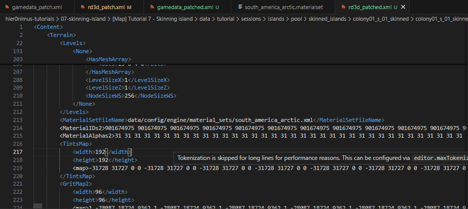

The next step is again like we did with the gamedata file, compressing the patched xml to the data format. We do this with the following command:
`Filedbreader.exe compress -f rd3d_patched.xml -o .data -c 2 -i ..\..\Island_RD3D.xml`

In case your environment variables are not correctly set up and you placed the FileDBReader folder in there, you can also use
`FileDBReader\Filedbreader.exe compress -f rd3d_patched.xml -o .data -c 2 -i ..\..\Island_RD3D.xml`

You will get a `rd3d_patched.data` file.

To be able to do the next step, first rename the original `gamedata.data` and `rd3d.data` to `gamedata_original.data` and `rd3d_original.data` to keep them as backup.
Then, rename both the `gamedata_patched.data` and the `rd3d_patched.data` to `gamedata.data` and `rd3d.data`. For some weird reason the next step only works when using the original name.

You should have the following files:

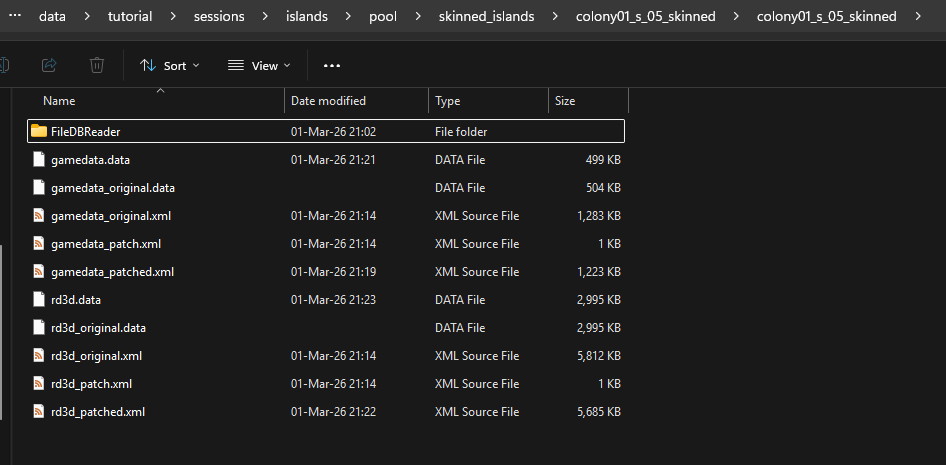

Amazing work! Now go up one folder to the root of the island file. 

We will now compress our `data` files back into the `a7m` file with the following command (open a new commandline console or go up one folder with using `cd ..` in the commandline you have still open):
`RdaConsole pack -f colony01_s_01_skinned/gamedata.data colony01_s_01_skinned/rd3d.data -o colony01_s_01_skinned.a7m -y -v 2`

For some weird reason this only works with the original .data file names. I tried it also with _patched.data versions but this did not work for some reason and the game kept loading in the loading screen having an infinte loading screen.

Your `colony01_s_01_skinned.a7m` file should be updated. It could be that the filesize did not change compared to the previous version, but you should see the Date modified being different.

Congratulations! You have now converted the basics of an island from a New World island to an Arctic islands. We are not ready yet offcourse, but we should update the files in the mods folder and start to game to see if everything still works and our changes are visible. We now have some not needed files into our folders, but we will clean those up later.

If we look ingame, all looks good! The ground is now snowy compared to the grass before.


We do still see the New World trees and some other wrong vegetation, but that will be the next step we will take! THe important thing is that we now confirmed our materialset is loading correctle and other patches we did in the gamedata and rd3d file are working correctly.

## Props and vegetation

The next thing we will be changing are the trees, bushes and other props we can find on the island. Now we see palm trees and green bushes but those are offcourse not the ones we want to see in the Arctic.

### PropGrid
If we go back to our original rd3d file, the next part we will be adapting is the `<PropGrid.`. This is the largest part of this file and contains all the different props on the island. Trees, bushes, rocks and other props are defined here. 

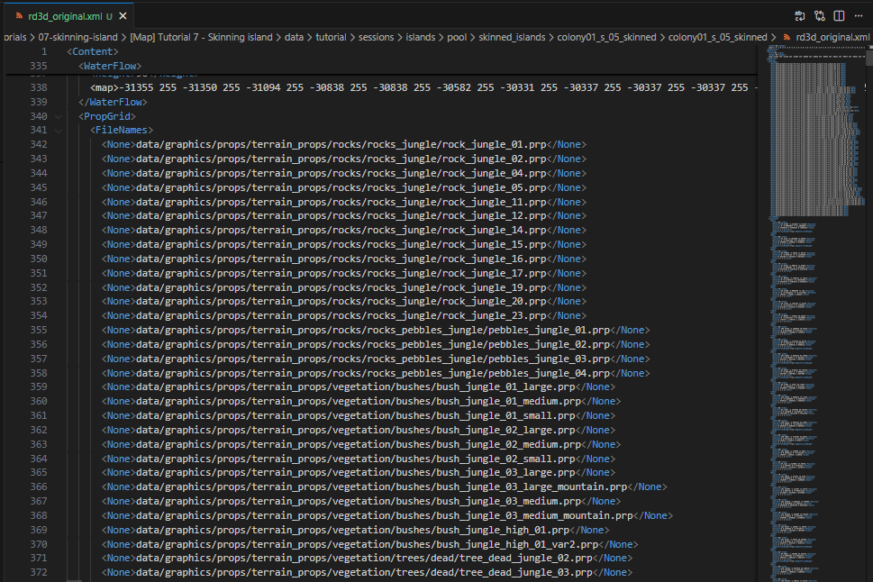

#### FileNames and Instances
The first part of this `<PropGrid>` is the `<FileNames>` node. This contains all the different props that are used on this island. You can see different trees, brushes, rocks,... This is a list that has a fixed (!) order and amount of props. We can expand this list but it is important to know that the next part, the `<Instances>` uses this list in their specific order as reference.

If we have a look at the `<Instances>` list, we see all `<None>` nodes which contain and `<Index>`, `<Position>`, `<Rotation>`, `<Scale>`, `<AdaptTerrainHeight>`. This `<Index>` references to the prop in the above list in `<FileNames>`. If we would insert another props on the 10th place of the list, all the following props would all of a sudden have a different index and all the props referenced in the `<Instances>` would reference to the wrong prop. This could result in a rock all of a sudden being a tree for example. In some cases that would probably be fine, but it is more safe to stick with the same order and do a first conversion with the existing similar props. Swapping a tree for a tree, a rock for a rock, ect. The other nodes are straight forward and tell us more about the specific prop. The size, the position,... Depending on the island there are thousands and thousands of props. Manually checking and changing those would be almost impossible. So, we stick to swapping based on similar props and will actually get a really good result already with minimal effort.

Now that we went over it, we know that we should stick to the amount of props in that list (for now). We should not add new props (for now) and just swap the `<FileNames>` - `<None>` paths with corresponding paths of props from the region we want the island to swap to, in our case Arctic props. You could again open an `rd3d` file from an existing Arctic island to see the props used on those original Arctic islands, or you could also go to the extracted rda files folder and check the props there. `data/dlc03/graphics/props/terrain_props/`.

Just like the materials in the materialset file, it is now important to swap out the props for similar props. In case you want a more visual approach, you could create a blender file and import all the props and place them in an overview next to eachother to more easily compare the different props and find a matching prop from the other region. It would take some time to set up an overview but can help a lot in terms of finding similar trees or rocks in size.

Something that is good to know is that the developers actually made it also more easy for themselves. There are around 23 rocks which all have their own New World and Arctic variation compared to the base Old World version. Those are easily swappable. `data/graphics/props/terrain_props/rocks/rocks_jungle/rock_jungle_01.prp` would then become `data/dlc03/graphics/props/terrain_props/vegetation/rocks/rocks_snow/rock_snow_01.prp` and so on.

Let's start with swapping the first props. Again, we do not change the original file, but will be patching the file. In the `rd3d_patch.xml` file we create a new `<ModOp>` which we will use to swap out the `PropGrid/FileNames`.

```XML
<ModOps>
    <ModOp Type="replace" Path="//MaterialSetFileName">
        <MaterialSetFileName>data/config/engine/material_sets/south_america_arctic.xml</MaterialSetFileName>
    </ModOp>
    <ModOp Type="replace" Path="//PropGrid/FileNames">
        <FileNames>

        </FileNames>
    </ModOp>
</ModOps>
```

We should add the original New World prop list in there and swap them all. That way we are sure we have the same amount of props and our list is still the same.

```XML
<ModOps>
    <ModOp Type="replace" Path="//MaterialSetFileName">
        <MaterialSetFileName>data/config/engine/material_sets/south_america_arctic.xml</MaterialSetFileName>
    </ModOp>
    <ModOp Type="replace" Path="//PropGrid/FileNames">
        <FileNames>
      <None>data/graphics/props/terrain_props/rocks/rocks_jungle/rock_jungle_01.prp</None>
      <None>data/graphics/props/terrain_props/rocks/rocks_jungle/rock_jungle_02.prp</None>
      <None>data/graphics/props/terrain_props/rocks/rocks_jungle/rock_jungle_03.prp</None>
      <None>data/graphics/props/terrain_props/rocks/rocks_jungle/rock_jungle_06.prp</None>
      <None>data/graphics/props/terrain_props/rocks/rocks_jungle/rock_jungle_09.prp</None>
      <None>data/graphics/props/terrain_props/rocks/rocks_jungle/rock_jungle_12.prp</None>
      <None>data/graphics/props/terrain_props/rocks/rocks_jungle/rock_jungle_13.prp</None>
      <None>data/graphics/props/terrain_props/rocks/rocks_jungle/rock_jungle_14.prp</None>
      <None>data/graphics/props/terrain_props/rocks/rocks_jungle/rock_jungle_15.prp</None>
      <None>data/graphics/props/terrain_props/rocks/rocks_jungle/rock_jungle_16.prp</None>
      <None>data/graphics/props/terrain_props/rocks/rocks_jungle/rock_jungle_17.prp</None>
      <None>data/graphics/props/terrain_props/rocks/rocks_jungle/rock_jungle_18.prp</None>
      <None>data/graphics/props/terrain_props/rocks/rocks_jungle/rock_jungle_19.prp</None>
      <None>data/graphics/props/terrain_props/rocks/rocks_jungle/rock_jungle_20.prp</None>
      <None>data/graphics/props/terrain_props/rocks/rocks_jungle/rock_jungle_23.prp</None>
      <None>data/graphics/props/terrain_props/rocks/rocks_pebbles_jungle/pebbles_jungle_01.prp</None>
      <None>data/graphics/props/terrain_props/rocks/rocks_pebbles_jungle/pebbles_jungle_02.prp</None>
      <None>data/graphics/props/terrain_props/rocks/rocks_pebbles_jungle/pebbles_jungle_03.prp</None>
      <None>data/graphics/props/terrain_props/rocks/rocks_pebbles_jungle/pebbles_jungle_04.prp</None>
      <None>data/graphics/props/terrain_props/vegetation/bushes/bush_jungle_01_large.prp</None>
      <None>data/graphics/props/terrain_props/vegetation/bushes/bush_jungle_01_medium.prp</None>
      <None>data/graphics/props/terrain_props/vegetation/bushes/bush_jungle_01_small.prp</None>
      <None>data/graphics/props/terrain_props/vegetation/bushes/bush_jungle_02_large.prp</None>
      <None>data/graphics/props/terrain_props/vegetation/bushes/bush_jungle_02_medium.prp</None>
      <None>data/graphics/props/terrain_props/vegetation/bushes/bush_jungle_02_small.prp</None>
      <None>data/graphics/props/terrain_props/vegetation/bushes/bush_jungle_03_large.prp</None>
      <None>data/graphics/props/terrain_props/vegetation/bushes/bush_jungle_03_large_mountain.prp</None>
      <None>data/graphics/props/terrain_props/vegetation/bushes/bush_jungle_03_medium.prp</None>
      <None>data/graphics/props/terrain_props/vegetation/bushes/bush_jungle_03_medium_mountain.prp</None>
      <None>data/graphics/props/terrain_props/vegetation/bushes/bush_jungle_03_small.prp</None>
      <None>data/graphics/props/terrain_props/vegetation/bushes/bush_jungle_04_small.prp</None>
      <None>data/graphics/props/terrain_props/vegetation/bushes/bush_jungle_high_01.prp</None>
      <None>data/graphics/props/terrain_props/vegetation/bushes/bush_jungle_high_01_var2.prp</None>
      <None>data/graphics/props/terrain_props/vegetation/trees/dead/tree_dead_jungle_palm_01.prp</None>
      <None>data/graphics/props/terrain_props/vegetation/trees/dead/tree_dead_jungle_palm_02.prp</None>
      <None>data/graphics/props/terrain_props/vegetation/trees/dead/tree_dead_jungle_palm_03.prp</None>
      <None>data/graphics/props/terrain_props/vegetation/trees/dead/tree_dead_palm_stump_01.prp</None>
      <None>data/graphics/props/terrain_props/vegetation/trees/dead/tree_dead_palm_stump_02.prp</None>
      <None>data/graphics/props/terrain_props/vegetation/trees/jungle/tree_jungle_palm_01.prp</None>
      <None>data/graphics/props/terrain_props/vegetation/trees/jungle/tree_jungle_palm_01_02.prp</None>
      <None>data/graphics/props/terrain_props/vegetation/trees/jungle/tree_jungle_palm_01_03.prp</None>
      <None>data/graphics/props/terrain_props/vegetation/trees/jungle/tree_jungle_palm_04_01.prp</None>
      <None>data/graphics/props/terrain_props/vegetation/trees/jungle/tree_jungle_palm_04_02.prp</None>
      <None>data/graphics/props/terrain_props/vegetation/trees/jungle/tree_jungle_palm_04_03.prp</None>
      <None>data/graphics/props/terrain_props/vegetation/trees/jungle/tree_jungle_palm_05.prp</None>
      <None>data/graphics/props/terrain_props/vegetation/trees/jungle/tree_jungle_palm_05_02.prp</None>
      <None>data/graphics/props/terrain_props/vegetation/trees/jungle/tree_jungle_palm_05_03.prp</None>
      <None>data/graphics/props/terrain_props/vegetation/trees/jungle/tree_jungle_palm_06.prp</None>
      <None>data/graphics/props/terrain_props/vegetation/trees/jungle/tree_jungle_palm_06_02.prp</None>
      <None>data/graphics/props/terrain_props/vegetation/trees/jungle/tree_jungle_palm_06_03.prp</None>
      <None>data/graphics/props/terrain_props/vegetation/trees/jungle/tree_jungle_palm_special_01.prp</None>
      <None>data/graphics/props/terrain_props/vegetation/trees/jungle/tree_jungle_palm_special_02.prp</None>
      <None>data/graphics/props/terrain_props/vegetation/trees/jungle_mountain/mountain_jungle_tree_04.prp</None>
      <None>data/graphics/props/terrain_props/vegetation/water/underwater_plant_01.prp</None>
      <None>data/graphics/props/terrain_props/vegetation/water/underwater_plant_02.prp</None>
      <None>data/graphics/props/terrain_props/vegetation/water/underwater_plant_03.prp</None>
      <None>data/graphics/props/terrain_props/vegetation/water/underwater_plant_04.prp</None>
      <None>data/graphics/props/terrain_props/vegetation/water/underwater_plant_08.prp</None>
        </FileNames>
    </ModOp>
</ModOps>  
```

 For full transparancy, Taludas has created some nice automated files to swap out the lists, but I think it is important to understand the logic here and do it by hand at least one time.
 
 Now go over the full list and swap out the New World props for corresponding Arctic props. This list is unique for every island because every island is different. Most of the props are similar, but if you open multiple island you will see that there are at least some small differences. If we have done one island, we will have an easier time doing it for the next one, but still, you will have to do this process for every island you want to convert.
 
 For certain props that have a similar version you can do a find and replace. For example, for the rocks I can do:
 `<None>data/graphics/props/terrain_props/rocks/rocks_jungle/rock_jungle_` and swap it with `<None>data/dlc03/graphics/props/terrain_props/vegetation/rocks/rocks_snow/rock_snow_`.
 
 Same for the pebbles and some other props. Go over them carefully. You will get the hang out of it quickly. I group them by type. First the rocks, then the pebbles, then the bushes, then trees, then dead trees, ect. In some cases you will not have enough corresponding props because there are just not that much corresponding different props for the Arctic. Then you can just use the same prop for a second or even more times. Be sure to swap the different lines, so the amount of lines keeps the same in the same order.

What you end up with can be different from what I have now. Maybe you swapped our trees or brushes differently, that is totally fine. I have the following result of my `rd3d_patch.xml` file:

```XML
<ModOps>
    <ModOp Type="replace" Path="//MaterialSetFileName">
        <MaterialSetFileName>data/config/engine/material_sets/south_america_arctic.xml</MaterialSetFileName>
    </ModOp>
    <ModOp Type="replace" Path="//PropGrid/FileNames">
        <FileNames>
            <None>data/dlc03/graphics/props/terrain_props/vegetation/rocks/rocks_snow/rock_snow_01.prp</None>
            <None>data/dlc03/graphics/props/terrain_props/vegetation/rocks/rocks_snow/rock_snow_02.prp</None>
            <None>data/dlc03/graphics/props/terrain_props/vegetation/rocks/rocks_snow/rock_snow_03.prp</None>
            <None>data/dlc03/graphics/props/terrain_props/vegetation/rocks/rocks_snow/rock_snow_06.prp</None>
            <None>data/dlc03/graphics/props/terrain_props/vegetation/rocks/rocks_snow/rock_snow_09.prp</None>
            <None>data/dlc03/graphics/props/terrain_props/vegetation/rocks/rocks_snow/rock_snow_12.prp</None>
            <None>data/dlc03/graphics/props/terrain_props/vegetation/rocks/rocks_snow/rock_snow_13.prp</None>
            <None>data/dlc03/graphics/props/terrain_props/vegetation/rocks/rocks_snow/rock_snow_14.prp</None>
            <None>data/dlc03/graphics/props/terrain_props/vegetation/rocks/rocks_snow/rock_snow_15.prp</None>
            <None>data/dlc03/graphics/props/terrain_props/vegetation/rocks/rocks_snow/rock_snow_16.prp</None>
            <None>data/dlc03/graphics/props/terrain_props/vegetation/rocks/rocks_snow/rock_snow_17.prp</None>
            <None>data/dlc03/graphics/props/terrain_props/vegetation/rocks/rocks_snow/rock_snow_18.prp</None>
            <None>data/dlc03/graphics/props/terrain_props/vegetation/rocks/rocks_snow/rock_snow_19.prp</None>
            <None>data/dlc03/graphics/props/terrain_props/vegetation/rocks/rocks_snow/rock_snow_20.prp</None>
            <None>data/dlc03/graphics/props/terrain_props/vegetation/rocks/rocks_snow/rock_snow_23.prp</None>
            <None>data/dlc03/graphics/props/terrain_props/vegetation/rocks/pebbles_snow/pebbles_snow_01.prp</None>
            <None>data/dlc03/graphics/props/terrain_props/vegetation/rocks/pebbles_snow/pebbles_snow_02.prp</None>
            <None>data/dlc03/graphics/props/terrain_props/vegetation/rocks/pebbles_snow/pebbles_snow_03.prp</None>
            <None>data/dlc03/graphics/props/terrain_props/vegetation/rocks/pebbles_snow/pebbles_snow_04.prp</None>
            <None>data/dlc03/graphics/props/terrain_props/vegetation/bushes/bush_arctic_01_large.prp</None>
            <None>data/dlc03/graphics/props/terrain_props/vegetation/bushes/bush_arctic_01_medium.prp</None>
            <None>data/dlc03/graphics/props/terrain_props/vegetation/bushes/bush_arctic_01_small.prp</None>
            <None>data/dlc03/graphics/props/terrain_props/vegetation/bushes/bush_arctic_02_medium.prp</None>
            <None>data/dlc03/graphics/props/terrain_props/vegetation/bushes/bush_arctic_02_medium.prp</None>
            <None>data/dlc03/graphics/props/terrain_props/vegetation/bushes/bush_arctic_02_small.prp</None>
            <None>data/dlc03/graphics/props/terrain_props/vegetation/bushes/bush_arctic_03_large.prp</None>
            <None>data/dlc03/graphics/props/terrain_props/vegetation/bushes/bush_arctic_03_small.prp</None>
            <None>data/dlc03/graphics/props/terrain_props/vegetation/bushes/bush_arctic_03_medium.prp</None>
            <None>data/dlc03/graphics/props/terrain_props/vegetation/bushes/bush_arctic_01_small.prp</None>
            <None>data/dlc03/graphics/props/terrain_props/vegetation/bushes/bush_arctic_03_small.prp</None>
            <None>data/dlc03/graphics/props/terrain_props/vegetation/bushes/bush_arctic_03_small.prp</None>
            <None>data/dlc03/graphics/props/terrain_props/vegetation/bushes/bush_arctic_02_small.prp</None>
            <None>data/dlc03/graphics/props/terrain_props/vegetation/bushes/bush_arctic_01_small.prp</None>
            <None>data/dlc03/graphics/props/terrain_props/vegetation/trees/tree_dead_snow_02.prp</None>
            <None>data/dlc03/graphics/props/terrain_props/vegetation/trees/tree_dead_snow_ground_01.prp</None>
            <None>data/dlc03/graphics/props/terrain_props/vegetation/trees/tree_dead_snow_stump_01.prp</None>
            <None>data/dlc03/graphics/props/terrain_props/vegetation/trees/tree_dead_snow_stump_01.prp</None>
            <None>data/dlc03/graphics/props/terrain_props/vegetation/trees/tree_dead_snow_stump_01.prp</None>
            <None>data/dlc03/graphics/props/terrain_props/vegetation/trees/tree_fir_snow_01.prp</None>
            <None>data/dlc03/graphics/props/terrain_props/vegetation/trees/tree_fir_snow_02.prp</None>
            <None>data/dlc03/graphics/props/terrain_props/vegetation/trees/tree_fir_snow_03.prp</None>
            <None>data/dlc03/graphics/props/terrain_props/vegetation/trees/tree_fir_snow_02.prp</None>
            <None>data/dlc03/graphics/props/terrain_props/vegetation/trees/tree_fir_snow_04.prp</None>
            <None>data/dlc03/graphics/props/terrain_props/vegetation/trees/tree_fir_snow_05.prp</None>
            <None>data/dlc03/graphics/props/terrain_props/vegetation/trees/tree_fir_snow_06.prp</None>
            <None>data/dlc03/graphics/props/terrain_props/vegetation/trees/tree_fir_snow_01.prp</None>
            <None>data/dlc03/graphics/props/terrain_props/vegetation/trees/tree_fir_snow_02.prp</None>
            <None>data/dlc03/graphics/props/terrain_props/vegetation/trees/tree_fir_snow_03.prp</None>
            <None>data/dlc03/graphics/props/terrain_props/vegetation/trees/tree_fir_snow_04.prp</None>
            <None>data/dlc03/graphics/props/terrain_props/vegetation/trees/tree_fir_snow_05.prp</None>
            <None>data/dlc03/graphics/props/terrain_props/vegetation/trees/tree_fir_snow_06.prp</None>
            <None>data/dlc03/graphics/props/terrain_props/vegetation/trees/tree_fir_snow_01.prp</None>
            <None>data/dlc03/graphics/props/terrain_props/vegetation/trees/tree_fir_snow_02.prp</None>
            <None>data/graphics/props/terrain_props/vegetation/water/underwater_plant_01.prp</None>
            <None>data/graphics/props/terrain_props/vegetation/water/underwater_plant_02.prp</None>
            <None>data/graphics/props/terrain_props/vegetation/water/underwater_plant_03.prp</None>
            <None>data/graphics/props/terrain_props/vegetation/water/underwater_plant_04.prp</None>
            <None>data/graphics/props/terrain_props/vegetation/water/underwater_plant_08.prp</None>
        </FileNames>
    </ModOp>
</ModOps>  
```

We could now patch our files again and compress them again to a `.a7m` file and have a look ingame. 
Do take into account the renaming and overwriting of the files in the patching and compressing process.

After patching, compressing again and overwriting the files. we should see all the props being replaced.


And just like that, we have taken a HUGE step in the process of converting islands. As you can see, th atmosphere of the islands is completely different now and it is all coming together step by step.

### Tweaks

If we take a closer look at the island, we do see some things that can use some optimazations. For example, if we compare our island with a normal Arctic island, there are way to many trees on the island. You can choose to keep it that way or we can remove trees in the rd3d file to keep it more in lign with vanilla arctic islands.

Another thing that stands out in a bad way (depending on what you prefer) is that big parts of the ground are muddy and not snowy. If you remember from our materialset, we had a lot of mud materials. We could optimize our materialset and maybe swap out some of those mud materials for snow materials to remove those muddy patches and make it more snowy.

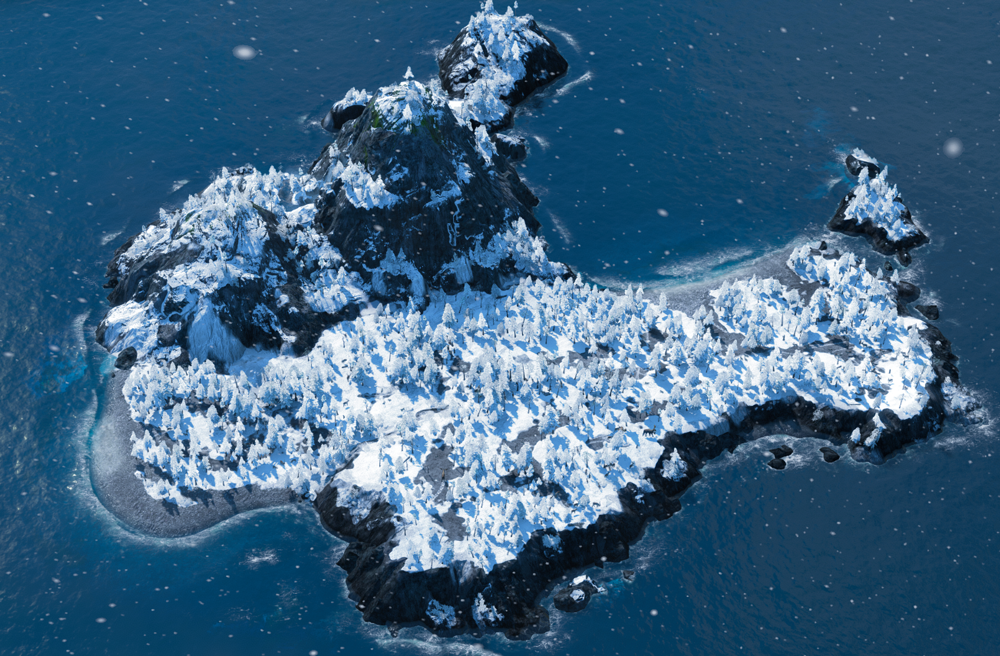

Those are only 2 of many tweaks that we could to to take the island skinning to the next level. The more time you want to invest into this process, the better the result will be.


