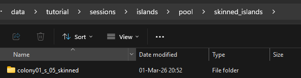
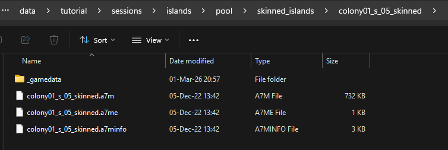
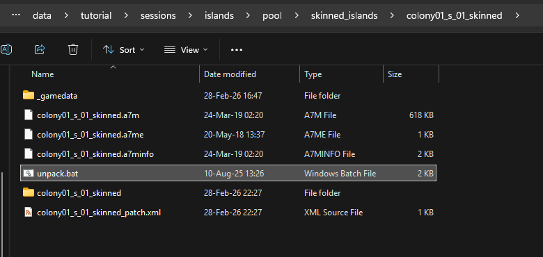
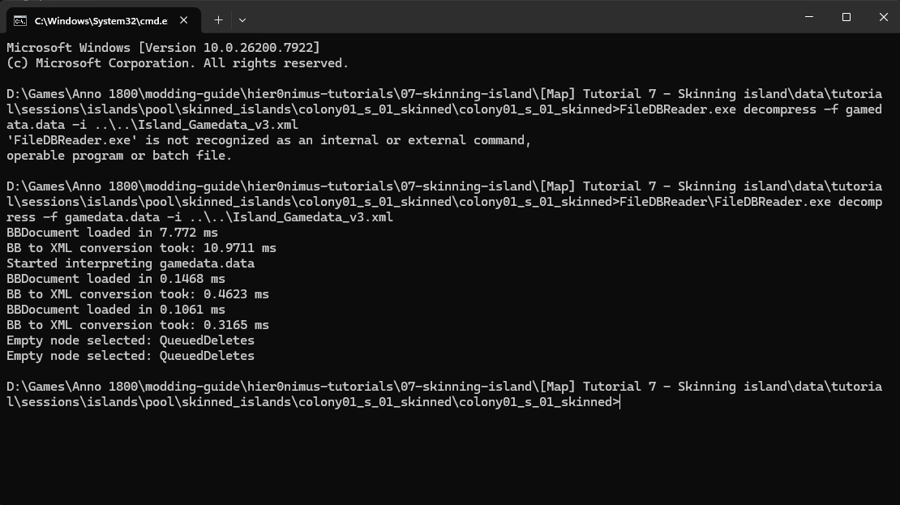
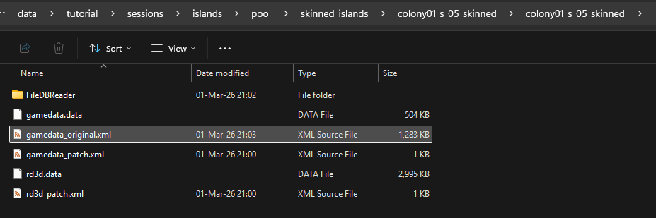
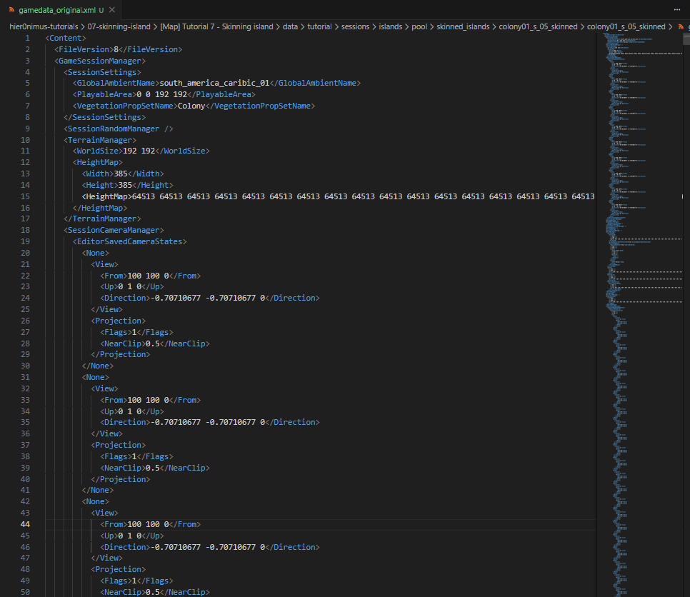
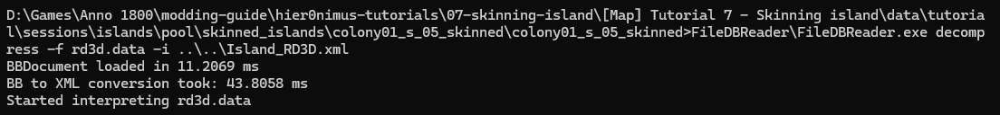
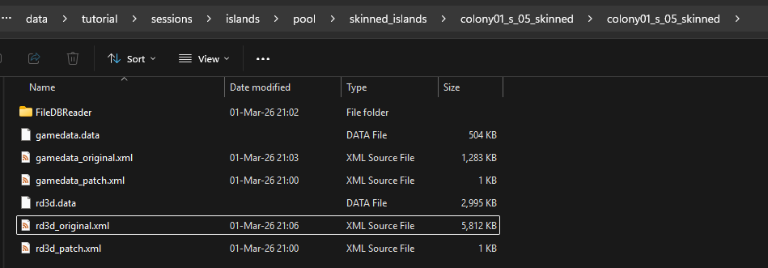
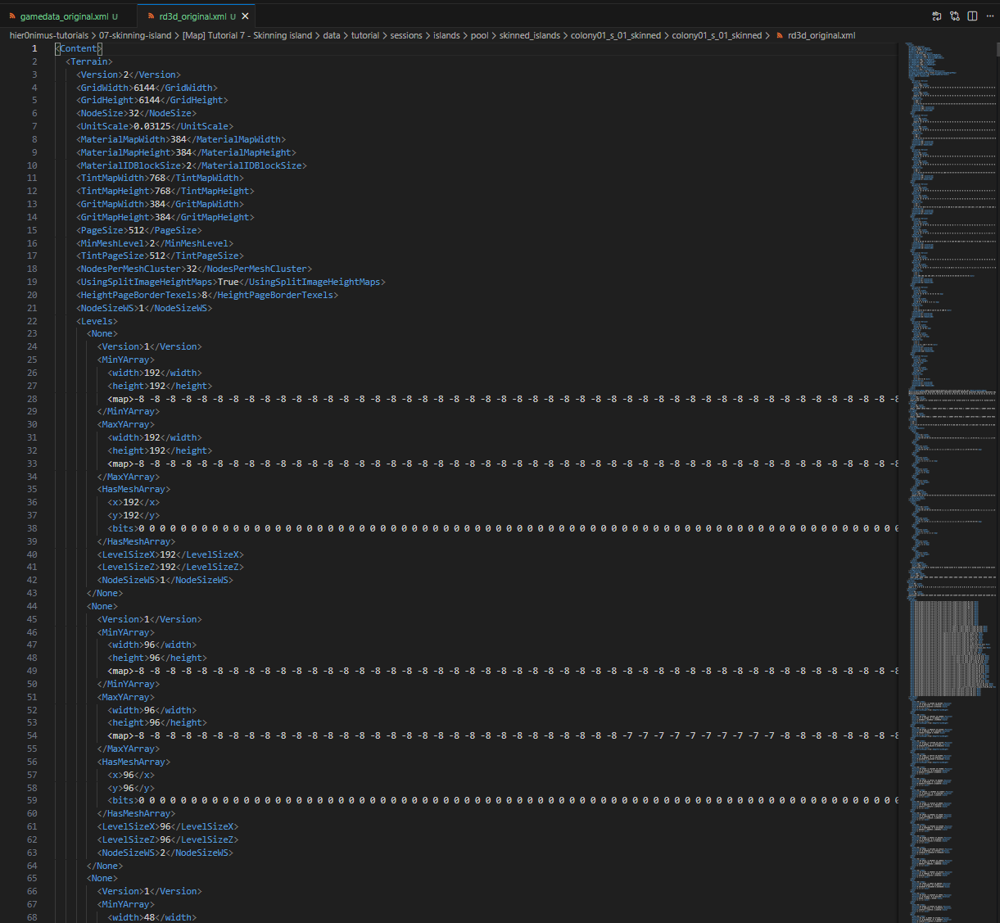

# Skinning an island (WIP)

## Introduction

In the current vanilla game, we have different sessions. Every session is bound to a region. We have the `Moderate` region which is Old World and Cape Trelawney, we have `Colony01` which is the New World, we have `Arctic` which is the Arctic, we have `Africa` which is Enbesa. And then we also offcourse have the new Asian region (`Mod2`) from New horizons which has Horai and other sessions from other mods that use the existing regions. Every region has it's own look and feel, its own vegetation and props, island ground, mountain an river textures. It also has defined which mines are available there and much more. 

Which islands are available in a session is bound to the amount of available islands that the game offers. A New World island can offcourse not fit into the Arctic with its jungle look and feel and Colony01 mineslots. The Moderate and Colony01 regions have a lot of islands. There was invested a lot of time into those 2 regions by the developers to make a large pool of different sizes of islands for those regions. Taludas an Taube even stretched that further and converted all Old World to New World islands and vice versa to even expand the pools even more. 

Sadly, the Arctic and the Africa region have a more limited islandpool. Both have their unique environment and mechanics which results in more work to make the islands. The Arctic islands for example are smaller islands with more challenges. The plateau islands are even more unique compared to what we have in other regions and there are no similar island avaialble (apart from one scenario island)! The Africa islands have their own challenges with the canal system which results in that all those islands being pancake flat. It would otherwise make no sense to make canals there because water would potenially flow uphill because islands from other regions all have sloped terrain.

Another reason why no new islands are added yet to the Arctic of the Enbesan session is the way the session and a lot of the islands are tangled to the questline. Even the slightest change to islands or the session could potentially break questlines. It is possible to manipulate those, but it is more tricky.

This is the reason why it is more challenging to make new Arctic and Enbesa islands and there are currently not many mods yet that expand those islandpools, which is a shame and we should change that! 

## Preparations

Set up the `FileDBReader`, `xmltest`, `rdaconsole` environment variables so you can use them in every folder.

Make sure you have a basic mod setup with assets.xml, modinfo.json and all the corresponding folders and file structure.

## Test custom islands in Arctic session

If we take a look at the structure of a session there are different levels. We have a region, which is in our case `160001`, the Arctic Region. 

If we go one level deeper, we get to the session, which is in our oase `180045`, the Arctic Session. 

If we go another level deeper, the session contains a map template, in our case `112793`, MapTemplate Arctic.

This maptemplate contains the `.a7t` `TemplateFilename` which contains all the information about which islands can be found in this session and much more together with some other files that can be found in that same location.

To quickly check our custom island, we will not change the maptemplate, but just change the link to the islands itself in the `RandomIsland` asset. 

If we go to a1800.net and search for `RandomIsland`, there are not that many islands for the arctic: 
- 116676 - colony03_a01_01
- 116886 - colony03_a01_02_multiplayer
- 116885 - colony03_a01_02_singleplayer
- 116677 - colony03_a01_03
- 116678 - colony03_a01_04
- 116679 - colony03_a01_05
- 116680 - colony03_a01_06
- 116681 - colony03_a01_07
- 116682 - colony03_a01_08

Just for testing and the first step in the process, we change the `<FilePath>` for the small ones to another small island from the New World to make sure we can swap out an island succesfully.

```XML
    <ModOp Type="merge" GUID="116682,116681,116680,116679" Path="/Values/RandomIsland/">
        <FilePath>data\sessions\islands\pool\colony01\colony01_s_01\colony01_s_01.a7m</FilePath>
    </ModOp>
```

Important to know is that this will only work for new games, because existing games will already have the session and map templete loaded. But this is just for testing, so this is fine for now.

Start the game with all updated files and create a new creative mode game to see the New World island in the Arctic.


Offcourse this island does not really fit in this region. As far as I know, there are no palm trees in the Arctic.

We do already see some more general settings being applied to the island. We see some snow on the mountains already. If we would settle the island we will be able to build the Arctic buildings on that island. But in contrast of a couple of things that are already changed, there are way more things that need adaptations to be fitting for this region. Hold on, we will get there one step at the time.

## Create a custom island

You can find the original island folders on the following locations for every region in the extracted rda files:
- For Old World and New World islands: `data\sessions\islands\pool`
- For Arctic islands: `data\dlc03\sessions\islands\pool`
- For Enbesan islands: `data\dlc06\sessions\islands\pool`

To skin an existing island, we copy the island we want to skin to our own mod directory.

Setup your mod structure and create the structure for custom islands under the sessions/islands/pool subdirectory. `data\tutorial\sessions\islands\pool\skinned_islands`

Copy the original island folder to the mod folder on location `data\tutorial\sessions\islands\pool\skinned_islands\`

We choose `colony01_s_01` as the example to start with a simple small island. Rename the folder to `colony01_s_01_skinned` to make it unique.



Make sure inside this folder we have the following files and folder:
- `_gamedata` folder with all the meshes of the island
- `a7m` islandfile that contains all the island information (location of all elements liks props, materials used, mineslot locations and locations of other elements,...)
- `a7me` islandfile we are not going to change
- `a7minfo` islandfile which provides additional island information we will be adapting

Change the names of those files to the same name as your island folder. `colony01_s_01_skinned.a7m`, `colony01_s_01_skinned.a7me`, `colony01_s_01_skinned.a7minfo`.



Open the _gamedata folder and change the name of the island folder in this folder to the same name as the changed island name folder `colony01_s_01_skinned`.

### Check changes

It is a good practice to check regularly with almost every step ingame if everything stll works. Often we do many steps and only then start the game to find out it is not working. Tracing back many steps trying to figure out where we went wrong in which of the steps we took compared to the last time we started the game.

Change the path of the island we changed before to our new custom island. 

```XML
    <ModOp Type="merge" GUID="116682,116681,116680,116679" Path="/Values/RandomIsland/">
        <FilePath>data\tutorial\sessions\islands\pool\skinned_islands\colony01_s_01_skinned\colony01_s_01_skinned.a7m</FilePath>
    </ModOp>
```

You should again see the same island ingame but now it loads our own custom island that we copied. We can not start making changes to that island now that we now it is correctly loaded.

## Preparations of files

To be able to convert/skin islands, like with the modelling process and opening map template files we need some files to convert island specific files. I did not create those files myself and got huge help from Taube and Taludas in this process. They did all the groundwork for this and I just make use of their hard work. A big thank you to them! Without them, this would not have been possible and I would not have been able to write down this process and share it with all of you.

### Which files?

Apart from the `FileDBReader`, `xmltest`, `rdaconsole` that we already have set up, we need some additional files.

Download the following [(.zip)](./_sources/files/skinning_island_files.zip) and extract them into the parent folder of your island: 
`data\tutorial\sessions\islands\pool\skinned_islands`

The following files from the zip should be placed in this directory:
- Island_Gamedata_v3.xml
- a7minfo.xml
- Island_RD3D.xml


Go back to the root of your island folder `data\tutorial\sessions\islands\pool\skinned_islands\colony01_s_01_skinned`, copy the file `unpack.bat` in there and execute the file to unpack the island files. 

1 folder with the name of your island and one file with the `.xml` extension will be created.



### Unpacking does not work?
In case this does not work, make sure you have set up the `FileDBReader`, `xmltest` and `rdaconsole` environment variables correctly. Open the `unpack.bat` with a code editor to see which actions are executed. Examples: `RdaConsole ^extract -f %island_name%.a7m -o %island_name% -y`. If you can not setup the environement files correctly, you can always add the `FileDBReader`, `xmltest` and `rdaconsole` references in every folder where you need them. Make sure to check the commands to see what directory you need.

If this is executed correctly, you should have a new folder and a new file inside the root with the same name as the parent folder, with the name of the island. `data\tutorial\sessions\islands\pool\skinned_islands\colony01_s_01_skinned`. The file should be a patch file for the `.a7minfo` file.

If you open the folder, you should have 4 files:
- `gamedata.data`
- `gamedata_patch.xml`
- `rd3d.data`
- `rd3d_patch.xml`

### Gamedata.data
The `gamedata.data` contains all the island logic in terms of meshes, big elements, mineslots and much more on the island. We can not open this file with a code editor to manipulate or change things. Because we want to manipulate the file in a structured non destructive way, we will be patching the file instead if directly editing the file. With patching the file, we will have a good overview of our changes and have an easier time to go back if something is not correct. The original file is also really big and long which would make manipulating it a big challenge to keep the overview.

To open the file, we need a command and one of the tools we used before. This is a `.data` file. To open those files we need the `FileDBReader` with the fileformat file for islands. 

Open the commandline in this directory by going to the explorer window of this folder, press `CTRL+L` and then execute `cmd` by typing and confirming with enter. A commandline will open in this directory.

The command we use for this is `FileDBReader.exe decompress -f gamedata.data -i ..\..\Island_Gamedata_v3.xml`. The `Island_Gamedata_v3.xml` should be 2 levels up like we copied the files earlier. The FileDBReader should be targeted as environment variable.
For some reason, if the command does not work for the environment variables, add the FileDBReader folder with all the files and fileformats to this folder and use the command `FileDBReader\FileDBReader.exe decompress -f gamedata.data -i ..\..\Island_Gamedata_v3.xml`



With the first command we have `'FileDBReader.exe' is not recognized as an internal or....`. Here we see what happens when the environment variable is not recognised and we need to add the FileDBReader files in the directory so we can target it within this directory. The second command is where we can execute it that way and which extracts the `gamedata.data` file into the `gamedata.xml` file.

Change the name of this file to `gamedata_original.xml` to keep it different and clear this is the original file. 



You can open this .xml file with the code editor to have a peek inside. You will see a lot of walls of numbers which maybe make not much sens at first sight, lists of other elements, ect. Take a bit of time to go through it and read the different nodes. You will encounter `GlobalAmbientName`, `PlayableArea`, `WorldSize`, `VegetationPropSetName`, `HeightMap`, `SessionCameraManager`, `StreetMap`, `Water`, `RiverGrid`, `EnvironmentGrid`, `PathManager`, `RegrowManager`, `TreeMap`, `AmbientMoodSoundHandler`, `AmbientMoodGrid`, `IncidentManager`, `AIUnitManager`, `AIConstructionManager`, `AnimalManager`, `HerdGrid`, `HerdAreas`, `ItemSessionManager`, `MilitaryManager`, `BlueprintManager`, `IrrigationManager`, `SeasonManager`, `AreaIDs`, `SpawnAreaPoints`, `AreaManagerData`, `ObjectGroupCollection`, `GameObject`,... and much more.



As you can see, this file is packed with information about the island and a lot of logic. Reading the names of the nodes gives an idea what is defined here and how much information is stored on this level, what can be manipulated, but also, what could potentially break if we do something wrong. 99.99% of this information is tricky to change and I do not even know how I would change it without breaking things or without actually knowing what I'm doing. We as modders do not have the accessable tools to change all those parameters so we do what we can with the tools we have. 

### rd3d.data
This `rd3d.data` file contains a couple of different things about island compared to the `gamedata.data` file. Two important parts in this file are all the props on the islands and the materialset that we will use to give the island its visual look and feel.

Let's open this file to also have a peek inside. Again with the `FileDBReader` and this time with the fileformat file for rd3d conversion. 
You should still have your commandline open from the previous command, otherwise open it again in the correct direcotory.

Use the command to decompress the `rd3d.data` file to an xml file: `FileDBReader.exe decompress -f rd3d.data -i ..\..\Island_RD3D.xml`. 
Again, if your environment variables are not correctly set up you can also use the command to target the files differently: `FileDBReader\FileDBReader.exe decompress -f rd3d.data -i ..\..\Island_RD3D.xml`



You will now have an `rd3d.xml` file. Change the name to `rd3d_original.xml`.



If we open this file with a code editor we can again already have a peek what is inside. If we again go through the different nodes and try to understand what we see there are some names that make things a bit more clear. `GridWidth`, `GridHeight`, `MaterialSetFileName`, `TintsMap`, `ActiveMap`, `WaterInfos`, `WaterFlow`, `PropGrid`, `Instances`,...



This files contains less different nodes and also is more straight forward then the gamedata file. 

Time to roll up our sleeves and manipulate the files. 

### Manipulating Gamedata.data
Open the `gamedata_original.xml` and the `gamedata_patch.xml` in a code editor and place them side by side. That way we see what we want to patch and what we do for the patching.

The first step of manipulation of the `gamedata.data` file will be changing 2 properties. `GlobalAmbientName` and `VegetationPropSetName`. In this exampe we will be changing a New World Island to an Arctic island. If we look at the top of the `gamedata_original.xml` we see `<GlobalAmbientName>south_america_caribic_01</GlobalAmbientName>`. This defines the "feeling" the island will have with certain elements like snow, sun, weather, basic ground materials,... Offcourse because we want an Arctic island we do not want the `south_america_caribic_01` which would give a jungle feeling. To know what the Arctic value for this is we can do the previous steps of extracting an island and looking at the gamedata.data from an Arctic island. There we will find the value `<GlobalAmbientName>DLC03_01</GlobalAmbientName>`. 

The other value we want to change now is `<VegetationPropSetName>Colony</VegetationPropSetName>`. In this case we do not want the vegetation of the New World in the Arctic offcourse. Again, look at an example of an Arctic island to see what the value is. In this case `<VegetationPropSetName>Arctic</VegetationPropSetName>`.

Now that we know what we want to change and what the values have to become, we can take actions to actually make it happen. We said before we will be patching instead of directly changing the files. In theory, we could just change the `gamedata_original.xml`, repack it and be done with it. For those small changes this would be fine. But we will be doing more manipulations in much deeper structure of the file where patching is much more advised instead of directly changing the file.

When we patch the file we use the same technique as we do for other operations in our mods, with `ModOp` operations. In this case we will be replacing 2 values in a certain path. With our previous knowledge of how mod operations work, this should not be a problem. The tricky part here is to actually be able to target the node you want to change because we do not have a GUID to target. We will be targetting our node via a more general path that starts with `//`. 

We will be writing our patch in the `gamedata_patch.xml` file.

```XML
<ModOps>
    <ModOp Type="replace" Path="//GlobalAmbientName">
        <GlobalAmbientName>DLC03_01</GlobalAmbientName>
    </ModOp>
    <ModOp Type="replace" Path="//VegetationPropSetName">
        <VegetationPropSetName>Arctic</VegetationPropSetName>
    </ModOp>
</ModOps>
```